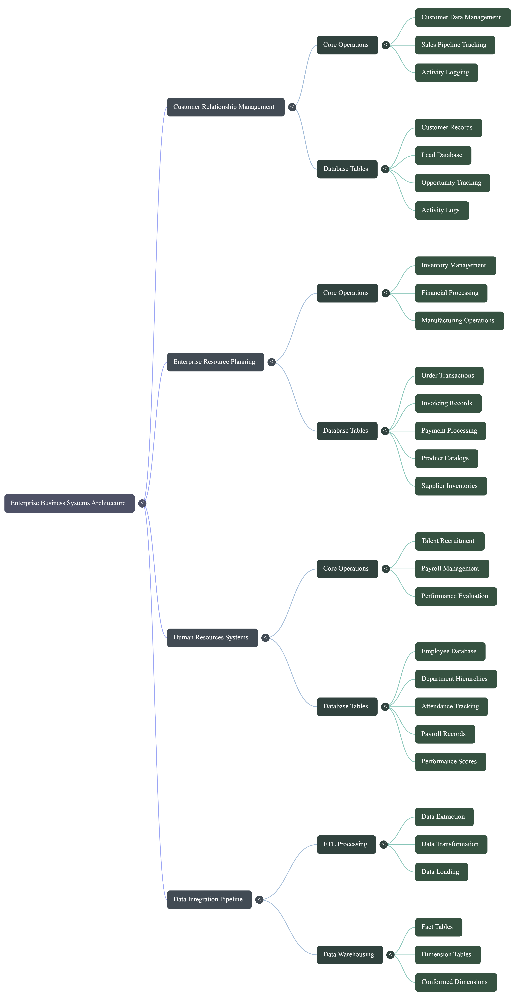

# Enterprise Architecture Mindmap

## Why This Resource Matters
Learning Excel in isolation can lead to fragmented knowledge where an analyst knows individual formulas but cannot synthesize them into an enterprise data product. The Enterprise Architecture Mindmap provides a high-level cognitive framework connecting data ingestion, relational modeling, analytical calculation, and executive visualization.

---

## Source Visual Artifact

---

## Source Summary
The mindmap visualizes the core pillars of the data analytics curriculum:
- **Core Grid Engine**: Workbooks, ranges, references, and calculation modes.
- **Data Engineering Layer**: Power Query, connector architecture, data types, and transformation sequences.
- **Relational Data Modeling**: Tables, star schema topologies, one-to-many cardinality, and data dictionaries.
- **Analytical Intelligence**: Formulas, dynamic arrays, statistical measures, and DAX expressions.
- **Business Presentation**: Pivot tables, interactive charts, slicer coordination, and dashboard architecture.

---

## My Understanding
The mindmap mirrors the 9-module curriculum of this course, proving that data analytics in Excel follows an engineering progression: from data hygiene to relational modeling, ending in executive storytelling.

---

## Key Takeaways
1. **Systemic View**: Always see where an individual task (e.g. data cleaning) feeds downstream elements (e.g. DAX measures and charts).
2. **Defensive Design**: Solid foundation at the ingestion stage prevents cascading errors in final executive reports.

---

## Concepts Supported
- [[Data Analysis Life Cycle]]
- [[Dimensional Modeling]]
- [[Star Schema vs Snowflake Schema]]

---

## Related Course Lessons
- [[01_Course/Course Map]]
- [[01_Course/Learning Objectives]]

---

## Original Source
- [Open Gemini Notebook Source](https://notebook.google.com/notebook/bcdef821-08bc-4186-9221-2c747d5a2b15?authuser=1)
- 🧠 [Open Interactive Course Mindmap on MindMeister](https://www.mindmeister.com/app/map/3782166881?t=I9gXHbkAlV)
- Asset file: `assets/enterprise-architecture-mindmap.png`

