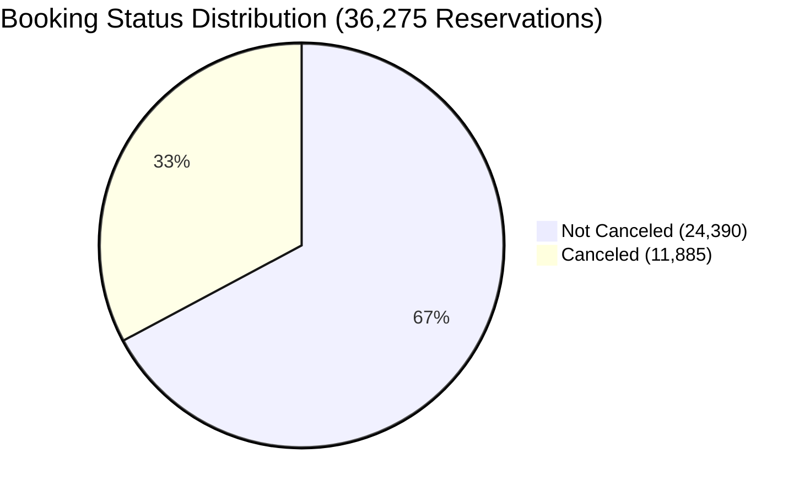

# 🏨 Hotel Reservations: Master Dataset Documentation & Practice Ground

> [!abstract] Benchmark Dataset Overview
> The **Hotel Reservations Dataset** is a premier open-access benchmark for hospitality revenue management, booking cancellation classification, and spreadsheet data modeling. Comprising **36,275 real reservation records**, it provides a rich operational training ground for testing Excel data management, validation lists, custom number masks, date engineering, and interactive dashboard analytics.

---

## 🌐 Provenance, Official Sources & Open Mirrors

| Source Entity | Platform | Resource Description | Direct Access Link |
| :--- | :--- | :--- | :--- |
| **Kaggle (Ahsan)** | Primary Origin | Hotel Reservations Classification Dataset (CC0 Public Domain) | [Kaggle: Hotel Reservations Dataset](https://www.kaggle.com/datasets/ahsan81/hotel-reservations-classification-dataset) |
| **Hugging Face (jason1966)** | Open Mirror | `ahsan81_hotel-reservations-classification-dataset` (Parquet / CSV / JSON) | [Hugging Face Dataset Mirror](https://huggingface.co/datasets/jason1966/ahsan81_hotel-reservations-classification-dataset) |
| **Local Source Copy** | Local Storage | Raw Source Data File (3.09 MB) | `D:\courses\Data Analysis 26-27\Hotel Reservations.csv` |
| **Course Module 6 Asset**| Local Course Vault | Ingested Course Material Copy | `09_Source_Materials/Module 6/2- Hotel Reservations.csv` |
| **Student Practice Demo** | Course Vault Demo | Fully Formatted Excel Workbook with Custom Columns & Validation | `11_Demos_and_Workbooks/02_Data_Management/Hotel_Reservations_Demo.xlsx` |

---

## 📊 Dataset Profile & Ground-Truth Statistics

### Audited Benchmark Figures (Empirically Verified):
- **Total Reservations**: `36,275` guest booking records
- **Data Granularity**: **1 row = 1 distinct hotel reservation**
- **Unique Booking IDs**: `36,275` (zero duplicate keys in `Booking_ID`)
- **Overall Cancellation Rate**: **`32.76%`** (`11,885` cancellations vs `24,390` fulfilled stays)
- **Average Daily Rate (ADR)**: **`$103.42`** (Range: `$0.00` to `$540.00`)
- **Complimentary Rooms**: `391` records under market segment *Complementary* with `$0.00` ADR
- **Average Lead Time**: `85.2 days` (Min: `0 days`, Max: `443 days`)
- **Temporal Coverage**: 
  - `2017`: `6,514` bookings (18.0%)
  - `2018`: `29,761` bookings (82.0%)

---

## 🔍 Data Quality Audit & Forensic Findings

> [!WARNING] The "Feb 29, 2018" Non-Leap Year Calendar Anomaly
> Forensic inspection reveals **37 records** with `arrival_year = 2018`, `arrival_month = 2`, and `arrival_date = 29`.
> 
> Because **2018 is not a leap year**, February 29, 2018 does not exist on the Gregorian calendar:
> - In Microsoft Excel, `=DATE(2018, 2, 29)` automatically rolls over to **March 1, 2018** (`2018-03-01`).
> - In Power Query or Python `datetime.date`, this throws an out-of-range exception unless handled with error-trapping.

---

## 📋 Comprehensive Data Dictionary (All 19 Attributes)

| # | Attribute Name | Excel Data Type | Description | Allowed / Sample Values | Business Analytics Significance |
| :-: | :--- | :--- | :--- | :--- | :--- |
| **1** | `Booking_ID` | Text (`@`) | Unique reservation identifier | `INN00001` to `INN36275` | Primary Key for deduplication and row identification. |
| **2** | `no_of_adults` | Integer (`0`) | Number of adult guests | `0` to `4` (mean: `1.84`) | Stay capacity planning & food service preparation. |
| **3** | `no_of_children` | Integer (`0`) | Number of children | `0` to `10` (mean: `0.11`) | Family demographic segmentation & rollaway bed supply. |
| **4** | `no_of_weekend_nights` | Integer (`0`) | Saturday/Sunday night count | `0` to `7` | Weekend leisure demand modeling. |
| **5** | `no_of_week_nights` | Integer (`0`) | Monday through Friday nights | `0` to `17` | Corporate weekday occupancy baseline. |
| **6** | `type_of_meal_plan` | Text (`@`) | Contracted guest meal plan | `Meal Plan 1`, `Meal Plan 2`, `Meal Plan 3`, `Not Selected` | F&B forecasting (`Meal Plan 1` accounts for 76.7% of demand). |
| **7** | `required_car_parking_space` | Binary / Custom Mask | Vehicle parking request | `0` = No, `1` = Yes | Custom mask: `[=1]"Parking Requested";[=0]"No Parking";"-"`. |
| **8** | `room_type_reserved` | Text (`@`) | Room tier selected by guest | `Room_Type 1`, `Room_Type 4`, `Room_Type 6`... | Tier yield management (`Room_Type 1` dominates at 77.5%). |
| **9** | `lead_time` | Integer (`0`) | Days between booking & check-in | `0` to `443` days | Direct correlation to cancellation probability. |
| **10** | `arrival_year` | Integer (`0`) | Scheduled arrival year | `2017`, `2018` | Year-over-year revenue pacing. |
| **11** | `arrival_month` | Integer (`0`) | Scheduled arrival month | `1` to `12` | Seasonal occupancy modeling. |
| **12** | `arrival_date` | Integer (`0`) | Day of arrival month | `1` to `31` | Granular calendar scheduling. |
| **13** | `market_segment_type` | Text (`@`) | Booking channel / source | `Online`, `Offline`, `Corporate`, `Aviation`, `Complementary` | Channel commission audit & marketing ROI evaluation. |
| **14** | `repeated_guest` | Binary / Custom Mask | Repeat guest indicator | `0` = New, `1` = Repeat Guest | Custom mask: `[=1]"Loyalty Member";[=0]"New Guest";"-"`. |
| **15** | `no_of_previous_cancellations` | Integer (`0`) | Historical cancelled reservations | `0` to `13` | Customer risk profiling & credit card pre-authorization. |
| **16** | `no_of_previous_bookings_not_canceled` | Integer (`0`) | Historical fulfilled stays | `0` to `58` | Loyalty score & VIP status qualification. |
| **17** | `avg_price_per_room` | Currency (`$#,##0.00`) | Average Daily Rate (ADR) | `$0.00` to `$540.00` | Revenue calculation: `[@[Total Nights]] * [@[avg_price_per_room]]`. |
| **18** | `no_of_special_requests` | Integer (`0`) | Guest special request count | `0` to `5` | Guest engagement index (high requests correlate with lower cancellation). |
| **19** | `booking_status` | Text (`@`) | Final disposition of reservation | `Not_Canceled`, `Canceled` | Primary Target Variable for classification & revenue optimization. |

---

## 🛠️ Hands-on Module 2 Implementation Checklist

When working on this dataset in [`11_Demos_and_Workbooks/02_Data_Management/Hotel_Reservations_Demo.xlsx`](file:///d:/courses/Data%20Analysis%2026-27/7-Introducation%20to%20Data%20Fields%20(Excel)/11_Demos_and_Workbooks/02_Data_Management/):

1. **Table Structure**: Convert to Table (`Ctrl + T`) named `Hotel_Bookings`. Freeze top row (`Alt + W + F + R`).
2. **Date Synthesis**: Add `Arrival Date`: `=DATE([@[arrival_year]], [@[arrival_month]], [@[arrival_date]])`.
3. **Stay Metrics**:
   - `Total Nights`: `=[@[no_of_weekend_nights]] + [@[no_of_week_nights]]`
   - `Total Guests`: `=[@[no_of_adults]] + [@[no_of_children]]`
   - `Total Booking Value`: `=[@[Total Nights]] * [@[avg_price_per_room]]`
4. **Data Validation**: Build separate `Validation_Lists` tab with restricted dropdown lists for `market_segment_type`, `type_of_meal_plan`, and `booking_status`.
5. **Conditional Formatting**: Soft red highlight for canceled bookings (`=$S2="Canceled"`), Light Blue gradient data bars on `lead_time`.

---

## 🔗 Cross-Vault References
- 📂 Case Study: [[06_Projects/Hotel Reservation Analysis/Project Overview|Hotel Reservation Analysis Project Overview]]
- 📊 Mini-Project Lab: [[05_Practice/Mini Projects/Hotel_Reservation_Dashboard_Mini_Project|Hotel Reservation Dashboard Mini Project]]
- 📑 Lesson Grounding: [[01_Data_Types_and_Formatting]], [[04_Data_Transformation_Tools]], [[06_Workbook_File_Formats]]
- 💾 Student Workbook: `11_Demos_and_Workbooks/02_Data_Management/Hotel_Reservations_Demo.xlsx`
