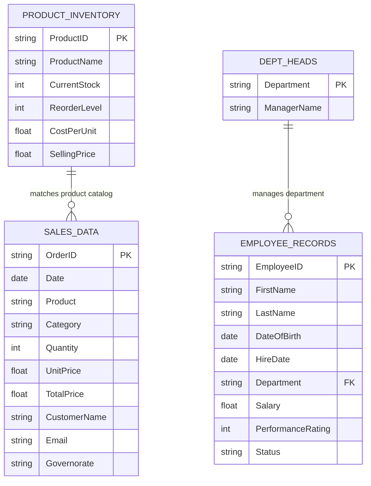

# 📦 Module 4 Dataset Documentation: Tables & Operational Data Models

> [!abstract] Dataset Overview
> The **Module 4 Tables & Operational Dataset** (`Module_4_Demo.xlsx`) serves as the official practice ground for **Module 4: Excel Tables Architecture**. It comprises six dedicated worksheet tabs designed to teach side-by-side range versus table mechanics, multi-attribute retail sales transactions across Egypt, relational HR employee management, and hardware inventory stock valuation with integrated Pivot Tables.

---

## 🗂️ Workbook Tab Directory

| Tab Name | Dimensions (Rows $\times$ Cols) | Primary Business Domain | Key Educational Purpose |
| :--- | :---: | :--- | :--- |
| **`table VS range `** | $13 \times 10$ | Pedagogical Experiment | Direct side-by-side behavioral drill: Standard Range (`C6:E12`) vs Table (`Table2`, `G6:J12`) answering *"What is the difference between them?"* |
| **`Sales_Data`** | $101 \times 10$ | Retail E-Commerce | 101 Egyptian retail transactions across 7 governorates. Used for `SalesTable` conversion, calculated columns, Slicers, and `SUBTOTAL` Total Rows. |
| **`Employee_Records`** | $30 \times 9$ | Human Resources | 30 employee profiles with birth dates, hire dates, salaries, and performance ratings across 6 corporate departments. |
| **`Dept_Heads`** | $2 \times 6$ | Management Reference | Horizontal lookup matrix mapping 6 functional departments to their executive leaders for relational cross-table lookups (`XLOOKUP` / `HLOOKUP`). |
| **`Sheet1`** | $24 \times 2$ | Executive Reporting | Active Pivot Table summarizing inventory unit costs by product category, totaling **65,537.70 EGP**. Demonstrates table auto-expansion feeding Pivot Tables. |
| **`Product_Inventory`**| $52 \times 6$ | Supply Chain / Inventory | 51 hardware SKUs with stock counts, safety reorder thresholds, and unit costs/prices. Powers inventory valuation and reorder alert logic. |

---

## 📊 Relational Data Topology

---

## 🔍 Detailed Data Dictionary by Tab

### 1. Tab: `Sales_Data` (101 Records)
- **Data Grain**: 1 row = 1 customer purchase transaction.
- **Geographic Scope**: Egypt (Governorates: `Cairo`, `Alexandria`, `Giza`, `Asyut`, `Luxor`, `Sohag`, `Gharbia`).
- **Currency**: Egyptian Pounds (EGP).

| Field Name | Data Type | Sample Value | Description & Business Rules |
| :--- | :---: | :--- | :--- |
| `OrderID` | Text | `"EGY0001"` | Unique alphanumeric transaction identifier (`EGY0001` - `EGY0100`). |
| `Date` | Date | `2024-11-28` | Transaction date (covering calendar year 2024). |
| `Product` | Text | `"Monitor Samsung"` | Hardware or peripheral product purchased. |
| `Category` | Text | `"Electronics"` | Product grouping (`Electronics`, `Peripherals`). |
| `Quantity` | Integer | `3` | Units purchased per transaction (typically `1` to `10`). |
| `UnitPrice` | Currency | `3263.78` | Retail price per unit in EGP. |
| `TotalPrice` | Currency | `9791.34` | Calculated transaction revenue (`Quantity * UnitPrice`). |
| `CustomerName` | Text | `"Nada Fouad"` | Customer full name. |
| `Email` | Text | `"nada.fouad@egypt.com"` | Customer contact address. |
| `Governorate` | Text | `"Asyut"` | Egyptian destination province. |

> [!caution] Data Cleaning Note: Row 102
> The raw sheet contains a detached text entry in cell `H102` (`'  Mohamed El-Sayed  '`) without an OrderID or date. Students must delete row 102 prior to table conversion to prevent corrupting table dimensions.

---

### 2. Tab: `Product_Inventory` (51 SKUs)
- **Data Grain**: 1 row = 1 hardware inventory item.

| Field Name | Data Type | Sample Value | Description & Business Rules |
| :--- | :---: | :--- | :--- |
| `ProductID` | Text | `"EGY001"` | SKU identifier. |
| `ProductName` | Text | `"Headphones Beats"` | Description of electronic or accessory hardware. |
| `CurrentStock` | Integer | `196` | On-hand warehouse physical inventory units. |
| `ReorderLevel` | Integer | `39` | Safety stock threshold triggering purchase orders. |
| `CostPerUnit` | Currency | `1157.48` | Procurement cost per item in EGP. |
| `SellingPrice` | Currency | `1364.39` | Standard retail customer selling price in EGP. |

---

### 3. Tab: `Employee_Records` (30 Staff Members)
- **Data Grain**: 1 row = 1 employee profile.
- **Departments**: `Sales`, `Marketing`, `HR`, `IT`, `Finance`, `Operations`.
- **Employment Statuses**: `Active`, `Terminated`, `On Leave`.
- **Performance Ratings**: Scale of `1` (lowest) to `5` (highest).

---

### 4. Tab: `Dept_Heads` (Management Matrix)
Horizontal matrix mapping 6 executive leaders:
- **Sales**: Ahmed El-Masry
- **Marketing**: Fatima Nour
- **HR**: Omar Farouk
- **IT**: Yasmin Hassan
- **Finance**: Mohamed Samir
- **Operations**: Aisha Mahmoud

---

## 🎯 Educational Integration & Exercises
- **Lesson Notes**: [[01_Excel_Tables_Architecture]], [[02_Structured_References]], [[03_Table_Features_and_Best_Practices]]
- **Concepts**: [[Excel Tables]], [[Structured References]], [[Pivot Tables]], [[Slicers and Timelines]]
- **Lab Exercise**: [[Ex03_Excel_Tables_and_Structured_References]]
- **Workbook File**: [`11_Demos_and_Workbooks/04_Tables/Module_4_Demo.xlsx`](file:///d:/courses/Data%20Analysis%2026-27/7-Introducation%20to%20Data%20Fields%20%28Excel%29/11_Demos_and_Workbooks/04_Tables/Module_4_Demo.xlsx)
