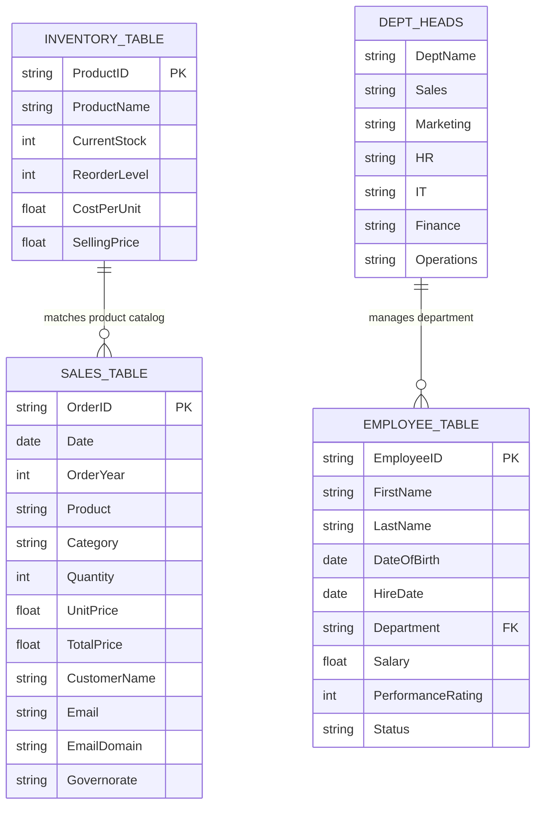

# 📦 Module 4 Dataset Documentation: Tables & Operational Data Models

> [!abstract] Dataset Overview
> The **Module 4 Tables & Operational Dataset** (`Module_4_Demo.xlsx`) serves as the official practice ground for **Module 4: Excel Tables Architecture**. It comprises five dedicated worksheet tabs featuring official Excel Tables (`ListObjects`), calculated columns (`OrderYear`, `TotalPrice`, `EmailDomain`, `Malak`), Total Row aggregations (`SUBTOTAL(101, ...)`, `SUBTOTAL(109, ...)`), relational HR management, and hardware inventory stock valuation.

---

## 🗂️ Workbook Tab Directory

| Tab Name | Dimensions (Rows $\times$ Cols) | Primary Table Object | Key Educational Purpose & Live Formulas |
| :--- | :---: | :---: | :--- |
| **`Table_VS_Range `** | $13 \times 10$ | `Table4` (C6:E12) `Table2` (G6:J13) | Side-by-side comparison answering *"What is the difference between them?"* - `Safaa`: `=D7*C7` - `Malak`: `=Table2[[#This Row],[Smmar ]]*Table2[[#This Row],[Nariman ]]` - Total Row: `=SUBTOTAL(101, ...)` and `=SUBTOTAL(109, ...)` |
| **`Sales_Data`** | $101 \times 12$ | `SalesTable` (A1:L101) | 101 retail transactions across 7 Egyptian governorates with 3 calculated columns: - `OrderYear`: `=YEAR(SalesTable[[#This Row],[Date]])` - `TotalPrice`: `=SalesTable[[#This Row],[Quantity]] * SalesTable[[#This Row],[UnitPrice]]` - `EmailDomain`: `=RIGHT(SalesTable[[#This Row],[Email]], ...)` |
| **`Employee_Records`** | $30 \times 9$ | `EmployeeTable` (A1:I31) | 30 employee profiles with birth dates, hire dates, salaries, and ratings across 6 corporate departments. |
| **`Dept_Heads`** | $2 \times 7$ | `Table8` (A1:G2) | Horizontal management lookup matrix mapping 6 departments to executive leaders for `XLOOKUP` / `HLOOKUP`. |
| **`Product_Inventory`**| $52 \times 6$ | `InventoryTable` (A1:F52) | 51 hardware SKUs with stock levels, safety reorder thresholds, and unit costs/selling prices in EGP. |

---

## 📊 Relational Data Topology

---

## 🔍 Detailed Data Dictionary by Tab

### 1. Tab: `Sales_Data` (`SalesTable`, 101 Records $\times$ 12 Columns)
- **Data Grain**: 1 row = 1 customer purchase transaction.
- **Geographic Scope**: Egypt (Governorates: `Cairo`, `Alexandria`, `Giza`, `Asyut`, `Luxor`, `Sohag`, `Gharbia`).
- **Currency**: Egyptian Pounds (EGP).

| Column Index | Field Name | Data Type | Sample Value | Formula / Business Rules |
| :---: | :--- | :---: | :--- | :--- |
| **A** | `OrderID` | Text | `"EGY0001"` | Primary Key (`EGY0001` - `EGY0100`). |
| **B** | `Date` | Date | `2024-11-28` | Transaction date in 2024. |
| **C** | `OrderYear` | Integer | `2024` | `=YEAR(SalesTable[[#This Row],[Date]])` |
| **D** | `Product` | Text | `"Monitor Samsung"` | Hardware or peripheral product purchased. |
| **E** | `Category` | Text | `"Electronics"` | Product category (`Electronics`, `Peripherals`). |
| **F** | `Quantity` | Integer | `3` | Units purchased (`1` to `10`). |
| **G** | `UnitPrice` | Currency | `3263.78` | Retail price per unit in EGP. |
| **H** | `TotalPrice` | Currency | `9791.34` | `=SalesTable[[#This Row],[Quantity]] * SalesTable[[#This Row],[UnitPrice]]` |
| **I** | `CustomerName` | Text | `"Nada Fouad"` | Customer full name. |
| **J** | `Email` | Text | `"nada.fouad@egypt.com"` | Customer contact address. |
| **K** | `EmailDomain` | Text | `"egypt.com"` | `=RIGHT(SalesTable[[#This Row],[Email]], LEN(...) - FIND("@", ...))` |
| **L** | `Governorate` | Text | `"Asyut"` | Egyptian destination province. |

---

### 2. Tab: `Table_VS_Range ` (Pedagogical Drill Grid)
- **Left Grid (`Table4`, `C6:E12`)**:
  - Columns: `Mostafa`, `Omar`, `Safaa`
  - Formula in `Safaa`: `=D7*C7` (standard coordinate reference)
- **Right Grid (`Table2`, `G6:J13`)**:
  - Columns: `Salah `, `Nariman `, `Smmar `, `Malak`
  - Formula in `Malak`: `=Table2[[#This Row],[Smmar ]]*Table2[[#This Row],[Nariman ]]`
  - **Total Row (Row 13)**:
    - `G13`: `"Total"`
    - `H13`: `=SUBTOTAL(101,Table2[[Nariman ]])` $\rightarrow$ `54`
    - `I13`: `=SUBTOTAL(101,Table2[[Smmar ]])` $\rightarrow$ `45`
    - `J13`: `=SUBTOTAL(109,Table2[Malak])` $\rightarrow$ `14,580`

---

### 3. Tab: `Product_Inventory` (`InventoryTable`, 51 SKUs)
- **Data Grain**: 1 row = 1 hardware inventory item.

| Field Name | Data Type | Sample Value | Description & Business Rules |
| :--- | :---: | :--- | :--- |
| `ProductID` | Text | `"EGY001"` | SKU identifier. |
| `ProductName` | Text | `"Headphones Beats"` | Electronic or accessory hardware description. |
| `CurrentStock` | Integer | `196` | On-hand physical inventory units. |
| `ReorderLevel` | Integer | `39` | Safety stock threshold triggering purchase orders. |
| `CostPerUnit` | Currency | `1157.48` | Procurement cost per item in EGP. |
| `SellingPrice` | Currency | `1364.39` | Standard retail customer selling price in EGP. |

---

### 4. Tab: `Employee_Records` (`EmployeeTable`, 30 Staff Profiles)
- **Data Grain**: 1 row = 1 employee profile.
- **Departments**: `Sales`, `Marketing`, `HR`, `IT`, `Finance`, `Operations`.
- **Employment Statuses**: `Active`, `Terminated`, `On Leave`.
- **Performance Ratings**: Scale of `1` (lowest) to `5` (highest).

---

### 5. Tab: `Dept_Heads` (`Table8`, Management Matrix)
Horizontal matrix mapping 6 executive leaders:
- **Sales**: Ahmed El-Masry
- **Marketing**: Fatima Nour
- **HR**: Omar Farouk
- **IT**: Yasmin Hassan
- **Finance**: Mohamed Samir
- **Operations**: Aisha Mahmoud

---

## 🎯 Educational Integration & Exercises
- **Lesson Notes**: [[01_Excel_Tables_Architecture]], [[02_Structured_References]], [[03_Table_Features_and_Best_Practices]]
- **Concepts**: [[Excel Tables]], [[Structured References]], [[Pivot Tables]], [[Slicers and Timelines]]
- **Formulas**: [[SUBTOTAL]], [[XLOOKUP]], [[YEAR]], [[RIGHT]]
- **Lab Exercise**: [[Ex03_Excel_Tables_and_Structured_References]] & [[Ex03_Solutions]]
- **Workbook File**: [`11_Demos_and_Workbooks/04_Tables/Module_4_Demo.xlsx`](file:///d:/courses/Data%20Analysis%2026-27/7-Introducation%20to%20Data%20Fields%20%28Excel%29/11_Demos_and_Workbooks/04_Tables/Module_4_Demo.xlsx)
