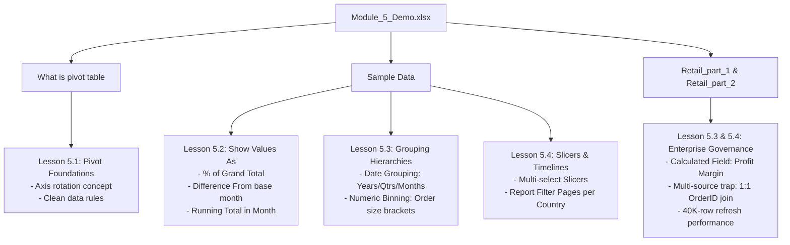

# 📦 Module 5 Dataset Documentation: Pivot Tables & Operational Data Models

> [!abstract] Dataset Overview
> The **Module 5 Pivot Tables Dataset** (`Module_5_Demo.xlsx`) serves as the core hands-on laboratory for **Module 5: Pivot Tables & Aggregation**. It contains five worksheet tabs spanning conceptual axis rotation demonstrations, an international multi-dimensional grocery sales dataset (`Sample Data`), and an enterprise-scale Egyptian retail dataset comprising **40,000 transactions** partitioned into two relational tables (`Retail_part_1 ` and `Retail_part_2`). This structure enables students to learn foundational cross-tabulations, advanced variance analysis, and multi-source integration challenges.

---

## 🗂️ Workbook Tab Directory

| Tab Name | Dimensions (Rows $\times$ Cols) | Primary Table Object | Key Educational Purpose & Data Schema |
| :--- | :---: | :---: | :--- |
| **`What is pivot table`** | $21 \times 22$ | Grid Matrix | Bilingual conceptual explanation (English & Arabic) defining what a Pivot Table is and illustrating the physical mechanics of rotating rows into columns and vice versa. |
| **`Sample Data`** | $218 \times 10$ | `Table2` (A3:J218) | 216 international grocery orders across 7 countries and 6 products. Primary dataset for `Alt + N + V`, 4 Quadrants, Date Grouping, and Show Values As (% of Total, Difference From). |
| **`Sheet5`** | $4 \times 1$ | Pivot Table | Initial validation Pivot Table aggregating a count of 40,001 `OrderID` records to verify cache indexing on large datasets. |
| **`Retail_part_1 `** | $40,003 \times 5$ | Raw Range | 40,000 Egyptian retail transactions detailing transaction headers: `OrderID`, `OrderDate` (2022–2025), `CustomerName`, `Category`, and `SubCategory`. |
| **`Retail_part_2`** | $40,001 \times 5$ | Raw Range | 40,000 transactional financial metrics: `OrderID`, `Region` (8 Egyptian governorates), `SalesAmount` (EGP), `Quantity`, and `Profit`. Primary dataset for Calculated Fields and multi-source data traps. |

---

## 📊 Relational Data Topology

```mermaid
erDiagram
    SAMPLE_DATA {
        int OrderID PK
        date Date
        string Product
        string Category
        string Country
        string Region
        string Month
        int Year
        string Quarter
        float Amount
    }

    RETAIL_PART_1 {
        int OrderID PK
        date OrderDate
        string CustomerName
        string Category
        string SubCategory
    }

    RETAIL_PART_2 {
        int OrderID PK_FK
        string Region
        float SalesAmount
        int Quantity
        float Profit
    }

    RETAIL_PART_1 ||--|| RETAIL_PART_2 : "1:1 Relationship via OrderID (Multi-Source Join)"
```

---

## 📋 Tab 1: `Sample Data` Data Dictionary (216 Records)

Located in `Sample Data` (Table name: `Table2`, coordinates `A3:J218`):

| Column Name | Excel Data Type | Business Description | Sample Values / Distinct Values |
|---|---|---|---|
| **`Order ID`** | Whole Number (`Integer`) | Unique transaction identifier | `1, 2, 3, ..., 216` |
| **`Date`** | Date (`YYYY-MM-DD`) | Order transaction timestamp | `2019-07-15` to `2019-11-20` |
| **`Product`** | Text (`String`) | Specific grocery commodity SKU | `Apple`, `Banana`, `Beans`, `Broccoli`, `Carrots`, `Orange` |
| **`Category`** | Text (`String`) | Product group classification | `Fruit`, `Vegetables` |
| **`Country`** | Text (`String`) | Country of commercial operation | `Australia`, `Canada`, `France`, `Germany`, `New Zealand`, `UK`, `US` |
| **`Region`** | Text (`String`) | Geographic territorial division | `East`, `North`, `South`, `West` |
| **`Month`** | Text (`String`) | Calendar month name | `July`, `August`, `September`, `October`, `November` |
| **`Year`** | Whole Number (`Integer`) | Calendar year of record | `2019` |
| **`Quarter`** | Text (`String`) | Fiscal/calendar quarter | `Q3`, `Q4` |
| **`Amount`** | Currency (`Numeric`) | Transaction revenue in USD | `$617.00` to `$9,062.00` (Mean: ~$2,770) |

---

## 📋 Tabs 4 & 5: Enterprise Retail Datasets (40,000 Records Each)

### Tab 4: `Retail_part_1 ` (Transaction Dimension)
- **Rows**: 40,000 transaction rows ($A1:E40003$).
- **Key Columns**:
  - `OrderID`: Unique integer identifier matching `Retail_part_2`.
  - `OrderDate`: Date spanning 4 years (`2022-01-01` through `2025-12-31`).
  - `CustomerName`: Egyptian retail customer names (`Youssef Ibrahim`, `Hany Zaki`, `Nour Ali`, `Fatma Galal`, `Omar Sami`, `Tamer Mostafa`, etc.).
  - `Category`: `Electronics`, `Furniture`, `Clothing`, `Food`.
  - `SubCategory`: `Mobiles`, `Chairs`, `Women`, `Kids`, `Dairy`, `Accessories`, `Beverages`, `Beds`, etc.

### Tab 5: `Retail_part_2` (Financial Fact Metrics)
- **Rows**: 40,000 transaction rows ($A1:E40001$).
- **Key Columns**:
  - `OrderID`: Primary key join field.
  - `Region`: 8 Egyptian governorates/cities (`Cairo`, `Giza`, `Alexandria`, `Mansoura`, `Tanta`, `Ismailia`, `Luxor`, `Aswan`).
  - `SalesAmount`: Gross sales value in EGP (ranging from $671.31 EGP to over $20,000 EGP).
  - `Quantity`: Number of units purchased (1 to 10 units).
  - `Profit`: Net profit earned on the order (EGP).

---

## 🎯 Educational Use Cases by Module 5 Lesson



### High-Yield Analytical Exercises for Students:
1. **Category Contribution**:
   - In `Sample Data`, calculate whether Fruit or Vegetables delivers higher total dollar revenue in the `US` versus `Germany`.
2. **MoM Pacing**:
   - Track monthly revenue pacing from July 2019 to November 2019 using `Running Total In`.
3. **Calculated Field Execution**:
   - In `Retail_part_2`, create a Calculated Field `= Profit / SalesAmount`. Audit why every region hovers around an average profit margin of 14.0%.
4. **The Multi-Source Challenge**:
   - Try to analyze `CustomerName` (from `Retail_part_1 `) against `Profit` (from `Retail_part_2`). Learn why an `XLOOKUP` bridge or Power Query merge is mandatory before pivoting.

---

## 🔗 Related Resources
- **Lesson Notes**:
  - [[01_Pivot_Table_Foundations]]
  - [[02_Advanced_Calculations_and_Show_Values_As]]
  - [[03_Grouping_and_Calculated_Fields]]
  - [[04_Interactive_Filtering_with_Slicers_and_Timelines]]
- **Mindmap Reference**: [`assets/module_5_pivot_tables_mindmap.png`](file:///d:/courses/Data%20Analysis%2026-27/7-Introducation%20to%20Data%20Fields%20(Excel)/assets/module_5_pivot_tables_mindmap.png)
- **Practice Challenge**: [[Ex04_Pivot_Table_Summaries]]
