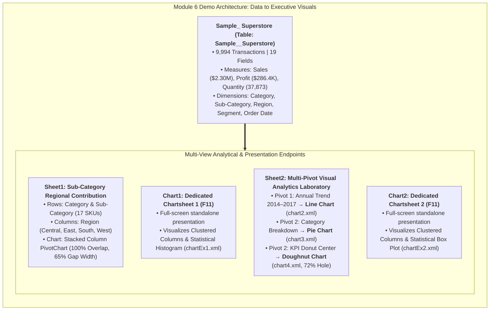

# 📦 Module 6 Dataset Documentation: Charts & Executive Visual Analytics

> [!abstract] Dataset & Workbook Overview
> The **Module 6 Demo Workbook** (`Module_6_Demo.xlsx`) serves as the official practice and visual modeling laboratory for **Module 6: Data Analysis Charts**. It combines an enterprise retail dataset (**`Sample_ Superstore`**, Table: `Sample__Superstore`, 9,994 records across 19 fields) with production multi-dimensional analytical views, full-screen chartsheets, time-series line trends, and category composition models across **6 dedicated sheets** housing **11 distinct chart objects**. This environment bridges data management, pivot table summarization, and cognitive visual design into publication-grade executive charts.

---

## 🗂️ Workbook Tab Directory

| Tab Name | Tab Classification | Primary Object | Key Educational Purpose & Analytical Schema |
| :--- | :--- | :---: | :--- |
| **`Sample_ Superstore`** | Data Worksheet ($9,995 \times 19$) | `Sample__Superstore` (Table) | 9,994 retail transaction line items spanning 2014–2017 across 4 geographic regions. Provides raw data for comparison bars, trend lines, donut composition, scatter plots, and filled maps. |
| **`Sheet1`** | Analytical Summary ($20 \times 7$) | PivotTable & Stacked Column PivotChart | Multi-dimensional cross-tabulation and PivotChart comparing **17 Sub-Categories across 4 Geographic Regions** (`Central`, `East`, `South`, `West`). Primary drill for stacked column geometry, gap width, and regional contribution analysis. |
| **`Chart1`** | Dedicated Chartsheet (`F11`) | Clustered Column & Statistical Histogram | Full-screen standalone presentation tab generated via `F11`. Demonstrates dedicated executive layout and native statistical **Histogram** binning (`chartEx1.xml` with zero gap width). |
| **`Sheet2`** | Multi-Pivot & Chart Laboratory ($19 \times 2$) | 2 PivotTables & 3 Charts (Line, Pie, Donut) | Houses two distinct analytical aggregations: (1) **Annual Sales Trend (2014–2017)** paired with a **Line Chart** (`chart2.xml`), and (2) **Category Sales Composition** paired with both a **Pie Chart** (`chart3.xml`) and a modern **Doughnut Chart** (`chart4.xml`, 72% hole size). |
| **`Chart2`** | Dedicated Chartsheet (`F11`) | Clustered Column & Box and Whisker Plot | Second full-screen standalone presentation tab generated via `F11`. Features an executive **Box and Whisker (`boxWhisker`)** distribution chart (`chartEx2.xml`) and clustered column comparison (`chart6.xml`). |

---

## 📊 Visual Analytics Architecture

---

## 📋 Tab 1: `Sample_ Superstore` Data Dictionary (9,994 Records)

Located in `Sample_ Superstore` (Table: `Sample__Superstore`, coordinates `A1:S9995`):

| Column Name | Excel Data Type | Business Description | Sample Values / Distinct Range |
| :--- | :--- | :--- | :--- |
| **`Row ID`** | Whole Number (`Integer`) | Sequential unique row counter | `1, 2, 3, ..., 9994` |
| **`Order ID`** | Text (`String`) | Transaction order code (Country-Year-ID) | `CA-2016-152156`, `US-2015-108966` |
| **`Order Date`** | Date (`YYYY-MM-DD`) | Date customer placed order | `2014-01-03` to `2017-12-30` |
| **`Ship Date`** | Date (`YYYY-MM-DD`) | Date product was dispatched | `2014-01-07` to `2018-01-05` |
| **`Ship Mode`** | Text (`String`) | Logistics delivery class (4 options) | `Standard Class`, `Second Class`, `First Class`, `Same Day` |
| **`Customer ID`** | Text (`String`) | Unique customer identifier code | `CG-12520`, `DV-13045`, `SO-20335` (793 distinct) |
| **`Segment`** | Text (`String`) | Customer classification (3 tiers) | `Consumer` (50.6%), `Corporate` (30.7%), `Home Office` (18.7%) |
| **`Country`** | Text (`String`) | Country of commercial operation | `United States` |
| **`City`** | Text (`String`) | Destination delivery city | `New York City`, `Los Angeles`, `Seattle`, `San Francisco` (531 cities) |
| **`State`** | Text (`String`) | Destination US state (49 states) | `California` (2,001), `New York` (1,128), `Texas` (985), `Pennsylvania` (587) |
| **`Region`** | Text (`String`) | Geographic sales district | `West` (3,203), `East` (2,848), `Central` (2,323), `South` (1,620) |
| **`Product ID`** | Text (`String`) | Unique SKU identifier | `FUR-BO-10001798`, `TEC-PH-10002275` (1,862 SKUs) |
| **`Category`** | Text (`String`) | High-level product department | `Technology`, `Furniture`, `Office Supplies` |
| **`Sub-Category`** | Text (`String`) | Detailed product grouping (17 items) | `Phones`, `Chairs`, `Storage`, `Tables`, `Binders`, `Copiers`, etc. |
| **`Product Name`** | Text (`String`) | Full commercial item description | `Global Troy Executive Leather Low-Back Tilter` |
| **`Sales`** | Currency (`Numeric`) | Gross transactional sales amount (USD) | `$0.44` to `$22,638.48` (Sum: `$2,297,200.86`) |
| **`Quantity`** | Whole Number (`Integer`) | Units purchased in order line | `1` to `14` (Sum: `37,873` units) |
| **`Discount`** | Percentage (`Decimal`) | Promotional markdown applied | `0.00` to `0.80` (Mean: `15.6%`) |
| **`Profit`** | Currency (`Numeric`) | Net financial margin realized (USD) | `-$6,599.98` to `+$8,399.98` (Sum: `$286,397.02`) |

---

## 📋 Tab 2: `Sheet1` PivotTable & Stacked Column PivotChart

`Sheet1` synthesizes product hierarchy with regional sales distribution, powering an interactive **Stacked Column PivotChart**:

### Multi-Dimensional Regional Sales Matrix (Audited Ground Truth)

| Category | Sub-Category | Central ($) | East ($) | South ($) | West ($) | Total Sales ($) | Regional Dominance |
| :--- | :--- | :---: | :---: | :---: | :---: | :---: | :--- |
| **Technology** | **Phones** | \$72,403.28 | \$100,614.98 | \$58,304.44 | \$98,684.35 | **\$330,007.05** | Coastal (East & West = 60.4%) |
| **Furniture** | **Chairs** | \$85,230.65 | \$96,260.68 | \$45,176.45 | \$101,781.33 | **\$328,449.10** | West Leads ($101.8K) |
| **Office Supplies**| **Storage** | \$45,930.11 | \$71,612.58 | \$35,768.06 | \$70,532.85 | **\$223,843.61** | East & West Tie (~$71K each) |
| **Furniture** | **Tables** | \$39,154.97 | \$39,139.81 | \$43,916.19 | \$84,754.56 | **\$206,965.53** | West Accounts for 41.0% |
| **Office Supplies**| **Binders** | \$56,923.28 | \$53,498.00 | \$37,030.34 | \$55,961.11 | **\$203,412.73** | Balanced across 4 Regions |
| **Technology** | **Machines** | \$26,797.38 | \$66,106.17 | \$53,890.96 | \$42,444.12 | **\$189,238.63** | East Leads ($66.1K) |
| **Technology** | **Accessories** | \$33,956.08 | \$45,033.37 | \$27,276.75 | \$61,114.12 | **\$167,380.32** | West Dominates ($61.1K) |
| **Technology** | **Copiers** | \$37,259.57 | \$53,219.46 | \$9,299.76 | \$49,749.24 | **\$149,528.03** | South Lowest ($9.3K) |
| **Furniture** | **Bookcases** | \$24,157.18 | \$43,819.33 | \$10,899.36 | \$36,004.12 | **\$114,880.00** | East Highest ($43.8K) |
| **Office Supplies**| **Appliances** | \$23,582.03 | \$34,188.47 | \$19,525.33 | \$30,236.34 | **\$107,532.16** | East Highest ($34.2K) |
| **Furniture** | **Furnishings** | \$15,254.37 | \$29,071.38 | \$17,306.68 | \$30,072.73 | **\$91,705.16** | West & East Strong |
| **Office Supplies**| **Paper** | \$17,491.90 | \$20,172.60 | \$14,150.98 | \$26,663.72 | **\$78,479.21** | West Highest ($26.7K) |
| **Office Supplies**| **Supplies** | \$9,467.37 | \$10,760.12 | \$8,318.93 | \$18,127.12 | **\$46,673.54** | West Accounts for 38.8% |
| **Office Supplies**| **Art** | \$5,765.34 | \$7,485.76 | \$4,655.62 | \$9,212.07 | **\$27,118.79** | Low Volume, High Margin |
| **Office Supplies**| **Envelopes** | \$4,636.87 | \$4,375.87 | \$3,345.56 | \$4,118.10 | **\$16,476.40** | Stable Uniform Demand |
| **Office Supplies**| **Labels** | \$2,451.47 | \$2,602.93 | \$2,353.18 | \$5,078.73 | **\$12,486.31** | West Leads ($5.1K) |
| **Office Supplies**| **Fasteners** | \$778.03 | \$819.72 | \$503.32 | \$923.22 | **\$3,024.28** | Micro-SKU ($3.0K Total) |
| **Summary Total** | **All Categories** | **\$501,239.89** | **\$678,781.43** | **\$391,722.90** | **\$725,456.64** | **\$2,297,200.86** | **West (31.6%) > East (29.5%)** |

---

## 📋 Dedicated Tabs: `Chart1`, `Chart2`, `Chart3` & `Sheet2`

### Tabs 3, 5 & 6: Dedicated Full-Screen Chartsheet Layouts (`F11`)
Unlike embedded floating charts, these Dedicated Chartsheet tabs occupy full-screen worksheets without spreadsheet cell gridlines, ideal for boardroom projection and deep distribution inspection:
1. **`Chart1` Chartsheet**: Houses Clustered Columns and a native statistical **Histogram** (`chartEx1.xml`) with zero gap width to reveal transaction frequency density.
2. **`Chart2` Chartsheet**: Houses Clustered Columns and a native statistical **Box and Whisker Plot** (`chartEx2.xml`, `layoutId="boxWhisker"`) to isolate median lines, IQR spans, and transaction outliers.
3. **`Chart3` Chartsheet**: Dedicated full-screen **Cartesian Scatter Plot** (`chart7.xml`) evaluating bivariate correlation between **Sales** (`$P$2:$P$9995`) and **Quantity** (`$Q$2:$Q$9995`) across all 9,994 transaction line items.

### Tab 4: `Sheet2` (Multi-Pivot Tables & Live Charts: Line, Pie, Donut)

`Sheet2` serves as a multi-model visualization laboratory combining two distinct analytical aggregation levels:

#### 1. Annual Time-Series Trajectory (Rows 3–8)
Paired with a **Line Chart** (`chart2.xml`, `lineChart` with optional smoothing), plotting enterprise revenue expansion:

| Calendar Year | Gross Annual Sales ($) | YoY Growth / Volume Trajectory |
| :---: | :---: | :--- |
| **2014** | \$484,247.50 | Baseline inaugural operational year |
| **2015** | \$470,532.51 | -2.8% slight dip (supply chain realignment) |
| **2016** | \$609,205.60 | +29.5% expansion surge across Technology & Furniture |
| **2017** | \$733,215.26 | +20.4% record revenue peak |
| **Total** | **\$2,297,200.86** | **Consistent Multi-Year Upward Momentum** |

#### 2. Category Sales Composition (Rows 15–19)
Paired with both a **Pie Chart** (`chart3.xml`) and an executive **Doughnut Chart** (`chart4.xml`, `holeSize="72"`):

| Product Category | Total Sales ($) | Revenue Share (%) | Visual Encoding & Role |
| :--- | :---: | :---: | :--- |
| **Technology** | \$836,154.03 | **36.4%** | Primary revenue engine (Phones, Machines, Copiers) |
| **Furniture** | \$741,999.80 | **32.3%** | High-volume core (Chairs, Tables, Bookcases) |
| **Office Supplies** | \$719,047.03 | **31.3%** | Stable recurring volume (Storage, Binders, Paper) |
| **Grand Total** | **\$2,297,200.86** | **100.0%** | **Perfect 3-Slice Part-to-Whole Composition** |

- **Doughnut Chart Technical Geometry**: `holeSize=72` provides an optimal 72% center opening, perfectly sized to accommodate an embedded aggregate KPI metric card (`$2.30M Total Sales`).

---

## 🎨 Complete Chart Inventory & Technical Specifications (11 Objects)

| Object ID | Package Location | Chart Type | Data Source / Sheet | Primary Visual Attributes |
| :--- | :--- | :--- | :--- | :--- |
| **Chart 1** | `xl/charts/chart1.xml` | **Stacked Column PivotChart** | `Sheet1` (`pt_SubCategorySales`) | 100% series overlap, 65% gap width, 4 regional stacks (Central, East, South, West) |
| **Chart 2** | `xl/charts/chart2.xml` | **Line Chart** | `Sheet2` (Rows 3–7) | Time-series trend (2014–2017), straight/smooth line geometry |
| **Chart 3** | `xl/charts/chart3.xml` | **Pie Chart** | `Sheet2` (Rows 15–18) | 3 categorical slices, part-to-whole share ($36.4\% / 32.3\% / 31.3\%$) |
| **Chart 4** | `xl/charts/chart4.xml` | **Doughnut Chart** | `Sheet2` (Rows 15–18) | **72% Hole Size**, ideal for center KPI scorecard embed |
| **ChartEx 1** | `xl/charts/chartEx1.xml`| **Process Funnel Chart** | `Sheet2` (Category Tiers) | Native Office 2016+ `funnel` layout, step-by-step volume tapering |
| **ChartEx 2** | `xl/charts/chartEx2.xml`| **Hierarchical Treemap** | `Sheet2` (Category Mix) | Native Office 2016+ `treemap` layout, nested proportional area rectangles |
| **Chart 5** | `xl/charts/chart5.xml` | **Clustered Column Chart** | `Chart1` (Dedicated Tab) | Full-screen presentation mode, clustered category comparison |
| **ChartEx 3** | `xl/charts/chartEx3.xml`| **Statistical Histogram** | `Chart1` (Dedicated Tab) | Native Office 2016+ statistical binning, 0% gap width |
| **Chart 6** | `xl/charts/chart6.xml` | **Clustered Column Chart** | `Chart2` (Dedicated Tab) | Full-screen presentation mode, clustered distribution comparison |
| **ChartEx 4** | `xl/charts/chartEx4.xml`| **Statistical Box & Whisker Plot** | `Chart2` (Dedicated Tab) | Native Office 2016+ `boxWhisker` layout, 5-number summary & outlier points |
| **Chart 7** | `xl/charts/chart7.xml` | **Cartesian Scatter Plot** | `Chart3` (Dedicated Tab) | Bivariate correlation between Sales ($P) and Quantity ($Q) across 9,994 transactions |

---

## 💡 Practical Applications & Course Connections

- **Lesson 6.1**: [[01_Visual_Analytics_and_Chart_Selection]] — Master Chart Selection Matrix, Comparison Columns, Line Trends, Pie vs Donut Part-to-Whole, Funnel, Treemap, Histogram, Box Plot, and Scatter Plot.
- **Lesson 6.2**: [[02_Formatting_and_Chart_Design_Rules]] — Gap Width tightening (50%–80%), Donut Hole Size (72%), Series Overlap (100%), and Dedicated Chartsheet layouts (`F11`: `Chart1`, `Chart2`, `Chart3`).
- **Lesson 6.3**: [[03_Dashboard_Visual_Hierarchy]] — Connecting `Sheet1` Stacked Columns, `Sheet2` Line Trends, Funnel, Treemap & Donut Composition to Executive Dashboards and multi-Pivot Slicers.
- **Student Workbook Repository**: [`11_Demos_and_Workbooks/README.md`](file:///d:/courses/Data%20Analysis%2026-27/7-Introducation%20to%20Data%20Fields%20(Excel)/11_Demos_and_Workbooks/README.md)
