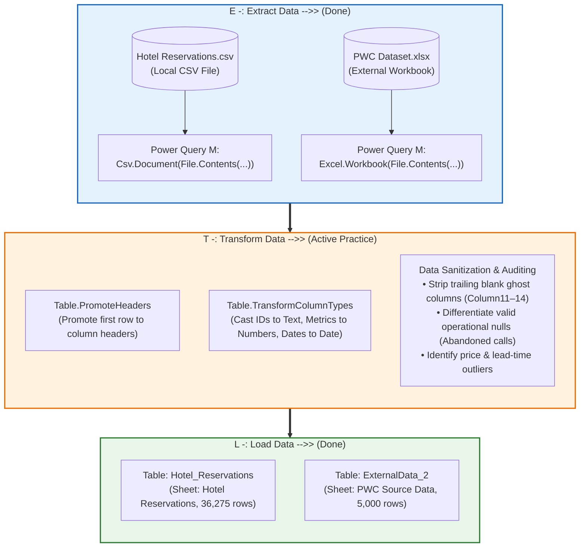

# 📦 Module 7 Dataset Documentation: Data Cleaning & Enterprise Ingestion

> [!abstract] Dataset & Workbook Overview
> The **Module 7 Demo Workbook** (`Module_7_Demo.xlsx`) serves as the official practice and operational laboratory for **Module 7: Importing Data and Data Cleaning**. It bridges multi-source ingestion channels with real-world data transformation workflows. Housing **41,275 combined operational records** across two production tables—**`Hotel_Reservations`** (36,275 rows) and **`PWC Source Data`** (5,000 rows)—it operationalizes the **ETL (Extract, Transform, Load)** lifecycle directly inside Microsoft Excel and Power Query.

---

## 🗂️ Workbook Tab Directory

| Tab Name | Tab Classification | Primary Object | Source Origin & Ingestion Channel | Key Educational Purpose & Transformation Scope |
| :--- | :--- | :---: | :--- | :--- |
| **`Hotel Reservations`** | Ingested Dataset ($36,276 \times 19$) | `Hotel_Reservations` (Table) | `Hotel Reservations.csv` via Power Query `Csv.Document` (Channel 3: CSV File) | Hospitality booking operations spanning 2017–2018. Demonstrates delimiter parsing, automated header promotion, numeric data typing (`Int64.Type`, `avg_price_per_room` currency), and outlier boundary analysis. |
| **`PWC Source Data`** | Ingested Dataset ($5,001 \times 14$) | `ExternalData_2` (Table) | `PWC Dataset.xlsx` (`Source Data ` sheet) via Power Query `Excel.Workbook` (Channel 2: Excel File) | Call center operational ticketing log (5,000 customer inquiries across 8 agents). Primary ground for handling 946 operational nulls (`Speed of answer in seconds`), time serial casting, and detecting 4 blank ghost columns (`Column11`–`Column14`). |

---

## 🌐 Dataset Provenance, Official Sources & Open Mirrors

Both datasets ingested into `Module_7_Demo.xlsx` are industry-standard benchmark assets with validated public mirrors:

### 1. PwC Switzerland Call Centre Trends Dataset
- **Official Forage Direct Download**: [Direct CDN Link (`01 Call-Center-Dataset.xlsx`)](https://cdn.theforage.com/vinternships/companyassets/4sLyCPgmsy8DA6Dh3/01%20Call-Center-Dataset.xlsx)
- **Canonical Origin**: **PwC Switzerland Digital Transformation & Power BI Virtual Case Experience on Forage**.
- **Context**: 5,000 inbound customer inquiries logged across Q1 2021 (January 1 – March 31, 2021) across 8 service agents.
- **Reference Project Hub**: [triwgani.github.io/pwc_digital.transformation](https://triwgani.github.io/pwc_digital.transformation/)
- **GitHub Benchmark Mirror**: [globalsmile/Call-Center-Analysis (`01 Call-Center-Dataset.xlsx`)](https://github.com/globalsmile/Call-Center-Analysis/blob/main/01%20Call-Center-Dataset.xlsx) (248 KB, exact matching column schema and `ID0001` Diane, `ID0002` Becky, `ID0003` Stewart initial records).
- **Course Raw File**: `09_Source_Materials/Module 9/13/PWC Dataset.xlsx` (Sheet: `Source Data `).

### 2. Hotel Reservations Hospitality Benchmark Dataset
- **Canonical Origin**: **Hotel Reservations Classification Dataset (CC0 Public Domain)** by Ahsan on Kaggle.
- **Context**: 36,275 real hospitality booking records spanning 2017–2018 for cancellation modeling and ADR revenue analysis.
- **Kaggle Primary Repository**: [Kaggle: Hotel Reservations Dataset](https://www.kaggle.com/datasets/ahsan81/hotel-reservations-classification-dataset)
- **Hugging Face Mirror**: [Hugging Face Parquet/CSV Mirror](https://huggingface.co/datasets/jason1966/ahsan81_hotel-reservations-classification-dataset)
- **Local Course Asset**: `D:\courses\Data Analysis 26-27\Hotel Reservations.csv`.

---

## ⚙️ The Live ETL Lifecycle Architecture

As executed live in `Module_7_Demo.xlsx`, data flows through the classic three-tier enterprise ETL cycle:



```text
36  ETL:
37
38  E -: Extract Data   -->> (Done)
39                      |
40  T -: Transform Data -->> (Active Practice)
41  L -: Load Data      -->> (Done)
```

---

## 💻 Live Power Query M Script Specifications

The queries inside `Module_7_Demo.xlsx` are driven by native Power Query M code stored in the workbook's Data Mashup package (`customXml/item1.xml`):

### 1. Hotel Reservations Extraction & Type Casting
```powerquery
shared #"Hotel Reservations" = let
    // Step 1: Extract CSV payload using comma delimiter
    Source = Csv.Document(
        File.Contents("D:\courses\Data Analysis 26-27\Hotel Reservations.csv"),
        [Delimiter=",", Columns=19, QuoteStyle=QuoteStyle.None]
    ),
    // Step 2: Promote first row of text to column headers
    #"Promoted Headers" = Table.PromoteHeaders(Source, [PromoteAllScalars=true]),
    // Step 3: Transform column types into strict types
    #"Changed Type" = Table.TransformColumnTypes(#"Promoted Headers",{
        {"Booking_ID", type text},
        {"no_of_adults", Int64.Type},
        {"no_of_children", Int64.Type},
        {"no_of_weekend_nights", Int64.Type},
        {"no_of_week_nights", Int64.Type},
        {"type_of_meal_plan", type text},
        {"required_car_parking_space", Int64.Type},
        {"room_type_reserved", type text},
        {"lead_time", Int64.Type},
        {"arrival_year", Int64.Type},
        {"arrival_month", Int64.Type},
        {"arrival_date", Int64.Type},
        {"market_segment_type", type text},
        {"repeated_guest", Int64.Type},
        {"no_of_previous_cancellations", Int64.Type},
        {"no_of_previous_bookings_not_canceled", Int64.Type},
        {"avg_price_per_room", type number},
        {"no_of_special_requests", Int64.Type},
        {"booking_status", type text}
    })
in
    #"Changed Type";
```

### 2. PWC Call Center Extraction & Ghost Column Audit
```powerquery
shared #"Source Data" = let
    // Step 1: Extract worksheet object from external Excel file
    Source = Excel.Workbook(
        File.Contents("D:\courses\Data Analysis 26-27\7-Introducation to Data Fields (Excel)\09_Source_Materials\Module 9\13\PWC Dataset.xlsx"),
        null,
        true
    ),
    // Step 2: Navigate to specific sheet Data table
    #"Source Data _Sheet" = Source{[Item="Source Data ",Kind="Sheet"]}[Data],
    // Step 3: Promote first row to column headers
    #"Promoted Headers" = Table.PromoteHeaders(#"Source Data _Sheet", [PromoteAllScalars=true]),
    // Step 4: Transform column types (Notice the 4 uncleaned trailing ghost columns)
    #"Changed Type" = Table.TransformColumnTypes(#"Promoted Headers",{
        {"Call Id", type text},
        {"Agent", type text},
        {"Date", type date},
        {"Time", type datetime},
        {"Topic", type text},
        {"Answered (Y/N)", type text},
        {"Resolved", type text},
        {"Speed of answer in seconds", Int64.Type},
        {"AvgTalkDuration", type datetime},
        {"Satisfaction rating", Int64.Type},
        {"Column11", type any},     // GHOST COLUMN TO BE REMOVED
        {"Column12", type any},     // GHOST COLUMN TO BE REMOVED
        {"Column13", type text},    // GHOST COLUMN TO BE REMOVED
        {"Column14", type text}     // GHOST COLUMN TO BE REMOVED
    })
in
    #"Changed Type";
```

---

## 📋 Comprehensive Field Catalog

### Table 1: `Hotel_Reservations` ($36,275 \times 19$)
| Field Name | Data Type | Sample Value | Description & Cleaning Considerations |
| :--- | :--- | :--- | :--- |
| `Booking_ID` | Text | `INN00001` | Primary key identifier. Audited for 100% uniqueness with zero duplicate entries. |
| `no_of_adults` | Whole Number | `2` | Number of adults registered. Bounds verified $\ge 0$. |
| `no_of_children` | Whole Number | `0` | Number of children registered. |
| `no_of_weekend_nights` | Whole Number | `1` | Saturday/Sunday overnight stay duration. |
| `no_of_week_nights` | Whole Number | `2` | Monday–Friday overnight stay duration. |
| `type_of_meal_plan` | Text | `Meal Plan 1` | Meal arrangement selected (`Meal Plan 1`, `Meal Plan 2`, `Not Selected`). Standardized casing. |
| `required_car_parking_space` | Binary / Integer | `0` | Boolean indicator (`0` = No, `1` = Yes) for parking reservation. |
| `room_type_reserved` | Text | `Room_Type 1` | Encrypted room category reserved by guest. |
| `lead_time` | Whole Number | `224` | Number of days elapsed between booking date and arrival date. Potential outliers ($> 350\text{ days}$). |
| `arrival_year` | Whole Number | `2017` | Year of scheduled check-in (`2017` or `2018`). |
| `arrival_month` | Whole Number | `10` | Calendar month index ($1\text{ to }12$). |
| `arrival_date` | Whole Number | `2` | Day of the month ($1\text{ to }31$). Combined via `=DATE(year, month, date)`. |
| `market_segment_type` | Text | `Offline` | Booking origin (`Online`, `Offline`, `Corporate`, `Complementary`, `Aviation`). |
| `repeated_guest` | Binary / Integer | `0` | Guest loyalty indicator (`0` = First-time visitor, `1` = Repeat customer). |
| `no_of_previous_cancellations` | Whole Number | `0` | Count of prior cancelled reservations on guest record. |
| `no_of_previous_bookings_not_canceled` | Whole Number | `0` | Count of successful past stays completed by guest. |
| `avg_price_per_room` | Decimal / Currency | `103.42` | Average daily rate (ADR) in USD. Note: $0.00 entries audited as valid *Complementary* stays. |
| `no_of_special_requests` | Whole Number | `0` | Total special requests logged by guest (e.g., high floor, crib). |
| `booking_status` | Text | `Not_Canceled` | Target classification label (`Not_Canceled` or `Canceled`). |

---

### Table 2: `PWC Source Data` ($5,000 \times 14$)
| Field Name | Data Type | Sample Value | Description & Cleaning Considerations |
| :--- | :--- | :--- | :--- |
| `Call Id` | Text | `001-A` | Unique call inquiry transaction key. |
| `Agent` | Text | `Diane` | Representative name handling the call (8 distinct agents). |
| `Date` | Date | `2021-01-01` | Operational call date (January–March 2021). |
| `Time` | Time / DateTime | `09:12:00` | Exact incoming call timestamp. |
| `Topic` | Text | `Contract related` | Inquiry subject (`Payment related`, `Technical support`, `Admin support`). |
| `Answered (Y/N)` | Text | `Y` | Binary response indicator (`Y` = Answered, `N` = Abandoned). |
| `Resolved` | Text | `Y` | Issue resolution indicator (`Y` or `N`). |
| `Speed of answer in seconds` | Integer | `30` | Queue hold time prior to agent connection. **Contains 946 nulls representing abandoned calls!** |
| `AvgTalkDuration` | Time / DateTime | `00:03:45` | Total elapsed conversation duration with agent. |
| `Satisfaction rating` | Integer | `3` | Customer CSAT rating on a scale of 1 to 5. Null when call was uncompleted. |
| `Column11` | Any / Blank | `null` | **Ghost Column**: Blank spreadsheet residue from original Excel extract; to be dropped in Power Query. |
| `Column12` | Any / Blank | `null` | **Ghost Column**: Blank spreadsheet residue to be removed. |
| `Column13` | Text / Blank | `null` | **Ghost Column**: Blank spreadsheet residue to be removed. |
| `Column14` | Text / Blank | `null` | **Ghost Column**: Blank spreadsheet residue to be removed. |

---

## 🎯 Hands-on Transformation Exercises in this Demo

### 1. Removing Irrelevant / Ghost Columns (`Table.RemoveColumns`)
When importing from older Excel files, phantom formatting in blank cells creates empty columns (`Column11` to `Column14`).
- **Power Query Action**: Select `Column11` through `Column14` $\rightarrow$ Right-click $\rightarrow$ **Remove Columns**.
- **Resulting M Code**:
  ```powerquery
  #"Removed Columns" = Table.RemoveColumns(#"Changed Type", {"Column11", "Column12", "Column13", "Column14"})
  ```

### 2. Auditing Missing Values (The 946 Nulls Dilemma)
- In `PWC Source Data`, column `Speed of answer in seconds` has 946 null values.
- **Rule**: Never delete these rows! They correspond 100% to `Answered (Y/N) = "N"`. Deleting them would falsely inflate the call resolution rate from 81.1% to 100%.

### 3. Date Engineering from Discrete Components
In `Hotel Reservations`, arrival is split into 3 columns: `arrival_year`, `arrival_month`, and `arrival_date`.
- **Excel Formula**:
  ```excel
  =DATE([@arrival_year], [@arrival_month], [@arrival_date])
  ```
- **Power Query Custom Column**:
  ```powerquery
  #Date([arrival_year], [arrival_month], [arrival_date])
  ```

---

## Related Knowledge
- Notes:
  - [[01_Data_Quality_Dimensions_and_Audit]]
  - [[02_Data_Cleaning_Techniques_in_Excel]]
  - [[03_Importing_Data_from_Enterprise_Sources]]
  - [[04_Business_Systems_for_Analysts]]
- Concepts: [[Data Cleaning]], [[ETL Process]], [[Power Query]], [[Six Dimensions of Data Quality]]
- Demo Workbook: [`Module_7_Demo.xlsx`](file:///d:/courses/Data%20Analysis%2026-27/7-Introducation%20to%20Data%20Fields%20(Excel)/11_Demos_and_Workbooks/07_Data_Cleaning/Module_7_Demo.xlsx)
