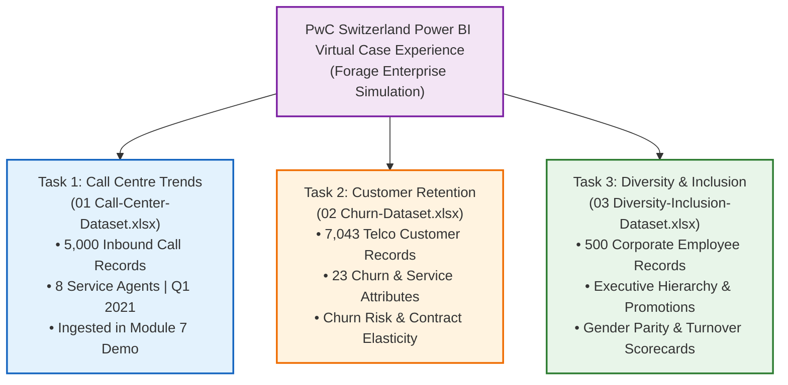
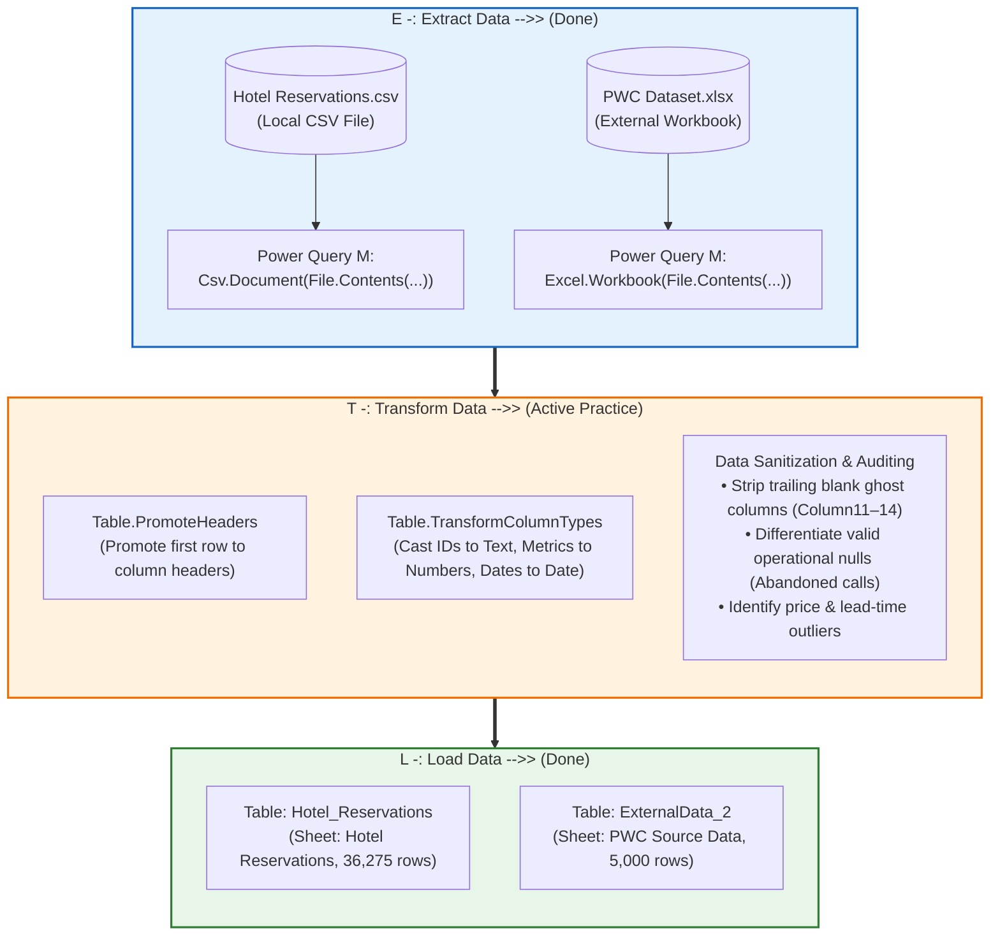
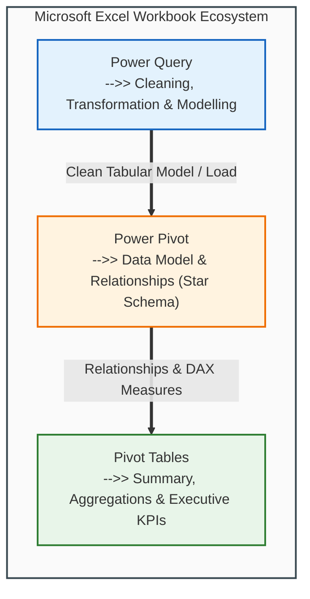

# 📦 Module 7 Dataset Documentation: Data Cleaning & Enterprise Ingestion

> [!abstract] Dataset & Workbook Overview
> The **Module 7 Demo Workbook** (`Module_7_Demo.xlsx`) serves as the official practice and operational laboratory for **Module 7: Importing Data and Data Cleaning**. It bridges multi-source enterprise ingestion channels (Excel, CSV, XML, JSON) with real-world data transformation workflows. Housing **66,745 combined operational records** across five production tables—**`Hotel_Reservations`** (36,275 rows), **`People`** (19,972 rows), **`Sample_ Superstore`** (9,994 rows), **`Product`** (504 rows), and **`Sheet1` / PwC Call Center** (5,000 rows)—it operationalizes the **ETL (Extract, Transform, Load)** lifecycle and the **Modern Excel Analytics Stack (Power Query $\to$ Power Pivot $\to$ Pivot Tables)** directly inside Microsoft Excel.

---

## 🗂️ Workbook Tab Directory

| Tab Name | Tab Classification | Primary Object | Source Origin & Ingestion Channel | Key Educational Purpose & Transformation Scope |
| :--- | :--- | :---: | :--- | :--- |
| **`Hotel Reservations`** | Ingested Dataset ($36,276 \times 19$) | `Hotel_Reservations` (Table) | `Hotel Reservations.csv` via Power Query `Csv.Document` (Channel 3: CSV File) | Hospitality booking operations spanning 2017–2018. Demonstrates delimiter parsing, automated header promotion, numeric data typing (`Int64.Type`, `avg_price_per_room` currency), and outlier boundary analysis. |
| **`Sample_ Superstore`** | Ingested Dataset ($9,995 \times 19$) | `Sample__Superstore` (Table) | `Sample_ Superstore.csv` via Power Query `Csv.Document` (Channel 3: CSV File, UTF-8 Encoding 65001) | Retail e-commerce transactions across Furniture, Office Supplies, and Technology. Demonstrates currency parsing, negative profit margins, hierarchical categories, and regional dimensional cross-filtering. |
| **`People`** | Ingested Dataset ($19,973 \times 5$) | `People` (Table) | `JSON_F52E2B61-18A1-11d1-B105-00805F49916B3.json` via Power Query `Json.Document` (Channel 6: JSON File) | Enterprise personnel register (19,972 contact records from AdventureWorks). Demonstrates JSON array-to-table expansion, record flattening, column projection (`Id`, `FirstName`, `LastName`, `EmailAddress`, `PhoneNumber`), and MIME/extension troubleshooting. |
| **`Product`** | Ingested Dataset ($505 \times 4$) | `Product` (Table) | `XML_F52E2B61-18A1-11d1-B105-00805F49916B1.xml` via Power Query `Xml.Tables` (Channel 5: XML File) | Manufacturing parts catalog (504 product lines from AdventureWorks). Demonstrates single-root XML parsing, node flattening (`ProductID`, `Name`, `ProductNumber`, `ListPrice`), and troubleshooting multi-root parsing errors. |
| **`Sheet1`** | Ingested Dataset ($5,001 \times 10$) | `Sheet1` (Table) | `01 Call-Center-Dataset.xlsx` (`Sheet1`) via Power Query `Excel.Workbook` (Channel 2: Excel File) | Authentic PwC Switzerland call center operational log (5,000 customer inquiries across 8 agents). Primary ground for handling 946 operational nulls (`Speed of answer in seconds`), time serial casting, and canonical 10-column schema ingestion. |

---

## 🌐 Dataset Provenance & The PwC Switzerland Simulation Suite

Both datasets ingested into `Module_7_Demo.xlsx` are industry-standard benchmark assets with validated public mirrors and authentic enterprise provenance:

### 1. The PwC Switzerland Power BI Virtual Case Experience Suite (Forage)

The `PWC Source Data` tab in `Module_7_Demo.xlsx` represents **Dataset 01** of the acclaimed **PwC Switzerland – Power BI Virtual Case Experience** hosted on **Forage**. In corporate analytics, this simulation is celebrated for delivering real-world, messy operational data across three distinct corporate departments:



#### 📦 The Complete Tripartite Dataset Suite

| Dataset # | Official Filename | PwC Simulation Task | Business Domain | Record Count & Scope | Direct Official Download Link |
| :---: | :--- | :--- | :--- | :--- | :--- |
| **01** | `01 Call-Center-Dataset.xlsx` | **Call Centre Trends** | Customer Support Operations | $5,000$ calls, $8$ agents, Q1 2021 (Includes 4 ghost columns) | [Download 01 Call-Center-Dataset.xlsx](https://cdn.theforage.com/vinternships/companyassets/4sLyCPgmsy8DA6Dh3/01%20Call-Center-Dataset.xlsx) |
| **02** | `02 Churn-Dataset.xlsx` | **Customer Retention** | Subscription & Customer Success | $7,043$ telco customers, 23 demographic & contract features | [Download 02 Churn-Dataset.xlsx](https://cdn.theforage.com/vinternships/companyassets/4sLyCPgmsy8DA6Dh3/02%20Churn-Dataset.xlsx) |
| **03** | `03 Diversity-Inclusion-Dataset.xlsx` | **Diversity & Inclusion** | Human Capital Management (HR) | $500$ employee records across corporate grades (FY20/FY21) | [Download 03 Diversity-Inclusion-Dataset.xlsx](https://cdn.theforage.com/vinternships/companyassets/4sLyCPgmsy8DA6Dh3/03%20Diversity-Inclusion-Dataset.xlsx) |

> [!IMPORTANT]
> **CDN Access & Automated Retrieval Notice:**
> The download URLs above point directly to the official Forage Content Delivery Network (`cdn.theforage.com/vinternships/companyassets/4sLyCPgmsy8DA6Dh3/`). These are the authentic, unadulterated source files from the PwC Switzerland simulation, not third-party recreations or modified Kaggle re-uploads. Note that while automated web scrapers and crawlers may encounter Cloudflare bot-protection when requesting these CDN links programmatically, human users can download and open them directly in any web browser.

#### 🏛️ Provenance, Documentation & Public Mirrors
- **Canonical Simulation Write-up & Documentation**: [triwgani.github.io/pwc_digital.transformation](https://triwgani.github.io/pwc_digital.transformation/) — Independent project documentation comprehensively mapping all three simulation tasks and dataset schemas.
- **Complete Simulation Suite GitHub Repository**: [Boomslang-Maverick/PWC-Forage-Power-BI-Virtual-Experience](https://github.com/Boomslang-Maverick/PWC-Forage-Power-BI-Virtual-Experience) — Preserves all three original `.xlsx` datasets alongside their respective PwC task briefs and business scenario guidelines.
- **Task 1 Single-File Mirror**: [globalsmile/Call-Center-Analysis](https://github.com/globalsmile/Call-Center-Analysis/blob/main/01%20Call-Center-Dataset.xlsx) — Dedicated public mirror of Dataset 01 matching our course raw file byte-for-byte.
- **Official Forage Simulation Enrollment**: [PwC Switzerland Power BI Virtual Case Experience](https://www.theforage.com/simulations/pwc-ch/power-bi-cqxg).
- **Course Raw Master File**: `09_Source_Materials/Module 9/13/PWC Dataset.xlsx` (Sheet: `Source Data `).

> [!TIP]
> **Portfolio Strategy Recommendation:**
> If you are building a professional data analyst portfolio, completing all three tasks from this PwC simulation represents a premier end-to-end showcase:
> 1. **Operations & Service Analytics**: Inbound ticketing, speed of answer, and agent CSAT scorecards (*Task 1*).
> 2. **Revenue & Churn Retention Analytics**: Customer lifetime value, contract risk elasticity, and preventive retention modeling (*Task 2*).
> 3. **Organizational & People Analytics**: Gender promotion parity, executive turnover, and DEI performance KPIs (*Task 3*).

---

### 2. Hotel Reservations Hospitality Benchmark Dataset
- **Canonical Origin**: **Hotel Reservations Classification Dataset (CC0 Public Domain)** by Ahsan on Kaggle.
- **Context**: 36,275 real hospitality booking records spanning 2017–2018 for cancellation modeling and ADR revenue analysis.
- **Kaggle Primary Repository**: [Kaggle: Hotel Reservations Dataset](https://www.kaggle.com/datasets/ahsan81/hotel-reservations-classification-dataset)
- **Hugging Face Mirror**: [Hugging Face Parquet/CSV Mirror](https://huggingface.co/datasets/jason1966/ahsan81_hotel-reservations-classification-dataset)
- **Local Course Asset**: `D:\courses\Data Analysis 26-27\Hotel Reservations.csv`.

---

## ⚙️ The Live ETL Lifecycle Architecture

As executed live in `Module_7_Demo.xlsx`, data flows through the classic three-tier enterprise ETL cycle:



```text
36  ETL:
37
38  E -: Extract Data   -->> (Done)
39                      |
40  T -: Transform Data -->> (Active Practice)
41  L -: Load Data      -->> (Done)
```

### 🏗️ Modern Excel Analytics Ecosystem Architecture



```text
Excel Workbook
Pivot Tables    -->> Summary
Power Query     -->> Cleaning and transformation and modelling
Power Pivot     -->> Data Model -- Relationships
```

| Layer | Core Functional Role | Technical Mechanism | Implementation in Module 7 & Course Demos |
| :--- | :--- | :--- | :--- |
| **Power Query** | **Cleaning, transformation and modelling** | Automated M-code pipeline (`Csv.Document`, `Excel.Workbook`, `Table.TransformColumnTypes`, `Table.RemoveColumns`) | Ingests raw external files, casts data types, purges ghost columns, and sanitizes missing values. |
| **Power Pivot** | **Data Model -- Relationships** | VertiPaq columnar in-memory database engine, 1-to-many relationships, DAX measures | Creates relational star schema between operational tables and dimension tables without bloated `VLOOKUP` / `XLOOKUP` helper columns. |
| **Pivot Tables** | **Summary** | Dynamic aggregations, multi-level grouping, interactive slicers, and timelines | Summarizes operational KPIs (e.g. Call Center 81.08% answer rate, Hotel cancellation distributions). |

---

## 💻 Live Power Query M Script Specifications

The queries inside `Module_7_Demo.xlsx` are driven by native Power Query M code stored in the workbook's Data Mashup package (`customXml/item1.xml`):

### 1. Hotel Reservations Extraction & Type Casting
```powerquery
shared #"Hotel Reservations" = let
    // Step 1: Extract CSV payload using comma delimiter
    Source = Csv.Document(
        File.Contents("D:\courses\Data Analysis 26-27\Hotel Reservations.csv"),
        [Delimiter=",", Columns=19, QuoteStyle=QuoteStyle.None]
    ),
    // Step 2: Promote first row of text to column headers
    #"Promoted Headers" = Table.PromoteHeaders(Source, [PromoteAllScalars=true]),
    // Step 3: Transform column types into strict types
    #"Changed Type" = Table.TransformColumnTypes(#"Promoted Headers",{
        {"Booking_ID", type text},
        {"no_of_adults", Int64.Type},
        {"no_of_children", Int64.Type},
        {"no_of_weekend_nights", Int64.Type},
        {"no_of_week_nights", Int64.Type},
        {"type_of_meal_plan", type text},
        {"required_car_parking_space", Int64.Type},
        {"room_type_reserved", type text},
        {"lead_time", Int64.Type},
        {"arrival_year", Int64.Type},
        {"arrival_month", Int64.Type},
        {"arrival_date", Int64.Type},
        {"market_segment_type", type text},
        {"repeated_guest", Int64.Type},
        {"no_of_previous_cancellations", Int64.Type},
        {"no_of_previous_bookings_not_canceled", Int64.Type},
        {"avg_price_per_room", type number},
        {"no_of_special_requests", Int64.Type},
        {"booking_status", type text}
    })
in
    #"Changed Type";
```

### 2. PWC Call Center Extraction (Original Forage Dataset: `01 Call-Center-Dataset.xlsx`)
```powerquery
shared #"Source Data" = let
    // Step 1: Ingest authentic Forage Excel workbook
    Source = Excel.Workbook(
        File.Contents("D:\courses\Data Analysis 26-27\01 Call-Center-Dataset.xlsx"), 
        null, 
        true
    ),
    // Step 2: Navigate to Sheet1 data payload
    Sheet1_Sheet = Source{[Item="Sheet1", Kind="Sheet"]}[Data],
    // Step 3: Promote first row of headers
    #"Promoted Headers" = Table.PromoteHeaders(Sheet1_Sheet, [PromoteAllScalars=true]),
    // Step 4: Enforce strict typed schema across all 10 canonical operational fields
    #"Changed Type" = Table.TransformColumnTypes(#"Promoted Headers",{
        {"Call Id", type text}, 
        {"Agent", type text}, 
        {"Date", type date}, 
        {"Time", type datetime}, 
        {"Topic", type text}, 
        {"Answered (Y/N)", type text}, 
        {"Resolved", type text}, 
        {"Speed of answer in seconds", Int64.Type}, 
        {"AvgTalkDuration", type datetime}, 
        {"Satisfaction rating", Int64.Type}
    })
in
    #"Changed Type";
```

### 3. Retail E-Commerce Extraction (`Sample_ Superstore.csv`)
```powerquery
shared #"Sample_ Superstore" = let
    // Step 1: Extract CSV payload using UTF-8 encoding (65001)
    Source = Csv.Document(
        File.Contents("D:\courses\Data Analysis 26-27\Sample_ Superstore.csv"),
        [Delimiter=",", Columns=19, Encoding=65001, QuoteStyle=QuoteStyle.None]
    ),
    // Step 2: Promote first row of text to column headers
    #"Promoted Headers" = Table.PromoteHeaders(Source, [PromoteAllScalars=true]),
    // Step 3: Enforce strict typed schema
    #"Changed Type" = Table.TransformColumnTypes(#"Promoted Headers",{
        {"Row ID", Int64.Type}, {"Order ID", type text}, {"Order Date", type text}, 
        {"Ship Date", type text}, {"Ship Mode", type text}, {"Customer ID", type text}, 
        {"Segment", type text}, {"Country", type text}, {"City", type text}, 
        {"State", type text}, {"Region", type text}, {"Product ID", type text}, 
        {"Category", type text}, {"Sub-Category", type text}, {"Product Name", type text}, 
        {"Sales", type number}, {"Quantity", Int64.Type}, {"Discount", type number}, 
        {"Profit", type number}
    })
in
    #"Changed Type";
```

### 4. Parts Catalog XML Extraction (`XML_F52E2B61-18A1-11d1-B105-00805F49916B1.xml`)
```powerquery
shared Product = let
    // Step 1: Parse single-root XML document into nested table structures
    Source = Xml.Tables(
        File.Contents("D:\courses\Data Analysis 26-27\7-Introducation to Data Fields (Excel)\09_Source_Materials\Module 7\2-Importing Data\XML_F52E2B61-18A1-11d1-B105-00805F49916B1.xml")
    ),
    // Step 2: Navigate to nested Product records table
    Table0 = Source{0}[Table],
    // Step 3: Enforce strict numeric and string types across all 504 items
    #"Changed Type" = Table.TransformColumnTypes(Table0,{
        {"ProductID", Int64.Type}, 
        {"Name", type text}, 
        {"ProductNumber", type text}, 
        {"ListPrice", type number}
    })
in
    #"Changed Type";
```

### 5. Personnel Register JSON Extraction (`JSON_F52E2B61-18A1-11d1-B105-00805F49916B3.json`)
```powerquery
shared People = let
    // Step 1: Read JSON document stream
    Source = Json.Document(
        File.Contents("D:\courses\Data Analysis 26-27\7-Introducation to Data Fields (Excel)\09_Source_Materials\Module 7\2-Importing Data\JSON_F52E2B61-18A1-11d1-B105-00805F49916B3.json")
    ),
    // Step 2: Extract nested People list object
    PeopleList = Source[People],
    // Step 3: Convert list of records into tabular format
    TableFromList = Table.FromList(PeopleList, Splitter.SplitByNothing(), null, null, ExtraValues.Error),
    // Step 4: Expand record keys into distinct columns (19,972 total rows)
    ExpandedColumn = Table.ExpandRecordColumn(
        TableFromList, 
        "Column1", 
        {"Id", "FirstName", "LastName", "EmailAddress", "PhoneNumber"}
    )
in
    ExpandedColumn;
```

---

## 📋 Comprehensive Field Catalog

### Table 1: `Hotel_Reservations` ($36,275 \times 19$)
| Field Name | Data Type | Sample Value | Description & Cleaning Considerations |
| :--- | :--- | :--- | :--- |
| `Booking_ID` | Text | `INN00001` | Primary key identifier. Audited for 100% uniqueness with zero duplicate entries. |
| `no_of_adults` | Whole Number | `2` | Number of adults registered. Bounds verified $\ge 0$. |
| `no_of_children` | Whole Number | `0` | Number of children registered. |
| `no_of_weekend_nights` | Whole Number | `1` | Saturday/Sunday overnight stay duration. |
| `no_of_week_nights` | Whole Number | `2` | Monday–Friday overnight stay duration. |
| `type_of_meal_plan` | Text | `Meal Plan 1` | Meal arrangement selected (`Meal Plan 1`, `Meal Plan 2`, `Not Selected`). Standardized casing. |
| `required_car_parking_space` | Binary / Integer | `0` | Boolean indicator (`0` = No, `1` = Yes) for parking reservation. |
| `room_type_reserved` | Text | `Room_Type 1` | Encrypted room category reserved by guest. |
| `lead_time` | Whole Number | `224` | Number of days elapsed between booking date and arrival date. Potential outliers ($> 350\text{ days}$). |
| `arrival_year` | Whole Number | `2017` | Year of scheduled check-in (`2017` or `2018`). |
| `arrival_month` | Whole Number | `10` | Calendar month index ($1\text{ to }12$). |
| `arrival_date` | Whole Number | `2` | Day of the month ($1\text{ to }31$). Combined via `=DATE(year, month, date)`. |
| `market_segment_type` | Text | `Offline` | Booking origin (`Online`, `Offline`, `Corporate`, `Complementary`, `Aviation`). |
| `repeated_guest` | Binary / Integer | `0` | Guest loyalty indicator (`0` = First-time visitor, `1` = Repeat customer). |
| `no_of_previous_cancellations` | Whole Number | `0` | Count of prior cancelled reservations on guest record. |
| `no_of_previous_bookings_not_canceled` | Whole Number | `0` | Count of successful past stays completed by guest. |
| `avg_price_per_room` | Decimal / Currency | `103.42` | Average daily rate (ADR) in USD. Note: $0.00 entries audited as valid *Complementary* stays. |
| `no_of_special_requests` | Whole Number | `0` | Total special requests logged by guest (e.g., high floor, crib). |
| `booking_status` | Text | `Not_Canceled` | Target classification label (`Not_Canceled` or `Canceled`). |

---

### Table 2: `Sheet1` / PwC Call Center ($5,000 \times 10$)
| Field Name | Data Type | Sample Value | Description & Cleaning Considerations |
| :--- | :--- | :--- | :--- |
| `Call Id` | Text | `001-A` | Unique call inquiry transaction key. |
| `Agent` | Text | `Diane` | Representative name handling the call (8 distinct agents). |
| `Date` | Date | `2021-01-01` | Operational call date (January–March 2021). |
| `Time` | Time / DateTime | `09:12:00` | Exact incoming call timestamp. |
| `Topic` | Text | `Contract related` | Inquiry subject (`Payment related`, `Technical support`, `Admin support`). |
| `Answered (Y/N)` | Text | `Y` | Binary response indicator (`Y` = Answered, `N` = Abandoned). |
| `Resolved` | Text | `Y` | Issue resolution indicator (`Y` or `N`). |
| `Speed of answer in seconds` | Integer | `30` | Queue hold time prior to agent connection. **Contains 946 nulls representing abandoned calls!** |
| `AvgTalkDuration` | Time / DateTime | `00:03:45` | Total elapsed conversation duration with agent. |
| `Satisfaction rating` | Integer | `3` | Customer CSAT rating on a scale of 1 to 5. Null when call was uncompleted. |

---

### Table 3: `Sample__Superstore` ($9,994 \times 19$)
| Field Name | Data Type | Sample Value | Description & Cleaning Considerations |
| :--- | :--- | :--- | :--- |
| `Row ID` | Integer | `1` | Sequential transaction index (1 to 9,994). |
| `Order ID` | Text | `CA-2016-152156` | Composite order key incorporating country, year, and serial. |
| `Order Date` / `Ship Date` | Text / Date | `11/8/2016` | Order processing and dispatch timestamps. |
| `Ship Mode` | Text | `Second Class` | Delivery priority (`Standard Class`, `Second Class`, `First Class`, `Same Day`). |
| `Customer ID` / `Segment` | Text | `CG-12520` / `Consumer` | Client identifier and market segment (`Consumer`, `Corporate`, `Home Office`). |
| `Country` / `City` / `State` / `Region` | Text | `United States` / `Henderson` / `Kentucky` / `South` | Geographic hierarchical dimensions for regional spatial analysis. |
| `Product ID` / `Category` / `Sub-Category` | Text | `FUR-BO-10001798` / `Furniture` / `Bookcases` | Merchandise taxonomy across 3 departments and 17 sub-categories. |
| `Product Name` | Text | `Bush Somerset Collection Bookcase` | Granular item description. Standardized casing and whitespace. |
| `Sales` | Decimal / Currency | `261.96` | Gross transactional sales revenue in USD. |
| `Quantity` | Integer | `2` | Units purchased per transaction line. |
| `Discount` | Decimal / Percentage | `0.00` | Applied promotional discount rate ($0.00\text{ to }0.80$). |
| `Profit` | Decimal / Currency | `41.91` | Net operational profit (contains negative values indicating unprofitable lines). |

---

### Table 4: `People` ($19,972 \times 5$)
| Field Name | Data Type | Sample Value | Description & Cleaning Considerations |
| :--- | :--- | :--- | :--- |
| `Id` | Integer | `285` | Unique personnel/business entity identifier from AdventureWorks. |
| `FirstName` | Text | `Syed` | Individual first name string. |
| `LastName` | Text | `Abbas` | Individual last name string. |
| `EmailAddress` | Text | `syed0@adventure-works.com` | Corporate email address. Audited for syntax validation. |
| `PhoneNumber` | Text | `926-555-0182` | Formatted contact phone number. |

---

### Table 5: `Product` ($504 \times 4$)
| Field Name | Data Type | Sample Value | Description & Cleaning Considerations |
| :--- | :--- | :--- | :--- |
| `ProductID` | Integer | `1` | Unique primary key for manufacturing inventory item. |
| `Name` | Text | `Adjustable Race` | Component part designation. |
| `ProductNumber` | Text | `AR-5381` | SKU / alphanumeric product code. |
| `ListPrice` | Decimal / Currency | `0.0000` | Recommended catalog price in USD ($0.00 for non-salable sub-assembly parts). |

---

## 🎯 Hands-on Transformation Exercises in this Demo

### 1. Removing Irrelevant / Ghost Columns (`Table.RemoveColumns`)
When importing from older Excel files, phantom formatting in blank cells creates empty columns (`Column11` to `Column14`).
- **Power Query Action**: Select `Column11` through `Column14` $\rightarrow$ Right-click $\rightarrow$ **Remove Columns**.
- **Resulting M Code**:
  ```powerquery
  #"Removed Columns" = Table.RemoveColumns(#"Changed Type", {"Column11", "Column12", "Column13", "Column14"})
  ```

### 2. Auditing Missing Values (The 946 Nulls Dilemma)
- In `PWC Source Data`, column `Speed of answer in seconds` has 946 null values.
- **Rule**: Never delete these rows! They correspond 100% to `Answered (Y/N) = "N"`. Deleting them would falsely inflate the call resolution rate from 81.1% to 100%.

### 3. Date Engineering from Discrete Components
In `Hotel Reservations`, arrival is split into 3 columns: `arrival_year`, `arrival_month`, and `arrival_date`.
- **Excel Formula**:
  ```excel
  =DATE([@arrival_year], [@arrival_month], [@arrival_date])
  ```
- **Power Query Custom Column**:
  ```powerquery
  #Date([arrival_year], [arrival_month], [arrival_date])
  ```

---

## Related Knowledge
- Notes:
  - [[01_Data_Quality_Dimensions_and_Audit]]
  - [[02_Data_Cleaning_Techniques_in_Excel]]
  - [[03_Importing_Data_from_Enterprise_Sources]]
  - [[04_Business_Systems_for_Analysts]]
- Concepts: [[Data Cleaning]], [[ETL Process]], [[Power Query]], [[Six Dimensions of Data Quality]]
- Demo Workbook: [`Module_7_Demo.xlsx`](file:///d:/courses/Data%20Analysis%2026-27/7-Introducation%20to%20Data%20Fields%20(Excel)/11_Demos_and_Workbooks/07_Data_Cleaning/Module_7_Demo.xlsx)
