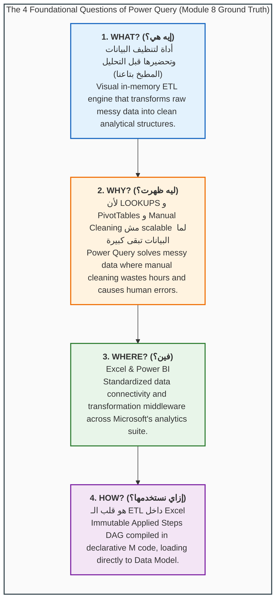
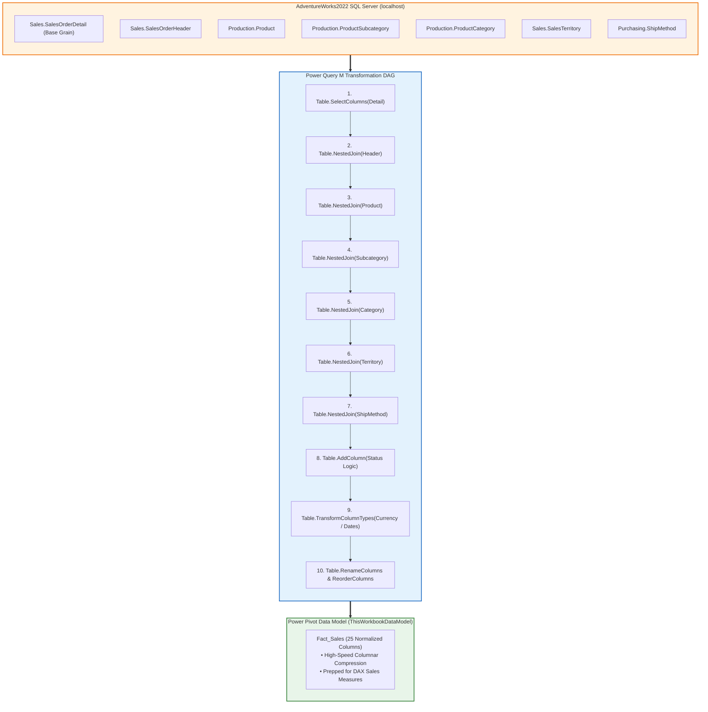
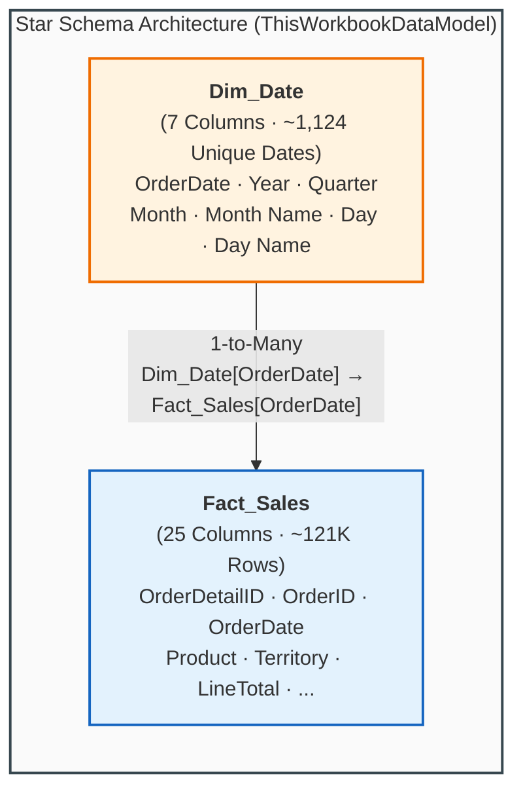

# 📦 Module 8 Dataset Documentation: Power Query & M Language Laboratory

> [!abstract] Dataset & Workbook Overview
> The **Module 8 Demo Workbook** ([`Module_8_Demo.xlsx`](file:///d:/courses/Data%20Analysis%2026-27/7-Introducation%20to%20Data%20Fields%20(Excel)/11_Demos_and_Workbooks/08_Power_Query/Module_8_Demo.xlsx)) serves as the official practice and operational laboratory for **Module 8: Power Query & M Language**. It grounds students in the fundamental architectural shift from manual cell-based manipulation to automated, reproducible data pipelines. Built upon the conceptual metaphor of **"المطبخ بتاعنا" (The Data Kitchen)**, the workbook pairs a foundational bilingual strategy tab (**`Intro`**) with enterprise ETL pipelines—featuring **`Fact_Sales`** (a 13-step Star Schema mashup connecting to **Microsoft SQL Server `AdventureWorks2022`** across 7 relational tables) alongside **`Dim_Date`** (a derived calendar dimension table extracting distinct dates and enriching them with 6 temporal intelligence columns) streaming directly into the **Power Pivot VertiPaq Data Model** (`ThisWorkbookDataModel`) as a proper **Star Schema**.

---

## 🗂️ Workbook Tab & Object Directory

| Object / Tab Name | Object Classification | Dimensions / Scope | Ingestion Channel & Storage | Educational Purpose & Architectural Significance |
| :--- | :--- | :---: | :--- | :--- |
| **`Intro`** | Worksheet Tab | $47\text{ Rows} \times 23\text{ Columns}$ | Native Excel Worksheet Grid | Anchors the pedagogical blueprint answering the **4 Essential Questions (What, Why, Where, How)**. Introduces the **"Data Kitchen" (`المطبخ بتاعنا`)** metaphor and details why manual lookups and formula cleaning fail at scale. |
| **`Fact_Sales`** | Power Query M Query | $25\text{ Normalized Columns}$ | Power Query M Formula (`Formulas/Section1.m`) | Connects to local SQL Server `AdventureWorks2022`, merges 7 relational tables via `Table.NestedJoin`, expands dimensional attributes, derives order status, enforces strict financial/date types, and delivers an enterprise Star Schema fact table. |
| **`Dim_Date`** | Power Query M Query | $7\text{ Columns}$ | Power Query M Formula (`Formulas/Section1.m`) — Derived from `Fact_Sales` | Derives distinct `OrderDate` values from `Fact_Sales` via query-to-query reference, enriches each date with `Year`, `Quarter` (Q1–Q4), `Month`, `Month Name`, `Day`, and `Day Name` columns, forming the calendar dimension of the Star Schema. |
| **`ThisWorkbookDataModel`** | VertiPaq Data Model | Multi-Table Star Schema | Power Pivot In-Memory Columnar Database | Stores `Fact_Sales` and `Dim_Date` as high-performance analytical model tables linked via `OrderDate` (1-to-Many), enabling Time Intelligence DAX measures without rendering raw rows into the Excel grid. |

---

## 🧠 The 4 Foundational Questions Framework

The `Intro` sheet formalizes the core theoretical pillars that distinguish junior spreadsheet users from senior analytics engineers:



### 1. What is Power Query? (`إيه هي؟`)
- **Arabic Definition**: «أداة لتنظيف البيانات وتحضيرها قبل التحليل (المطبخ بتاعنا)»
- **The Data Kitchen Metaphor**:
  - In a commercial restaurant, raw vegetables, unwashed herbs, and uncut meats never appear on the customer's table in the dining room.
  - The **Kitchen** is where prep cooks wash, peel, chop, debone, and season raw ingredients.
  - The **Dining Room** is where guests are served elegant, finished plates.
  - In Excel Analytics:
    - **Raw Ingredients** = Unclean CSVs, ERP dumps, database extracts, and web tables.
    - **The Kitchen** = **Power Query** (where data is filtered, unpivoted, cleansed, and typed).
    - **The Plated Dish** = **Power Pivot Data Model**, PivotTables, and Executive Dashboards.

### 2. Why Did It Emerge? (`ليه ظهرت؟`)
- **Arabic Definition**: «لأن الـ LOOKUPS و PivotTables و Manual Cleaning مش scalable لما البيانات تبقى كبيرة. Power Query اتعمل علشان يحل مشكلة البيانات الـ messy اللي تنظيفها يدوي بيضيع وقت وبيعمل أخطاء.»
- **The Scalability Wall**:
  - Traditional `=VLOOKUP` and `=XLOOKUP` formulas recalculate cell-by-cell on the grid. On 100,000+ rows, they freeze Microsoft Excel.
  - PivotTables require tidy, tabular columns; feeding them raw, cross-tabulated reports yields incorrect totals and broken hierarchies.
  - Manual copy-pasting and text trimming are prone to accidental keystrokes, undetected deletions, and wasted analyst hours.
  - Power Query solves this permanently with **"Build Once, Refresh Forever"** non-destructive automation.

### 3. Where Does It Live? (`فين؟`)
- **Core Ecosystem**: **Excel & Power BI**
- Skills mastered in Power Query inside Excel transfer 100% into Power BI Desktop, Power BI Dataflows, and Microsoft Fabric Dataflows Gen2.

### 4. How Do We Use It? (`إزاي نستخدمها؟ - ملخص`)
From the operational summary documented in `Module_8_Demo.xlsx`:
1. **هو عبارة عن أداة ETL داخل Excel**: Handles extraction from files/APIs/databases, in-memory transformations, and loading into analytical destinations.
2. **كل خطوة بتعملها جواه بتتسجل تلقائيًا كـ Applied Steps وكود M تقدر تعيده على أي بيانات جديدة**: Generates an immutable, repeatable Directed Acyclic Graph (DAG) recipe.
3. **Power Query بيئة مستقلة عن Excel، مش فورمولا ومش Pivot—هو Tool مخصصة لتنظيف وتجهيز البيانات**: Operates in its own execution sandbox; it does not burden worksheet cells and feeds the downstream Data Model seamlessly.
4. **بتستخدمه لما يكون عندك شغل متكرر، دمج ملفات، تنظيف تقيل، أو تجهيز Data للـ dashboards والتحليل**: The cornerstone of reliable enterprise business intelligence pipelines.

---

## 🛠️ Pipeline 1: Enterprise SQL Server Multi-Table Mashup (`Fact_Sales`)

Extracted directly from the embedded OpenXML package (`customXml/item6.xml` $\to$ `Formulas/Section1.m`) of [`Module_8_Demo.xlsx`](file:///d:/courses/Data%20Analysis%2026-27/7-Introducation%20to%20Data%20Fields%20(Excel)/11_Demos_and_Workbooks/08_Power_Query/Module_8_Demo.xlsx):

```powerquery
section Section1;

shared Fact_Sales = let
    //==================================================
    // 1. CONNECT TO LOCAL SQL SERVER
    //==================================================
    Source = Sql.Database(
        "localhost",
        "AdventureWorks2022"
    ),

    //==================================================
    // 2. NAVIGATE TO SQL SERVER TABLES
    //==================================================
    SalesOrderDetail = Source{
        [Schema = "Sales", Item = "SalesOrderDetail"]
    }[Data],

    SalesOrderHeader = Source{
        [Schema = "Sales", Item = "SalesOrderHeader"]
    }[Data],

    Product = Source{
        [Schema = "Production", Item = "Product"]
    }[Data],

    ProductSubcategory = Source{
        [Schema = "Production", Item = "ProductSubcategory"]
    }[Data],

    ProductCategory = Source{
        [Schema = "Production", Item = "ProductCategory"]
    }[Data],

    SalesTerritory = Source{
        [Schema = "Sales", Item = "SalesTerritory"]
    }[Data],

    ShipMethod = Source{
        [Schema = "Purchasing", Item = "ShipMethod"]
    }[Data],

    //==================================================
    // 3. BASE TABLE: SALES ORDER DETAILS
    //    GRAIN: ONE ROW PER SALES ORDER LINE
    //==================================================
    Detail = Table.SelectColumns(
        SalesOrderDetail,
        {
            "SalesOrderID",
            "SalesOrderDetailID",
            "ProductID",
            "OrderQty",
            "UnitPrice",
            "UnitPriceDiscount",
            "LineTotal"
        }
    ),

    //==================================================
    // 4. MERGE SALES ORDER HEADER
    //==================================================
    MergeHeader = Table.NestedJoin(
        Detail,
        {"SalesOrderID"},
        SalesOrderHeader,
        {"SalesOrderID"},
        "Header",
        JoinKind.LeftOuter
    ),

    ExpandHeader = Table.ExpandTableColumn(
        MergeHeader,
        "Header",
        {
            "OrderDate",
            "DueDate",
            "ShipDate",
            "Status",
            "OnlineOrderFlag",
            "CustomerID",
            "SalesPersonID",
            "TerritoryID",
            "ShipMethodID"
        },
        {
            "OrderDate",
            "DueDate",
            "ShipDate",
            "StatusID",
            "OnlineOrderFlag",
            "CustomerID",
            "SalesPersonID",
            "TerritoryID",
            "ShipMethodID"
        }
    ),

    //==================================================
    // 5. MERGE PRODUCT
    //==================================================
    MergeProduct = Table.NestedJoin(
        ExpandHeader,
        {"ProductID"},
        Product,
        {"ProductID"},
        "ProductLookup",
        JoinKind.LeftOuter
    ),

    ExpandProduct = Table.ExpandTableColumn(
        MergeProduct,
        "ProductLookup",
        {
            "Name",
            "ProductSubcategoryID"
        },
        {
            "Product",
            "ProductSubcategoryID"
        }
    ),

    //==================================================
    // 6. MERGE PRODUCT SUBCATEGORY
    //==================================================
    MergeSubcategory = Table.NestedJoin(
        ExpandProduct,
        {"ProductSubcategoryID"},
        ProductSubcategory,
        {"ProductSubcategoryID"},
        "SubcategoryLookup",
        JoinKind.LeftOuter
    ),

    ExpandSubcategory = Table.ExpandTableColumn(
        MergeSubcategory,
        "SubcategoryLookup",
        {
            "Name",
            "ProductCategoryID"
        },
        {
            "ProductSubCategory",
            "ProductCategoryID"
        }
    ),

    //==================================================
    // 7. MERGE PRODUCT CATEGORY
    //==================================================
    MergeCategory = Table.NestedJoin(
        ExpandSubcategory,
        {"ProductCategoryID"},
        ProductCategory,
        {"ProductCategoryID"},
        "CategoryLookup",
        JoinKind.LeftOuter
    ),

    ExpandCategory = Table.ExpandTableColumn(
        MergeCategory,
        "CategoryLookup",
        {"Name"},
        {"ProductCategory"}
    ),

    //==================================================
    // 8. MERGE SALES TERRITORY
    //==================================================
    MergeTerritory = Table.NestedJoin(
        ExpandCategory,
        {"TerritoryID"},
        SalesTerritory,
        {"TerritoryID"},
        "TerritoryLookup",
        JoinKind.LeftOuter
    ),

    ExpandTerritory = Table.ExpandTableColumn(
        MergeTerritory,
        "TerritoryLookup",
        {
            "Name",
            "Group"
        },
        {
            "Territory",
            "TerritoryGroup"
        }
    ),

    //==================================================
    // 9. MERGE SHIPPING METHOD
    //==================================================
    MergeShipMethod = Table.NestedJoin(
        ExpandTerritory,
        {"ShipMethodID"},
        ShipMethod,
        {"ShipMethodID"},
        "ShipMethodLookup",
        JoinKind.LeftOuter
    ),

    ExpandShipMethod = Table.ExpandTableColumn(
        MergeShipMethod,
        "ShipMethodLookup",
        {"Name"},
        {"ShipMethod"}
    ),

    //==================================================
    // 10. ADD READABLE ORDER STATUS
    //==================================================
    AddStatus = Table.AddColumn(
        ExpandShipMethod,
        "Status",
        each
            if [StatusID] = 1 then "In Process"
            else if [StatusID] = 2 then "Approved"
            else if [StatusID] = 3 then "Backordered"
            else if [StatusID] = 4 then "Rejected"
            else if [StatusID] = 5 then "Shipped"
            else if [StatusID] = 6 then "Cancelled"
            else "Unknown",
        type text
    ),

    //==================================================
    // 11. SET DATA TYPES
    //==================================================
    SetTypes = Table.TransformColumnTypes(
        AddStatus,
        {
            {"SalesOrderID", Int64.Type},
            {"SalesOrderDetailID", type number},
            {"ProductID", Int64.Type},
            {"ProductSubcategoryID", Int64.Type},
            {"ProductCategoryID", Int64.Type},
            {"CustomerID", Int64.Type},
            {"SalesPersonID", Int64.Type},
            {"TerritoryID", Int64.Type},
            {"ShipMethodID", Int64.Type},
            {"OrderQty", Int64.Type},
            {"UnitPrice", Currency.Type},
            {"UnitPriceDiscount", type number},
            {"LineTotal", Currency.Type},
            {"OrderDate", type date},
            {"DueDate", type date},
            {"ShipDate", type date},
            {"StatusID", Int64.Type},
            {"OnlineOrderFlag", type logical}
        }
    ),

    //==================================================
    // 12. RENAME COLUMNS TO MATCH VISUALS
    //==================================================
    RenameColumns = Table.RenameColumns(
        SetTypes,
        {
            {"SalesOrderDetailID", "OrderDetailID"},
            {"SalesOrderID", "OrderID"}
        }
    ),

    //==================================================
    // 13. REORDER FINAL FACT SALES COLUMNS
    //==================================================
    Final = Table.ReorderColumns(
        RenameColumns,
        {
            "OrderDetailID",
            "OrderID",
            "OrderDate",
            "DueDate",
            "ShipDate",
            "StatusID",
            "Status",
            "OnlineOrderFlag",
            "CustomerID",
            "SalesPersonID",
            "TerritoryID",
            "Territory",
            "TerritoryGroup",
            "ShipMethodID",
            "ShipMethod",
            "ProductID",
            "Product",
            "ProductSubCategory",
            "ProductCategory",
            "OrderQty",
            "UnitPrice",
            "UnitPriceDiscount",
            "LineTotal",
            "ProductSubcategoryID",
            "ProductCategoryID"
        },
        MissingField.Ignore
    )

in
    Final;
```



---

## 📋 Data Dictionary: `Fact_Sales` Schema ($25\text{ Columns}$)

| Field Name | Storage Data Type | Sample Value | Business Meaning & Analytical Utility | Upstream Origin Table |
| :--- | :--- | :--- | :--- | :--- |
| `OrderDetailID` | Number (`type number`) | `1` | Primary key of line item record. | `Sales.SalesOrderDetail` |
| `OrderID` | Integer (`Int64.Type`) | `43659` | Foreign key referencing sales order document. | `Sales.SalesOrderDetail` |
| `OrderDate` | Date (`type date`) | `2011-05-31` | Transaction placement date. | `Sales.SalesOrderHeader` |
| `DueDate` | Date (`type date`) | `2011-06-12` | Contractual delivery target date. | `Sales.SalesOrderHeader` |
| `ShipDate` | Date (`type date`) | `2011-06-07` | Fulfillment warehouse dispatch date. | `Sales.SalesOrderHeader` |
| `StatusID` | Integer (`Int64.Type`) | `5` | Raw status code ($1\text{ to }6$). | `Sales.SalesOrderHeader` |
| `Status` | Text (`type text`) | `Shipped` | Human-readable status derived via conditional logic. | Derived (`Table.AddColumn`) |
| `OnlineOrderFlag` | Logical (`type logical`) | `false` | Distinguishes e-commerce vs B2B salesperson orders. | `Sales.SalesOrderHeader` |
| `CustomerID` | Integer (`Int64.Type`) | `29825` | Client corporate/retail identifier. | `Sales.SalesOrderHeader` |
| `SalesPersonID` | Integer (`Int64.Type`) | `279` | Internal representative commission ID. | `Sales.SalesOrderHeader` |
| `TerritoryID` | Integer (`Int64.Type`) | `5` | Sales territory region index. | `Sales.SalesOrderHeader` |
| `Territory` | Text (`type text`) | `Southeast` | Geographic division designation. | `Sales.SalesTerritory` |
| `TerritoryGroup` | Text (`type text`) | `North America` | Continental macro-region grouping. | `Sales.SalesTerritory` |
| `ShipMethodID` | Integer (`Int64.Type`) | `5` | Logistics freight carrier ID. | `Sales.SalesOrderHeader` |
| `ShipMethod` | Text (`type text`) | `CARGO TRANSPORT 5` | Delivery carrier method name. | `Purchasing.ShipMethod` |
| `ProductID` | Integer (`Int64.Type`) | `776` | SKU manufacturing inventory ID. | `Production.Product` |
| `Product` | Text (`type text`) | `Mountain-100 Black, 42` | Granular product title. | `Production.Product` |
| `ProductSubCategory` | Text (`type text`) | `Mountain Bikes` | Intermediate merchandise category. | `Production.ProductSubcategory` |
| `ProductCategory` | Text (`type text`) | `Bikes` | High-level merchandise department. | `Production.ProductCategory` |
| `OrderQty` | Integer (`Int64.Type`) | `1` | Units ordered per line item. | `Sales.SalesOrderDetail` |
| `UnitPrice` | Currency (`Currency.Type`) | `$2,024.99` | Price charged per unit in USD. | `Sales.SalesOrderDetail` |
| `UnitPriceDiscount` | Decimal (`type number`) | `0.00` | Contractual discount rate applied ($0.00\text{–}0.40$). | `Sales.SalesOrderDetail` |
| `LineTotal` | Currency (`Currency.Type`) | `$2,024.99` | Net financial revenue before tax ($\text{Qty} \times \text{Price} \times (1 - \text{Discount})$). | `Sales.SalesOrderDetail` |
| `ProductSubcategoryID` | Integer (`Int64.Type`) | `1` | Taxonomy key for subcategory lookup. | `Production.Product` |
| `ProductCategoryID` | Integer (`Int64.Type`) | `1` | Top-level taxonomy key for department lookup. | `Production.ProductSubcategory` |

---

## 🛠️ Pipeline 2: Derived Calendar Dimension (`Dim_Date`)

```powerquery
section Section1;

shared Dim_Date = let
    // 1. Reference the existing Fact_Sales query as input source
    Source = Fact_Sales,

    // 2. Isolate the date column — drop all non-date fields
    #"Removed Other Columns" = Table.SelectColumns(Source, {"OrderDate"}),

    // 3. Deduplicate to produce one row per unique calendar date
    #"Removed Duplicates" = Table.Distinct(#"Removed Other Columns", {"OrderDate"}),

    // 4. Extract Year component as integer
    #"Inserted Year" = Table.AddColumn(#"Removed Duplicates", "Year",
        each Date.Year([OrderDate]), Int64.Type),

    // 5. Extract Month number (1–12)
    #"Inserted Month" = Table.AddColumn(#"Inserted Year", "Month",
        each Date.Month([OrderDate]), Int64.Type),

    // 6. Extract full Month Name (e.g., "January", "February")
    #"Inserted Month Name" = Table.AddColumn(#"Inserted Month", "Month Name",
        each Date.MonthName([OrderDate]), type text),

    // 7. Extract Day of Month (1–31)
    #"Inserted Day" = Table.AddColumn(#"Inserted Month Name", "Day",
        each Date.Day([OrderDate]), Int64.Type),

    // 8. Extract Day Name (e.g., "Monday", "Tuesday")
    #"Inserted Day Name" = Table.AddColumn(#"Inserted Day", "Day Name",
        each Date.DayOfWeekName([OrderDate]), type text),

    // 9. Extract Quarter of Year (1–4)
    #"Inserted Quarter" = Table.AddColumn(#"Inserted Day Name", "Quarter",
        each Date.QuarterOfYear([OrderDate]), Int64.Type),

    // 10. Reorder columns into logical temporal hierarchy
    #"Reordered Columns" = Table.ReorderColumns(#"Inserted Quarter",
        {"OrderDate", "Year", "Quarter", "Month", "Month Name", "Day", "Day Name"}),

    // 11. Format Quarter as "Q1", "Q2", "Q3", "Q4" for Slicer-friendly display
    #"Added Prefix" = Table.TransformColumns(#"Reordered Columns",
        {{"Quarter", each "Q" & Text.From(_, "en-AE"), type text}})
in
    #"Added Prefix";
```

### Data Dictionary: `Dim_Date` Schema ($7\text{ Columns}$)

| Field Name | Storage Data Type | Sample Value | Business Meaning & Analytical Utility | Derivation Method |
| :--- | :--- | :--- | :--- | :--- |
| `OrderDate` | Date (`type date`) | `2011-05-31` | **Primary Key** — unique calendar date linking to `Fact_Sales[OrderDate]`. | `Table.Distinct` from `Fact_Sales` |
| `Year` | Integer (`Int64.Type`) | `2014` | Calendar year for annual trend analysis and YoY comparisons. | `Date.Year([OrderDate])` |
| `Quarter` | Text (`type text`) | `Q3` | Fiscal/calendar quarter label, Slicer-ready (`Q1`–`Q4`). | `"Q" & Text.From(Date.QuarterOfYear([OrderDate]))` |
| `Month` | Integer (`Int64.Type`) | `7` | Month ordinal ($1$–$12$) for chronological sorting. | `Date.Month([OrderDate])` |
| `Month Name` | Text (`type text`) | `July` | Full month name for PivotTable row labels and chart axes. | `Date.MonthName([OrderDate])` |
| `Day` | Integer (`Int64.Type`) | `15` | Day of month ($1$–$31$). | `Date.Day([OrderDate])` |
| `Day Name` | Text (`type text`) | `Friday` | Day of week name for weekday/weekend analysis patterns. | `Date.DayOfWeekName([OrderDate])` |



---

## ⚡ Architectural Decision: Grid Load vs Data Model Load

A defining architectural lesson of `Module_8_Demo.xlsx` is the decision to load both tables as **Connection-Only into the Data Model** (`ThisWorkbookDataModel`):

| Evaluation Dimension | Standard Worksheet Grid Load | Data Model (VertiPaq) Load (Module 8 Standard) |
| :--- | :--- | :--- |
| **Physical Storage** | Uncompressed worksheet XML cells. | High-performance columnar compressed binary (`xl/model/item.data`). |
| **Row Boundary** | Hard-capped at 1,048,576 rows. | Virtually unlimited (scales to 10M–50M rows in 64-bit Excel). |
| **Workbook Responsiveness** | Scrolling and filtering large tables lags UI. | 0 grid rendering overhead; workbook opens instantaneously. |
| **Analytical Capabilities** | Requires grid lookup formulas (`=XLOOKUP`). | Supports multi-table **Star Schema** relationships and explicit **DAX measures**. |
| **Visual Presentation** | Raw rows clutter workbook tabs. | Grid remains pristine; reports surfaced strictly via **PivotTables & Slicers**. |
| **Time Intelligence** | Requires manual year/month helper columns on the grid. | `Dim_Date` dimension enables DAX `TOTALYTD`, `SAMEPERIODLASTYEAR`, and calendar-based slicers natively. |

---

## Related Knowledge
- Curriculum Lessons:
  - [[01_Power_Query_Fundamentals_and_ETL]]
  - [[02_Core_Data_Transformations]]
  - [[03_Combining_Data_Append_and_Merge]]
  - [[04_Introduction_to_M_Language_and_APIs]]
- Upstream & Downstream References:
  - [[Module 7 Dataset Documentation]]
  - [[01_Dimensional_Modeling_Principles]]
  - [[Call Center Performance Analysis]]
- Practice Workbooks:
  - [`Module_8_Demo.xlsx`](file:///d:/courses/Data%20Analysis%2026-27/7-Introducation%20to%20Data%20Fields%20(Excel)/11_Demos_and_Workbooks/08_Power_Query/Module_8_Demo.xlsx)
  - [`Module_7_Demo.xlsx`](file:///d:/courses/Data%20Analysis%2026-27/7-Introducation%20to%20Data%20Fields%20(Excel)/11_Demos_and_Workbooks/07_Data_Cleaning/Module_7_Demo.xlsx)
- Interactive Mind Map: [Course Mind Map](https://sohila-khaled-abbas.github.io/COURSE-EXCEL-ZERO-TO-HERO/mindmap/)
