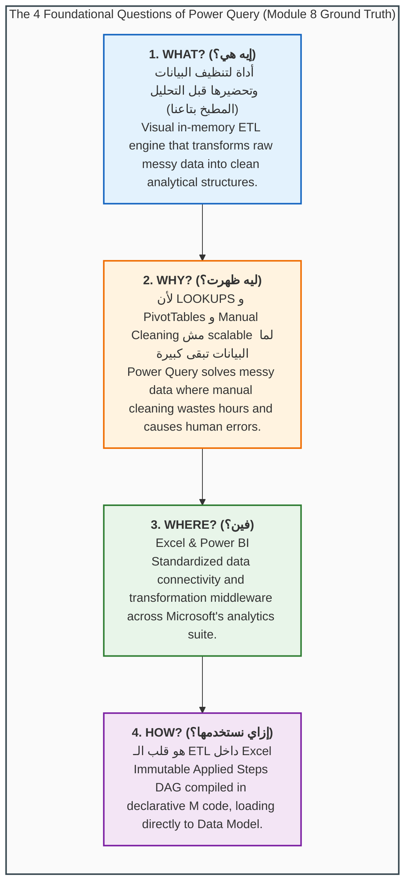
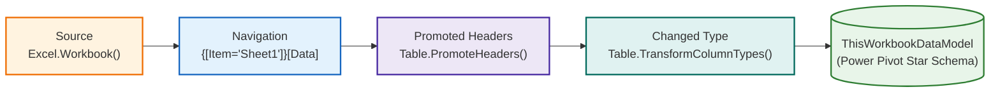

# 📦 Module 8 Dataset Documentation: Power Query & M Language Laboratory

> [!abstract] Dataset & Workbook Overview
> The **Module 8 Demo Workbook** ([`Module_8_Demo.xlsx`](file:///d:/courses/Data%20Analysis%2026-27/7-Introducation%20to%20Data%20Fields%20(Excel)/11_Demos_and_Workbooks/08_Power_Query/Module_8_Demo.xlsx)) serves as the official practice and operational laboratory for **Module 8: Power Query & M Language**. It grounds students in the fundamental architectural shift from manual cell-based manipulation to automated, reproducible data pipelines. Built upon the conceptual metaphor of **"المطبخ بتاعنا" (The Data Kitchen)**, the workbook pairs a foundational bilingual strategy tab (**`Intro`**) with an automated Power Query M ingestion pipeline (**`Fact_Calls`**) streaming **5,000 operational records** from the authentic **PwC Switzerland Call Center Dataset** (`01 Call-Center-Dataset.xlsx`) directly into the **Power Pivot VertiPaq Data Model** (`ThisWorkbookDataModel`).

---

## 🗂️ Workbook Tab & Object Directory

| Object / Tab Name | Object Classification | Dimensions / Scope | Ingestion Channel & Storage | Educational Purpose & Architectural Significance |
| :--- | :--- | :---: | :--- | :--- |
| **`Intro`** | Worksheet Tab | $47\text{ Rows} \times 23\text{ Columns}$ | Native Excel Worksheet Grid | Anchors the pedagogical blueprint answering the **4 Essential Questions (What, Why, Where, How)**. Introduces the **"Data Kitchen" (`المطبخ بتاعنا`)** metaphor and details why manual lookups and formula cleaning fail at scale. |
| **`Fact_Calls`** | Power Query M Query | $5,000\text{ Rows} \times 10\text{ Columns}$ | Power Query M Formula (`Formulas/Section1.m`) | Extracts `Sheet1` from `"01 Call-Center-Dataset.xlsx"`, promotes headers, enforces strict typed contracts across 10 operational fields, and delivers the clean dataset into memory. |
| **`ThisWorkbookDataModel`** | VertiPaq Data Model | $5,000\text{ Stored Records}$ | Power Pivot In-Memory Columnar Database | Stores `Fact_Calls` as a high-performance analytical model table without rendering raw rows into the Excel grid, preserving lightning-fast UI responsiveness and eliminating 1M worksheet row constraints. |

---

## 🧠 The 4 Foundational Questions Framework

The `Intro` sheet formalizes the core theoretical pillars that distinguish junior spreadsheet users from senior analytics engineers:



### 1. What is Power Query? (`إيه هي؟`)
- **Arabic Definition**: «أداة لتنظيف البيانات وتحضيرها قبل التحليل (المطبخ بتاعنا)»
- **The Data Kitchen Metaphor**:
  - In a commercial restaurant, raw vegetables, unwashed herbs, and uncut meats never appear on the customer's table in the dining room.
  - The **Kitchen** is where prep cooks wash, peel, chop, debone, and season raw ingredients.
  - The **Dining Room** is where guests are served elegant, finished plates.
  - In Excel Analytics:
    - **Raw Ingredients** = Unclean CSVs, ERP dumps, database extracts, and web tables.
    - **The Kitchen** = **Power Query** (where data is filtered, unpivoted, cleansed, and typed).
    - **The Plated Dish** = **Power Pivot Data Model**, PivotTables, and Executive Dashboards.

### 2. Why Did It Emerge? (`ليه ظهرت؟`)
- **Arabic Definition**: «لأن الـ LOOKUPS و PivotTables و Manual Cleaning مش scalable لما البيانات تبقى كبيرة. Power Query اتعمل علشان يحل مشكلة البيانات الـ messy اللي تنظيفها يدوي بيضيع وقت وبيعمل أخطاء.»
- **The Scalability Wall**:
  - Traditional `=VLOOKUP` and `=XLOOKUP` formulas recalculate cell-by-cell on the grid. On 100,000+ rows, they freeze Microsoft Excel.
  - PivotTables require tidy, tabular columns; feeding them raw, cross-tabulated reports yields incorrect totals and broken hierarchies.
  - Manual copy-pasting and text trimming are prone to accidental keystrokes, undetected deletions, and wasted analyst hours.
  - Power Query solves this permanently with **"Build Once, Refresh Forever"** non-destructive automation.

### 3. Where Does It Live? (`فين؟`)
- **Core Ecosystem**: **Excel & Power BI**
- Skills mastered in Power Query inside Excel transfer 100% into Power BI Desktop, Power BI Dataflows, and Microsoft Fabric Dataflows Gen2.

### 4. How Do We Use It? (`إزاي نستخدمها؟ - ملخص`)
From the operational summary documented in `Module_8_Demo.xlsx`:
1. **هو عبارة عن أداة ETL داخل Excel**: Handles extraction from files/APIs/databases, in-memory transformations, and loading into analytical destinations.
2. **كل خطوة بتعملها جواه بتتسجل تلقائيًا كـ Applied Steps وكود M تقدر تعيده على أي بيانات جديدة**: Generates an immutable, repeatable Directed Acyclic Graph (DAG) recipe.
3. **Power Query بيئة مستقلة عن Excel، مش فورمولا ومش Pivot—هو Tool مخصصة لتنظيف وتجهيز البيانات**: Operates in its own execution sandbox; it does not burden worksheet cells and feeds the downstream Data Model seamlessly.
4. **بتستخدمه لما يكون عندك شغل متكرر، دمج ملفات، تنظيف تقيل، أو تجهيز Data للـ dashboards والتحليل**: The cornerstone of reliable enterprise business intelligence pipelines.

---

## 🛠️ Decompiled Power Query M Source Code

Extracted directly from the embedded OpenXML package (`customXml/item6.xml` $\to$ `Formulas/Section1.m`) of [`Module_8_Demo.xlsx`](file:///d:/courses/Data%20Analysis%2026-27/7-Introducation%20to%20Data%20Fields%20(Excel)/11_Demos_and_Workbooks/08_Power_Query/Module_8_Demo.xlsx):

```powerquery
section Section1;

shared Fact_Calls = let
    Source = Excel.Workbook(File.Contents("D:\courses\Data Analysis 26-27\01 Call-Center-Dataset.xlsx"), null, true),
    Sheet1_Sheet = Source{[Item="Sheet1",Kind="Sheet"]}[Data],
    #"Promoted Headers" = Table.PromoteHeaders(Sheet1_Sheet, [PromoteAllScalars=true]),
    #"Changed Type" = Table.TransformColumnTypes(#"Promoted Headers",{{"Call Id", type text}, {"Agent", type text}, {"Date", type date}, {"Time", type time}, {"Topic", type text}, {"Answered (Y/N)", type text}, {"Resolved", type text}, {"Speed of answer in seconds", Int64.Type}, {"AvgTalkDuration", type datetime}, {"Satisfaction rating", Int64.Type}})
in
    #"Changed Type";
```



---

## 📋 Data Dictionary: `Fact_Calls` Schema

The resulting table `Fact_Calls` consists of **5,000 customer interaction logs** spanning Q1 2021 across 8 service agents:

| Field Name | Storage Data Type | Sample Value | Business Meaning & Analytical Utility | Null Values & Integrity Rules |
| :--- | :--- | :--- | :--- | :--- |
| `Call Id` | Text (`type text`) | `ID0001` | Unique transaction identifier for each inbound call. | 0 nulls. Primary key of inbound interaction log. |
| `Agent` | Text (`type text`) | `Diane` | Representative handling the customer inquiry (8 agents: Diane, Becky, Stewart, Greg, Dan, Joe, Martha, Jim). | 0 nulls. Operational grouping dimension. |
| `Date` | Date (`type date`) | `2021-01-01` | Calendar date on which call occurred (Jan 1, 2021 – Mar 31, 2021). | 0 nulls. Connects to `Dim_Date` in Star Schema. |
| `Time` | Time (`type time`) | `09:12:00` | Exact arrival timestamp of incoming call. | 0 nulls. Used for hourly call arrival distribution. |
| `Topic` | Text (`type text`) | `Contract related` | Inbound call subject category (`Contract related`, `Tech support`, `Payment related`, `Admin support`, `Streaming`). | 0 nulls. Categorical service slicing dimension. |
| `Answered (Y/N)` | Text (`type text`) | `Y` | Indicator whether agent picked up (`Y`) or call was abandoned (`N`). | 0 nulls ($4,054\text{ Y} \mid 946\text{ N}$). Foundational KPI filter. |
| `Resolved` | Text (`type text`) | `Y` | Indicator whether customer issue was successfully resolved. | 0 nulls ($3,646\text{ Y} \mid 1,354\text{ N}$). Resolution rate numerator. |
| `Speed of answer in seconds` | Integer (`Int64.Type`) | `90` | Queue latency elapsed before agent answered call. | **946 nulls**. These represent unanswered calls ($N$) and must **never** be deleted or defaulted to 0! |
| `AvgTalkDuration` | Datetime (`type datetime`) | `00:04:15` | Total elapsed duration of conversation with client. | Null when call was not answered. |
| `Satisfaction rating` | Integer (`Int64.Type`) | `3` | Customer CSAT score collected post-call ($1\text{ to }5$ scale). | Null on unanswered/abandoned calls. Average calculated over answered calls only. |

---

## ⚡ Architectural Decision: Grid Load vs Data Model Load

A defining architectural lesson of `Module_8_Demo.xlsx` is the decision to load `Fact_Calls` as **Connection-Only into the Data Model** (`ThisWorkbookDataModel`):

| Evaluation Dimension | Standard Worksheet Grid Load | Data Model (VertiPaq) Load (Module 8 Standard) |
| :--- | :--- | :--- |
| **Physical Storage** | Uncompressed worksheet XML cells. | High-performance columnar compressed binary (`xl/model/item.data`). |
| **Row Boundary** | Hard-capped at 1,048,576 rows. | Virtually unlimited (scales to 10M–50M rows in 64-bit Excel). |
| **Workbook Responsiveness** | Scrolling and filtering large tables lags UI. | 0 grid rendering overhead; workbook opens instantaneously. |
| **Analytical Capabilities** | Requires grid lookup formulas (`=XLOOKUP`). | Supports multi-table **Star Schema** relationships and explicit **DAX measures**. |
| **Visual Presentation** | Raw rows clutter workbook tabs. | Grid remains pristine; reports surfaced strictly via **PivotTables & Slicers**. |

---

## Related Knowledge
- Curriculum Lessons:
  - [[01_Power_Query_Fundamentals_and_ETL]]
  - [[02_Core_Data_Transformations]]
  - [[03_Combining_Data_Append_and_Merge]]
  - [[04_Introduction_to_M_Language_and_APIs]]
- Upstream & Downstream References:
  - [[Module 7 Dataset Documentation]]
  - [[01_Dimensional_Modeling_Principles]]
  - [[Call Center Performance Analysis]]
- Practice Workbooks:
  - [`Module_8_Demo.xlsx`](file:///d:/courses/Data%20Analysis%2026-27/7-Introducation%20to%20Data%20Fields%20(Excel)/11_Demos_and_Workbooks/08_Power_Query/Module_8_Demo.xlsx)
  - [`Module_7_Demo.xlsx`](file:///d:/courses/Data%20Analysis%2026-27/7-Introducation%20to%20Data%20Fields%20(Excel)/11_Demos_and_Workbooks/07_Data_Cleaning/Module_7_Demo.xlsx)
- Interactive Mind Map: [Course Mind Map](https://sohila-khaled-abbas.github.io/COURSE-EXCEL-ZERO-TO-HERO/mindmap/)
