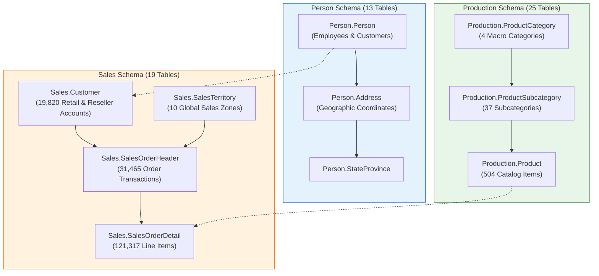

# 🚴 AdventureWorks2022 OLTP: Enterprise Schema & Ingestion Reference

> [!abstract] Business Domain & Educational Role
> **AdventureWorks Cycles** is Microsoft's premier enterprise sample database modeling a multinational bicycle manufacturing and direct/reseller retail corporation. In this curriculum, `AdventureWorks2022` serves as the **Advanced Relational Benchmark**, teaching students how to navigate **large, normalized 3NF schemas spanning multiple enterprise functional boundaries**:
> $$\text{Person (Demographics)} \longleftrightarrow \text{Sales (Commercial)} \longleftrightarrow \text{Production (BOM & Catalog)} \longleftrightarrow \text{Purchasing (Supply Chain)}$$

---

## 1. Multi-Schema Architecture (71 Tables across 6 Schemas)



---

## 2. Table Inventory & Business Grain (Core Analytical Tables)

| Schema | Table Name | Primary Key | Foreign Key Links | Row Count | Business Grain & Role |
| :--- | :--- | :--- | :--- | :---: | :--- |
| `Sales` | **`SalesOrderHeader`** | `SalesOrderID` | `CustomerID`, `SalesPersonID`, `TerritoryID` | **31,465** | One row per sales order transaction (Order grain). |
| `Sales` | **`SalesOrderDetail`** | `SalesOrderID`, `SalesOrderDetailID` | `SalesOrderID`, `ProductID`, `SpecialOfferID` | **121,317** | One row per line item within an order (Grain: Order × Product). |
| `Sales` | **`Customer`** | `CustomerID` | `PersonID`, `StoreID`, `TerritoryID` | **19,820** | Unified customer entity linking B2C consumers and B2B retail stores. |
| `Production`| **`Product`** | `ProductID` | `ProductSubcategoryID`, `ProductModelID` | **504** | Catalog inventory item (Bicycles, Components, Apparel, Accessories). |
| `Production`| **`ProductSubcategory`**| `ProductSubcategoryID` | `ProductCategoryID` | **37** | Intermediate product groupings (e.g. Mountain Bikes, Road Bikes). |
| `Production`| **`ProductCategory`** | `ProductCategoryID` | None | **4** | Top-level catalog categories: Bikes, Components, Clothing, Accessories. |
| `Sales` | **`SalesTerritory`** | `TerritoryID` | `CountryRegionCode` | **10** | Global commercial sales zones (Northwest, Southwest, Europe, Pacific, etc.). |
| `Person` | **`Person`** | `BusinessEntityID` | None | **19,972** | Master directory of human beings (Employees, Customers, Vendors). |

---

## 3. Production Analytical Extraction Query (Denormalized Sales Star)

To ingest AdventureWorks OLTP data into Excel without drowning Power Query in dozens of normalized lookup joins, execute this optimized extraction query:

```sql
SELECT 
    soh.SalesOrderID,
    soh.OrderDate,
    YEAR(soh.OrderDate) AS OrderYear,
    DATENAME(MONTH, soh.OrderDate) AS OrderMonth,
    soh.OnlineOrderFlag,
    CASE WHEN soh.OnlineOrderFlag = 1 THEN 'B2C Web Customer' ELSE 'B2B Retail Reseller' END AS Channel,
    st.Name AS TerritoryName,
    st.[Group] AS GlobalRegion,
    cat.Name AS CategoryName,
    subcat.Name AS SubcategoryName,
    p.Name AS ProductName,
    p.Color AS ProductColor,
    sod.OrderQty,
    sod.UnitPrice,
    sod.UnitPriceDiscount,
    sod.LineTotal,
    p.StandardCost * sod.OrderQty AS TotalCost,
    sod.LineTotal - (p.StandardCost * sod.OrderQty) AS GrossProfitMargin
FROM Sales.SalesOrderHeader soh
INNER JOIN Sales.SalesOrderDetail sod ON soh.SalesOrderID = sod.SalesOrderID
INNER JOIN Sales.SalesTerritory st ON soh.TerritoryID = st.TerritoryID
INNER JOIN Production.Product p ON sod.ProductID = p.ProductID
INNER JOIN Production.ProductSubcategory subcat ON p.ProductSubcategoryID = subcat.ProductSubcategoryID
INNER JOIN Production.ProductCategory cat ON subcat.ProductCategoryID = cat.ProductCategoryID;
```
