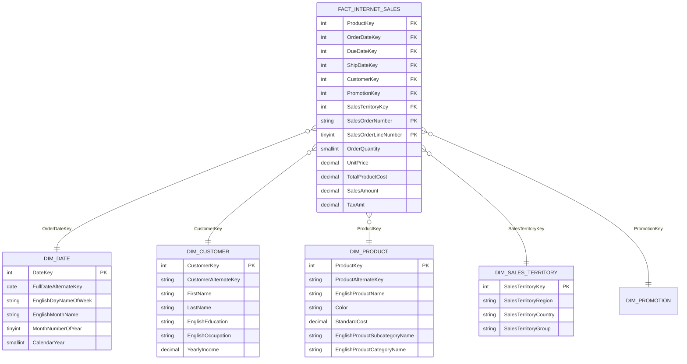

# ⭐ AdventureWorksDW2022: Dimensional Data Warehouse & Star Schema Reference

> [!abstract] Educational Paradigm: OLTP vs Dimensional OLAP
> **AdventureWorksDW2022** is the analytical counterpart to the transactional `AdventureWorks2022` database. While OLTP databases are normalized (3NF) to optimize high-concurrency writes and eliminate redundancy, **Data Warehouses are denormalized into Star Schemas to optimize query speed, reporting aggregation, and business intelligence modeling**.
>
> $$\begin{array}{ccc}
> \textbf{AdventureWorks OLTP} & \xrightarrow{\textbf{ETL Transformation}} & \textbf{AdventureWorksDW} \\
> \text{Normalized 3NF Tables} & & \text{Dimensional Star Schema} \\
> \text{Natural / Business Keys} & & \text{Integer Surrogate Keys} \\
> \text{Row-by-Row Operations} & & \text{Massive Analytical Aggregation}
> \end{array}$$

---

## 1. Dimensional Architecture: The Internet Sales Star Schema



---

## 2. Table Inventory & Dimensional Classification

| Entity Name | Entity Type | Primary / Surrogate Key | Natural / Business Key | Fact Grain / Dimensions Covered |
| :--- | :---: | :--- | :--- | :--- |
| **`FactInternetSales`** | **Fact Table** | `SalesOrderNumber`, `LineNumber` | None | Individual line item sold through B2C e-commerce. |
| **`FactResellerSales`** | **Fact Table** | `SalesOrderNumber`, `LineNumber` | None | Individual line item sold through B2B wholesale partners. |
| **`DimDate`** | **Dimension** | `DateKey` (e.g. `20210515`) | `FullDateAlternateKey` | 1 row per calendar day; covers fiscal, calendar, and seasonal hierarchies. |
| **`DimProduct`** | **Dimension** | `ProductKey` (Integer) | `ProductAlternateKey` (`BK-M68B-42`) | Denormalized hierarchy (Category $\to$ Subcategory $\to$ Product). |
| **`DimCustomer`** | **Dimension** | `CustomerKey` (Integer) | `CustomerAlternateKey` (`AW00011000`) | Customer demographics, marital status, income, education. |
| **`DimSalesTerritory`** | **Dimension** | `SalesTerritoryKey` (Integer)| `TerritoryID` | Geographic hierarchy (Region $\to$ Country $\to$ Group). |
| **`DimPromotion`** | **Dimension** | `PromotionKey` (Integer) | `PromotionAlternateKey` | Marketing discounts and seasonal promotions. |

---

## 3. Why Surrogate Keys Matter in Excel & Power Pivot
1. **Integer Efficiency in VertiPaq**: Integer surrogate keys (`int32` / `int64`) compress at over **$10\times$ the efficiency** of string business keys (`"BK-M68B-42"`), drastically reducing Excel workbook size.
2. **Handling History (Slowly Changing Dimensions - SCD)**: If a product's price or description changes, a new surrogate key is assigned, preserving historical reporting integrity.
3. **Integer Date Keys (`DateKey`)**: Representing dates as integers (`20210101`) enables ultra-fast numerical joins and native sorting without string conversion latency.

---

## 4. Production Star Schema Query for Direct Power Pivot Modeling

```sql
SELECT 
    fis.SalesOrderNumber,
    fis.SalesOrderLineNumber,
    fis.OrderDateKey,
    fis.CustomerKey,
    fis.ProductKey,
    fis.SalesTerritoryKey,
    fis.OrderQuantity,
    fis.UnitPrice,
    fis.TotalProductCost,
    fis.SalesAmount,
    fis.SalesAmount - fis.TotalProductCost AS GrossProfit
FROM dbo.FactInternetSales fis;
```
