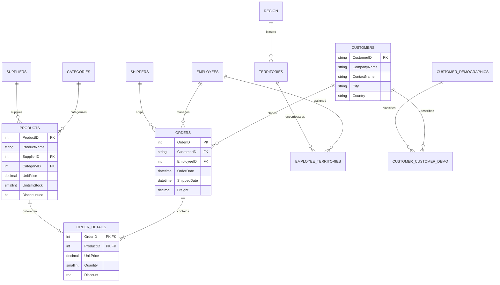

# 📦 Northwind Sample Database: Schema & Ingestion Reference

> [!abstract] Business Domain & Educational Role
> **Northwind Traders** is an iconic relational database representing a specialty foods wholesale and export business. In this curriculum, Northwind serves as the **Foundation-to-Intermediate gateway** for learning the complete data lifecycle:
> $$\text{SQL Server Relational Tables} \longrightarrow \text{Analytical SQL Queries} \longrightarrow \text{Power Query Ingestion} \longrightarrow \text{Excel Pivot / Dashboard}$$

---

## 1. Relational Schema Architecture (13 Tables)



---

## 2. Table Inventory & Business Grain

| Table Name | Schema | Primary Key | Foreign Keys | Row Count | Business Grain & Meaning |
| :--- | :---: | :--- | :--- | :---: | :--- |
| **`Orders`** | `dbo` | `OrderID` | `CustomerID`, `EmployeeID`, `ShipVia` | **830** | One row per sales order transaction. |
| **`Order Details`** | `dbo` | `OrderID`, `ProductID` | `OrderID`, `ProductID` | **2,155** | One row per line item within an order (Grain: Order × Product). |
| **`Products`** | `dbo` | `ProductID` | `SupplierID`, `CategoryID` | **77** | One row per inventory item sold by Northwind. |
| **`Customers`** | `dbo` | `CustomerID` | None | **91** | One row per commercial business purchasing from Northwind. |
| **`Employees`** | `dbo` | `EmployeeID` | `ReportsTo` (Self-referencing) | **9** | One row per sales representative / manager. |
| **`Categories`** | `dbo` | `CategoryID` | None | **8** | Product classification (Beverages, Condiments, Confections, etc.). |
| **`Suppliers`** | `dbo` | `SupplierID` | None | **29** | Vendors supplying raw food inventory to Northwind. |
| **`Shippers`** | `dbo` | `ShipperID` | None | **3** | Third-party logistics carriers (Speedy, United, Federal). |
| **`Territories`** | `dbo` | `TerritoryID` | `RegionID` | **53** | Geographic sales areas. |
| **`Region`** | `dbo` | `RegionID` | None | **4** | Macro regions (Eastern, Western, Northern, Southern). |

---

## 3. Core Analytical Queries for Excel Ingestion

### Query 1: Customer Sales Summary (Power Query Feed)
```sql
SELECT 
    c.CustomerID,
    c.CompanyName,
    c.Country,
    c.City,
    COUNT(DISTINCT o.OrderID) AS TotalOrders,
    ROUND(SUM(od.UnitPrice * od.Quantity * (1 - od.Discount)), 2) AS TotalRevenue,
    ROUND(AVG(od.UnitPrice * od.Quantity * (1 - od.Discount)), 2) AS AvgLineValue
FROM dbo.Customers c
INNER JOIN dbo.Orders o ON c.CustomerID = o.CustomerID
INNER JOIN dbo.[Order Details] od ON o.OrderID = od.OrderID
GROUP BY c.CustomerID, c.CompanyName, c.Country, c.City;
```

### Query 2: Product Performance & Profitability View
```sql
SELECT 
    p.ProductID,
    p.ProductName,
    cat.CategoryName,
    s.CompanyName AS SupplierName,
    p.UnitPrice,
    p.UnitsInStock,
    p.UnitsOnOrder,
    COALESCE(SUM(od.Quantity), 0) AS TotalQuantitySold,
    ROUND(COALESCE(SUM(od.UnitPrice * od.Quantity * (1 - od.Discount)), 0), 2) AS TotalGrossSales
FROM dbo.Products p
INNER JOIN dbo.Categories cat ON p.CategoryID = cat.CategoryID
INNER JOIN dbo.Suppliers s ON p.SupplierID = s.SupplierID
LEFT JOIN dbo.[Order Details] od ON p.ProductID = od.ProductID
GROUP BY p.ProductID, p.ProductName, cat.CategoryName, s.CompanyName, p.UnitPrice, p.UnitsInStock, p.UnitsOnOrder;
```
