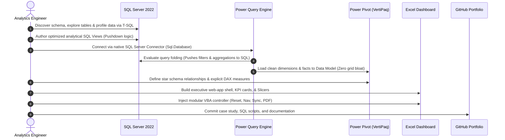

# 💻 SQL Server Learning Environment Architecture

> [!abstract] Full-Stack Analytics Engineering Environment
> This document specifies the complete local developer environment connecting Microsoft SQL Server relational databases to Excel analytical dashboards, Obsidian second-brain documentation, and GitHub version control.
>
> $$\begin{array}{ccccccc}
> \textbf{SQL Server 2022} & \longrightarrow & \textbf{Power Query (M)} & \longrightarrow & \textbf{Power Pivot (DAX)} & \longrightarrow & \textbf{Excel Dashboard} \\
> \downarrow & & \downarrow & & \downarrow & & \downarrow \\
> \text{T-SQL Scripts} & & \text{ETL Recipes} & & \text{Star Schema} & & \text{VBA Automation} \\
> \downarrow & & & & & & \downarrow \\
> \multicolumn{7}{c}{\textbf{Obsidian Second Brain} \longleftrightarrow \textbf{GitHub Portfolio Repository}}
> \end{array}$$

---

## 1. Local Technology Stack & Specifications

| Component | Software & Version | Physical Location / Endpoint | Purpose in Curriculum |
| :--- | :--- | :--- | :--- |
| **Relational Database Engine** | Microsoft SQL Server 2022 (v16.0) | `localhost` / `.` (Port: 1433) | Upstream relational data storage, querying, and view hosting. |
| **SQL Administration GUI** | SQL Server Management Studio (SSMS) | Windows Start Menu | Database inspection, ERD diagramming, profiling, query execution. |
| **Command-Line Tool** | `sqlcmd` Utility (v16.0+) | Terminal PATH | Automated script deployment, silent restores, CI verification. |
| **Data Ingestion Engine** | Power Query (M Formula Language) | Built into Microsoft Excel | Extracting data via native SQL Server connector, shaping, and typing. |
| **In-Memory Analytical Engine**| Power Pivot (VertiPaq Tabular Engine) | Built into Microsoft Excel | Star schema dimensional modeling, multi-table relationships, explicit DAX. |
| **Presentation Canvas** | Microsoft Excel (Office 365) | Local `.xlsx` / `.xlsm` workbooks | Native grid KPI cards, PivotCharts, Slicers, UI/UX application shell. |
| **Automation Layer** | Visual Basic for Applications (VBA) | Modular workbook code panes | View navigation, scoped filter resets, automated refresh, PDF export. |
| **Knowledge Management** | Obsidian (Markdown Vault) | `COURSE-EXCEL-ZERO-TO-HERO/` | Atomic concept notes, MOCs, lab workflows, project documentation. |
| **Version Control & Publishing**| Git + GitHub + GitHub Pages | `origin/main` | Portfolio showcase, static site distribution, automated CI audits. |

---

## 2. The End-to-End Analytics Workflow

---

## 3. Local SQL Server Connection Configuration

When connecting from Microsoft Excel's Power Query:
- **Data $\to$ Get Data $\to$ From Database $\to$ From SQL Server Database**:
  - **Server**: `localhost` (or `.`)
  - **Database (Optional)**: `Northwind` / `pubs` / `AdventureWorks2022` / `AdventureWorksDW2022`
  - **Data Connectivity mode**: `Import`
  - **Advanced Options (SQL Statement)**: Can be left empty for Direct Table Navigation (Query Folding), or populated with an explicit T-SQL View/Extraction query.
- **Authentication**: Select **Use my current credentials** (Windows Integrated Authentication).
