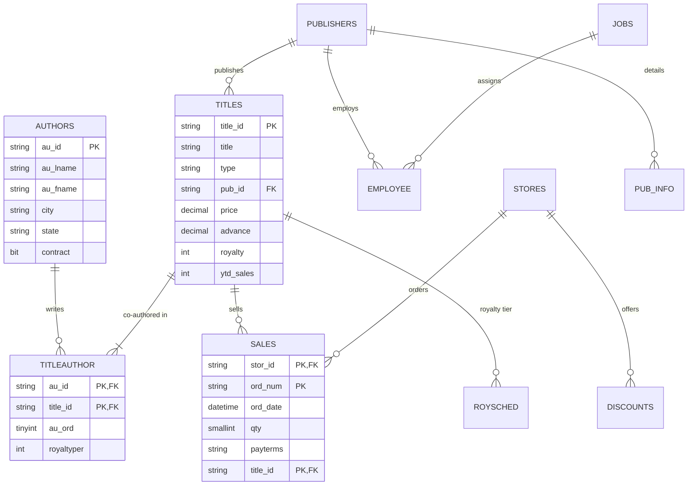

# 📚 pubs Sample Database: Schema & Ingestion Reference

> [!abstract] Business Domain & Educational Role
> **pubs** represents a fictitious book publishing business. In this curriculum, `pubs` serves as the **Intermediate analytical benchmark**, specifically designed to teach:
> 1. How to navigate **Many-to-Many ($M:N$) relationships** via associative bridge tables (`titleauthor`).
> 2. How naive SQL joins produce **accidental Cartesian duplication and double-counted financial metrics**.
> 3. Designing robust CTEs and analytical views for Excel Power Query ingestion.

---

## 1. Relational Schema Architecture (11 Tables)



---

## 2. Table Inventory & Business Grain

| Table Name | Schema | Primary Key | Foreign Keys | Row Count | Business Grain & Meaning |
| :--- | :---: | :--- | :--- | :---: | :--- |
| **`titles`** | `dbo` | `title_id` | `pub_id` | **18** | One row per published book title. |
| **`authors`** | `dbo` | `au_id` | None | **23** | One row per contracted book author. |
| **`titleauthor`** | `dbo` | `au_id`, `title_id` | `au_id`, `title_id` | **25** | **Associative Bridge Table**: Links co-authors to books, with `royaltyper` percentage split. |
| **`sales`** | `dbo` | `stor_id`, `ord_num`, `title_id` | `stor_id`, `title_id` | **21** | One row per store book sales order transaction. |
| **`publishers`**| `dbo` | `pub_id` | None | **8** | One row per publishing house imprint. |
| **`stores`** | `dbo` | `stor_id` | None | **6** | Retail bookstores ordering titles from publishers. |
| **`roysched`** | `dbo` | None (Heap) | `title_id` | **86** | Tiered royalty schedule based on sales volume thresholds. |
| **`discounts`**| `dbo` | None (Heap) | `stor_id` | **3** | Volume and initial discount terms for retail stores. |
| **`employee`** | `dbo` | `emp_id` | `pub_id`, `job_id` | **43** | Internal publishing staff. |
| **`jobs`** | `dbo` | `job_id` | None | **14** | Job description grades and salary levels. |
| **`pub_info`** | `dbo` | `pub_id` | `pub_id` | **8** | Publisher corporate logos and marketing overviews. |

---

## 3. The Double-Counting Hazard in Many-to-Many Relationships

> [!CAUTION] The Naive Join Trap
> If a book has **2 co-authors** (e.g. `title_id = 'BU1111'`), joining `titles` directly to `titleauthor` duplicates the `titles` row:
> ```sql
> -- INCORRECT: Produces $23,980 instead of $11,990 total advance!
> SELECT SUM(t.advance) AS DistortedAdvance
> FROM dbo.titles t
> INNER JOIN dbo.titleauthor ta ON t.title_id = ta.title_id;
> ```
> *The Analytical Fix*: Use Common Table Expressions (CTEs) or window functions to aggregate author royalties before joining to titles, or model the bridge table cleanly in Power Pivot!

---

## 4. Production Analytical Query for Power Query

```sql
-- Clean Author Royalty Allocation Query (Prevents Double-Counting)
WITH AuthorBookSummary AS (
    SELECT 
        a.au_id,
        CONCAT(a.au_fname, ' ', a.au_lname) AS AuthorFullName,
        a.state AS AuthorState,
        t.title_id,
        t.title AS BookTitle,
        t.type AS Genre,
        t.price AS RetailPrice,
        t.ytd_sales AS YtdSalesUnits,
        ta.royaltyper AS AuthorRoyaltySharePct,
        ROUND((t.price * t.ytd_sales * (ta.royaltyper / 100.0) * (t.royalty / 100.0)), 2) AS AuthorEstimatedRoyaltyEarnings
    FROM dbo.authors a
    INNER JOIN dbo.titleauthor ta ON a.au_id = ta.au_id
    INNER JOIN dbo.titles t ON ta.title_id = t.title_id
)
SELECT 
    au_id,
    AuthorFullName,
    AuthorState,
    COUNT(title_id) AS TotalBooksPublished,
    SUM(YtdSalesUnits) AS TotalUnitsSold,
    SUM(AuthorEstimatedRoyaltyEarnings) AS TotalRoyaltiesEarned
FROM AuthorBookSummary
GROUP BY au_id, AuthorFullName, AuthorState;
```
