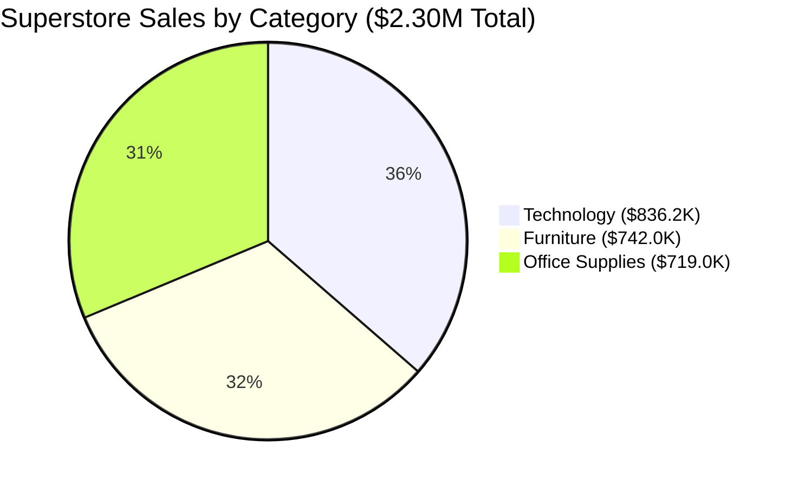

# 📦 Sample Superstore: Master Dataset Documentation & Practice Ground

> [!abstract] Benchmark Dataset Overview
> **Sample Superstore** is the gold standard benchmark dataset created for Business Intelligence, Data Engineering, and spreadsheet modeling education. Originally provided with **Tableau** and widely adopted across **Microsoft Excel** and **Power BI** curricula, it simulates the operations of a national retail corporation selling products across four geographic regions in the United States.

---

## 🌐 Provenance, Official Sources & Open Mirrors

This dataset is a **fictitious retail enterprise dataset** created specifically for training analysts in commercial reporting, ETL pipelines, and visual analytics. It is not an open-government or single-institution export; it is a globally recognized pedagogical standard.

### Authoritative & Community Sources

| Source Entity | Platform | Resource Description | Direct Access Link |
| :--- | :--- | :--- | :--- |
| **Tableau Public** | Official Creator Hub | Official Sample Data Repository (Superstore Sales) | [Tableau Public Sample Data](https://public.tableau.com/app/learn/sample-data) |
| **Tableau Desktop Help** | Official Docs | Tutorial: Getting Started with Superstore Data | [Tableau Superstore Guide](https://help.tableau.com/current/guides/get-started-tutorial/en-gb/get-started-tutorial-connect.htm) |
| **Kaggle (Naveen Kumar)** | Kaggle Mirror | Sample Superstore (Practice dataset for retail BI) | [Kaggle: Sample Superstore (naveenkumar20bps1137)](https://www.kaggle.com/datasets/naveenkumar20bps1137/sample-superstore) |
| **Kaggle (Upal Kundu)** | Kaggle Mirror | Sample Superstore Data (`Sample - Superstore.xls`) | [Kaggle: Sample Superstore Data (upalkundu287)](https://www.kaggle.com/datasets/upalkundu287/sample-superstore-data) |
| **Kaggle (Anoop)** | Kaggle Mirror | Sample Superstore CSV Mirror | [Kaggle: Sample Superstore (anooper)](https://www.kaggle.com/datasets/anooper/sample-superstore) |
| **GitHub Gist (Ashwini)** | Raw CSV Mirror | Clean raw CSV version of 9,994-row Superstore data | [GitHub Gist: Superstore CSV](https://gist.github.com/SharmaAshwini/8bd642f6c46792a9c40c8ccad60391e9) |
| **GitHub Gist (Phuong)** | Raw CSV Mirror | Superstore dataset export with schema definitions | [GitHub Gist: Superstore Export](https://gist.github.com/nnbphuong/38db511db14542f3ba9ef16e69d3814c) |
| **GitHub Repository** | Full Project Mirror | Tableau-Superstore repository with workbook models | [GitHub: Sau101/Tableau-Superstore](https://github.com/Sau101/Tableau-Superstore) |

---

## 📊 Dataset Profile & Ground-Truth Statistics



### Audited Benchmark Figures (Empirically Verified):
- **Total Inbound Rows**: `9,994` transaction line items
- **Data Grain**: **1 row = 1 product line item within an order**
- **Unique Orders**: `5,009` discrete customer orders
- **Unique Customers**: `793` individual consumer, corporate, and home office buyers
- **Unique Products**: `1,862` distinct retail SKUs
- **Total Gross Sales**: `$2,297,200.86`
- **Total Net Profit**: `$286,397.02` (Overall Profit Margin: **12.47%**)
- **Total Units Sold**: `37,873` items
- **Average Discount Rate**: `15.62%`

---

## 🗄️ Comprehensive 19-Column Data Dictionary

| # | Column Header | Data Type | Excel Format Mask | Sample Value | Analytical Role & Description |
| :---: | :--- | :---: | :--- | :--- | :--- |
| **1** | `Row ID` | Integer | `0` | `1` | Surrogate primary key for row identification. |
| **2** | `Order ID` | Text | `@` | `CA-2016-152156` | Natural composite key: Country Code + Year + Order Number. |
| **3** | `Order Date` | Date (Serial) | `YYYY-MM-DD` | `2016-11-08` | Transaction placement date; stored as Excel date serial. |
| **4** | `Ship Date` | Date (Serial) | `YYYY-MM-DD` | `2016-11-11` | Fulfillment date; used for turnaround time calculation. |
| **5** | `Ship Mode` | Text (Category) | `@` | `Second Class` | Fulfillment tier: `Standard Class`, `Second Class`, `First Class`, `Same Day`. |
| **6** | `Customer ID` | Text | `@` | `CG-12520` | Unique customer identifier across all purchases. |
| **7** | `Segment` | Text (Category) | `@` | `Consumer` | Customer persona: `Consumer` (5,191), `Corporate` (3,020), `Home Office` (1,783). |
| **8** | `Country` | Text | `@` | `United States` | Sovereign market (100% United States in this edition). |
| **9** | `City` | Text | `@` | `Henderson` | Municipal destination (531 unique US cities). |
| **10** | `State` | Text | `@` | `Kentucky` | US State (49 states represented). |
| **11** | `Region` | Text (Category) | `@` | `South` | Regional division: `West` (3,203), `East` (2,848), `Central` (2,323), `South` (1,620). |
| **12** | `Product ID` | Text | `@` | `FUR-BO-10001798` | Product SKU code: Category (`FUR`) + SubCat (`BO`) + Sequence. |
| **13** | `Category` | Text (Category) | `@` | `Furniture` | Top-level hierarchy: `Office Supplies` (6,026), `Furniture` (2,121), `Technology` (1,847). |
| **14** | `Sub-Category` | Text (Category) | `@` | `Bookcases` | Granular product taxonomy (17 distinct sub-categories). |
| **15** | `Product Name` | Text | `@` | `Bush Somerset Bookcase` | Full descriptive SKU title. |
| **16** | `Sales` | Decimal (Currency)| `$#,##0.00` | `261.96` | Gross transactional revenue in USD. |
| **17** | `Quantity` | Integer | `#,##0` | `2` | Volume of items ordered in this line item. |
| **18** | `Discount` | Decimal (Percent) | `0.0%` | `0.00` | Applied discount rate (e.g. `0.20` displays as `20.0%`). |
| **19** | `Profit` | Decimal (Currency)| `$#,##0.00;[Red]($#,##0.00);"-"` | `41.91` | Net financial profit (can be negative for unprofitable sales). |

---

## 🎯 Direct Alignment with Module 2: Data Management

The Superstore dataset provides the empirical foundation for mastering the core skills of **[[02_Notes/02_Data_Management]]**:

### 1. Data Types & Custom Number Formatting ([[01_Data_Types_and_Formatting]])
- **The Date Serial Trap**: `Order Date` (`11-08-2016`) stored as raw text vs converted to true Excel serial numbers (`42682`).
- **Profit Formatting Mask**: Accounting display formatting where negative profits appear in red parentheses:
  ```text
  $#,##0.00;[Red]($#,##0.00);"-"
  ```
- **Text Preservation**: Formatting `Postal Code` and `Order ID` strictly as Text (`@`) to prevent loss of leading zeros or unwanted scientific notation.

### 2. Precision Sorting & Multi-Level Sorts ([[02_Sorting_and_Filtering]])
- **Multi-Level Sort Drill**: Sort by `Region` (A to Z) ➔ `Category` (A to Z) ➔ `Profit` (Smallest to Largest).
- **Forensic Filtering**: Isolate all records where `Discount >= 20%` AND `Profit < $0` to reveal toxic discount thresholds that destroy margins in the `Central` region.

### 3. Data Validation & Governance ([[03_Data_Validation_and_Integrity]])
- **Validation Picklists**: Constructing strict dropdown lists for `Ship Mode` (`{"Standard Class", "Second Class", "First Class", "Same Day"}`) to prevent typographical entry errors.
- **Range Constraints**: Restricting `Discount` entry to decimal values between `0.00` and `0.80`.

### 4. High-Speed Data Transformation Tools ([[04_Data_Transformation_Tools]])
- **Flash Fill (`Ctrl + E`)**: Splitting `Order ID` (`CA-2016-152156`) into Country (`CA`), Year (`2016`), and Order Number (`152156`).
- **Text-to-Columns**: Decomposing `Product ID` (`FUR-BO-10001798`) using `-` delimiter to separate Category Code (`FUR`), Sub-Category Code (`BO`), and SKU sequence.
- **Deduplication Audit**: Identifying the distinction between unique `Order ID` records (5,009) and multi-line item transaction rows (9,994).

### 5. Keyboard Navigation Across 10,000 Rows ([[05_Keyboard_Shortcuts_and_Navigation]])
- Jumping from Row 1 to Row 9,994 in one keystroke via `Ctrl + Down Arrow`.
- Selecting the entire 9,994 x 19 range instantaneously with `Ctrl + Shift + 8` (`Ctrl + *`) or `Ctrl + A`.
