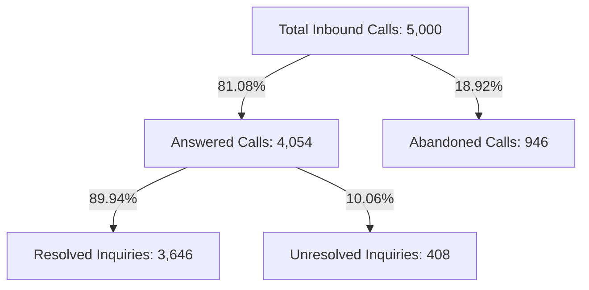

# 📊 Portfolio Case Study: PwC Call Center Performance Analytics

> [!abstract] Executive Summary & Engagement Context
> Completed as part of the prestigious **PwC Switzerland Virtual Case Experience** (hosted on **Forage**). Operating in the role of a **Digital Accelerator**, conducted an end-to-end operational intelligence analysis of **5,000 inbound customer service interactions** for **Claire**, Call Centre Manager at a global telecommunications client. Designed a 2-page executive business intelligence dashboard (**The KPI Dashboard** & **The Detail Page**) that diagnosed an **18.92% queue abandonment rate**, benchmarked agent productivity across an **Agent Performance Quadrant**, and formulated operational recommendations projected to eliminate up to 50% of lost customer calls.

---

## 🎯 Business Challenge & Client Mandate
Claire, Call Centre Manager at an international telecommunications enterprise, was experiencing slipping customer satisfaction (CSAT) ratings and operational opacity in her department. Her leadership team lacked a centralized business intelligence system to monitor real-time queue demand, queue hold times (Average Speed of Answer), topic complexity, and agent accountability across the 8-person team.

### Primary Objectives for Claire
- **Measure Queue Health**: Quantify abandonment rates and Average Speed of Answer (ASA) across all hours of operation.
- **Topic-Level Diagnostics**: Evaluate resolution efficiency across 5 core inquiry topics (`Contract related`, `Payment related`, `Technical support`, `Admin support`, `Streaming`).
- **Agent Performance Quadrant**: Benchmark agents across **Average Handle Time (Talk Duration) vs Calls Answered** to identify coaching opportunities.
- **Enterprise Reporting**: Deliver an interactive self-service reporting suite with synchronized slicers and automated state reset controls.

---

## 🛠️ Technical Stack & Methodology
- **Core Platform**: Microsoft Excel (Modern BI Stack) & Power BI Cloud Service.
- **Data Engineering**: Power Query ETL pipeline, forensic handling of 946 abandoned operational nulls, strict data typing.
- **Semantic Modeling**: Power Pivot data model, explicit DAX measures (`DIVIDE`, `CALCULATE`, `DISTINCTCOUNT`).
- **Dashboard Architecture**:
  - **Page 1: The KPI Dashboard** — High-level operational overview, CSAT scorecards, abandonment ratios, and hourly arrival trends.
  - **Page 2: The Detail Page** — Granular topic breakdown and the 2-axis Agent Performance Quadrant.
- **Interactivity**: Synchronized multi-pivot Slicers with a single-click VBA filter reset macro (`ClearAllSlicers`).

---

## 📈 Ground-Truth Performance Metrics (Q1 2021)

| Executive KPI | Measured Value | Benchmark / Target | Variance / Operational Status |
| :--- | :---: | :---: | :--- |
| **Total Calls Offered** | **5,000** | 5,000 | 100% Data Capture Across Q1 2021 |
| **Answer Rate** | **81.08%** | > 80.0% | ✅ Meets Industry Connection SLA |
| **Call Abandonment Rate** | **18.92%** | < 10.0% | ⚠️ Critical Issue (946 lost customers) |
| **First-Contact Resolution (Answered)** | **89.94%** | > 85.0% | 🌟 High Problem-Solving Competency |
| **Average Speed of Answer (ASA)** | **67.52 sec** | < 45.0 sec | ⚠️ 22.5s Above Acceptable SLA |
| **Average Talk Duration** | **00:03:45** | < 04:00 | Balanced Handle Time |
| **Average Customer Satisfaction (CSAT)**| **3.40 / 5.00** | > 4.00 / 5.00 | ⚠️ Key Improvement Opportunity |

---

## 🔍 In-Depth Analytical Findings for Claire

### 1. The Queue Bottleneck (Access vs Execution)
A critical insight emerged when separating access metrics from execution metrics:
- Once customers reached an agent, the team achieved an **89.94% resolution rate**.
- However, 946 callers (18.92%) abandoned before reaching an agent due to an average queue wait time of **67.52 seconds**.
- **Root Cause**: The contact center does not suffer from technical incompetence; it suffers from a front-end queue congestion and staffing bottleneck during peak midday hours.

### 2. The Agent Performance Quadrant
Mapping agents across **Average Handle Time vs Calls Answered**:
- **Stellar Producers (Jim & Dan)**: Jim handled the highest team volume (536 calls, 90.49% resolution). Dan answered 523 calls with 3.45 CSAT and 90.06% resolution.
- **Speed & Queue Relief (Becky)**: Lowest ASA on the team (65.33s), providing vital queue relief during arrival surges.
- **Thorough Specialist (Martha)**: Longer talk times rewarded with the highest CSAT rating on the team (**3.47 / 5.00**).
- **Mentorship Candidate (Joe)**: Lowest CSAT (3.33 / 5.00) and slowest answer speed (70.99s), making him the primary candidate for peer coaching.

---

## 💡 Strategic Recommendations & Estimated Business Impact

| Operational Initiative | Strategic Action for Claire | Projected Business Impact |
| :--- | :--- | :--- |
| **1. Virtual Queue & Callback** | Implement automated queue callbacks when wait times exceed 45 seconds. | 35–50% reduction in call abandonment. |
| **2. Peak Hour Shift Staggering** | Stagger agent lunch breaks to ensure 100% desk coverage from 11:00 AM to 2:00 PM. | Average Speed of Answer reduced to <45 seconds. |
| **3. IVR Self-Service Offloading** | Offload routine streaming authentication and payment inquiries to mobile app / IVR. | 15–20% deflection of total inbound telephone queue. |
| **4. Peer Mentorship Program** | Pair Joe with Martha to share customer closing scripts and fast troubleshooting flows. | Increase team CSAT from 3.40 to >3.75 within 60 days. |
| **5. Synergy with Retention Risk (Task 2)**| Connect repeated technical call logs into predictive churn risk modeling. | Protect high-LTV subscribers before contract cancellation. |

---

## 🌐 External Dashboards & Authentic References
- 🔗 **Interactive Power BI Cloud Report**: [Open Live PwC Call Centre Report](https://app.powerbi.com/links/_jx5u479wZ?ctid=af2c0734-cb42-464f-b6bf-2a241b6ada56&pbi_source=linkShare)
- 📖 **Canonical Documentation Hub**: [triwgani.github.io/pwc_digital.transformation](https://triwgani.github.io/pwc_digital.transformation/)
- 📦 **PwC Switzerland 3-Task Simulation Suite**:
  1. *Task 1: Call Centre Trends* (`01 Call-Center-Dataset.xlsx` - 5,000 calls)
  2. *Task 2: Customer Retention* (`02 Churn-Dataset.xlsx` - 7,043 telco accounts)
  3. *Task 3: Diversity and Inclusion* (`03 Diversity-Inclusion-Dataset.xlsx` - 500 employee records)

---

## 💼 Skills Demonstrated as a Digital Accelerator
- `Digital Transformation & Client Advisory`
- `Exploratory Data Analysis (EDA)`
- `Forensic Data Quality Auditing`
- `Excel Tables & Power Query ETL`
- `Power Pivot & DAX Semantic Modeling`
- `Power BI Executive Dashboard Design`
- `Agent Performance Quadrant Analysis`
- `VBA Macro Automation`

