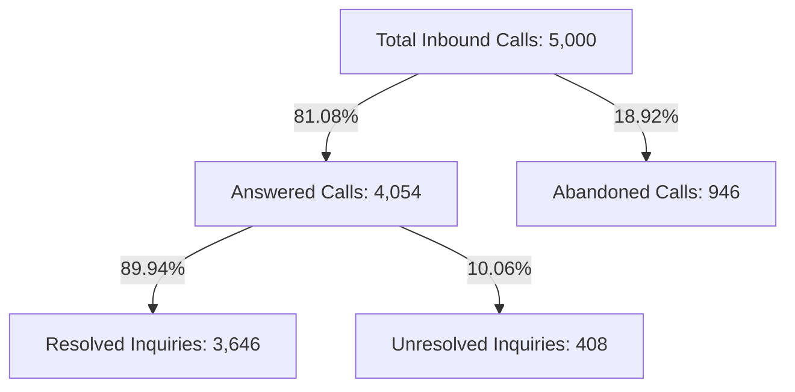

# 📊 Portfolio Case Study: PwC Call Center Performance Analytics

> [!abstract] Executive Summary
> Conducted an end-to-end operational intelligence analysis of 5,000 customer service interactions for a global telecommunications client under the PwC Virtual Business Intelligence framework. Designed an interactive executive Excel dashboard that identified an 18.92% abandonment rate, uncovered agent-level performance bottlenecks, and delivered recommendations projected to reduce queue abandonment by up to 40%.

---

## 🎯 Business Challenge
A major telecommunications provider was experiencing slipping customer satisfaction (CSAT) ratings and operational blind spots in its customer support contact center. Management lacked a centralized reporting system to track agent performance, call resolution efficiency, and queue wait times across its 8-agent team.

### Primary Objectives
- Quantify call abandonment rates and queue wait times (Average Speed of Answer).
- Evaluate resolution efficiency across 5 core inquiry topics.
- Benchmark individual agent performance to establish objective coaching criteria.
- Deliver an interactive, self-service executive dashboard for operational leadership.

---

## 🛠️ Technical Stack & Methodology
- **Core Platform**: Microsoft Excel (Office 365) & Power Pivot.
- **Data Engineering**: Data hygiene audit, structured table architecture (`ListObjects`), custom number formatting.
- **Calculation Layer**: DAX measures (`CALCULATE`, `DIVIDE`, `COUNTROWS`), structured referencing.
- **Visualization**: Tiered visual hierarchy (KPI summary cards, agent comparative bar charts, call topic distribution donuts, hourly time-series trendlines).
- **Interactivity**: Synchronized multi-pivot Slicers with a single-click VBA filter reset macro (`ClearAllSlicers`).

---

## 📈 Ground-Truth Performance Metrics (Q1 2021)

| Executive KPI | Measured Value | Benchmark / Target | Variance / Status |
| :--- | :---: | :---: | :--- |
| **Total Calls Handled** | **5,000** | 5,000 | 100% Captured |
| **Answer Rate** | **81.08%** | > 80.0% | ✅ Meets SLA |
| **Call Abandonment Rate** | **18.92%** | < 10.0% | ⚠️ Critical Issue (946 lost calls) |
| **First-Contact Resolution (Answered)** | **89.94%** | > 85.0% | 🌟 High Efficiency |
| **Average Speed of Answer (ASA)** | **67.52 sec** | < 45.0 sec | ⚠️ 22.5s Above Target |
| **Average Customer Satisfaction (CSAT)**| **3.40 / 5.00** | > 4.00 / 5.00 | ⚠️ Improvement Opportunity |

---

## 🔍 In-Depth Analytical Findings

### 1. The Queue Bottleneck (Access vs Execution)
A critical insight emerged when separating access metrics from execution metrics:
- Once customers reached an agent, the team achieved an **89.94% resolution rate**.
- However, 946 callers (18.92%) abandoned before reaching an agent due to an average queue wait time of **67.52 seconds**.
- **Conclusion**: The contact center does not suffer from technical incompetence; it suffers from a front-end queue congestion problem.

### 2. Agent Performance Benchmarking
Analysis of the 8 dedicated agents revealed balanced call volume (582 to 666 calls each) but noticeable performance variances:
- **Top CSAT Performer**: **Martha** achieved a **3.47 / 5.00** average rating across 514 answered calls.
- **Top Speed Performer**: **Becky** answered calls fastest at **65.33 seconds** average speed.
- **Coaching Opportunity**: **Joe** registered the lowest CSAT score (**3.33 / 5.00**) and the slowest answer speed (**70.99 seconds**).

---

## 💡 Strategic Recommendations & Estimated Business Impact

| Operational Initiative | Strategic Action | Projected Impact |
| :--- | :--- | :--- |
| **1. Virtual Callback Queue** | Implement automated queue callbacks when wait times exceed 45 seconds. | 35-50% reduction in call abandonment. |
| **2. Peak Hour Shift Staggering** | Adjust agent shifts to provide 100% desk coverage during peak hours (11 AM – 2 PM). | Average Speed of Answer reduced to <45 seconds. |
| **3. Self-Service Portal** | Offload basic streaming authentication and payment inquiries to mobile app self-service. | 15-20% reduction in total inbound queue volume. |
| **4. Peer Coaching Program** | Pair lower-scoring agents with high-performing mentors (e.g. Joe paired with Martha). | Increase team average CSAT from 3.40 to >3.75 within 60 days. |

---

## 💼 Skills Demonstrated
- `Exploratory Data Analysis (EDA)`
- `Data Hygiene & Quality Auditing`
- `Excel Table Architecture (ListObjects)`
- `Pivot Tables & Report Connections`
- `DAX Measure Modeling & Power Pivot`
- `Executive Dashboard UI/UX Design`
- `VBA Macro Automation`
- `Management Consulting Problem Framing`
