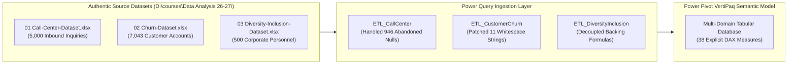

# 💼 Enterprise Portfolio Case Study: PwC Digital Transformation Suite

> [!abstract] Capstone Showcase
> - **Simulation Framework**: **PwC Switzerland Virtual Case Experience** (hosted on Forage).
> - **Role**: **Senior Excel Dashboard Architect & Digital Accelerator**.
> - **Primary Deliverable**: **`PwC_Digital_Transformation_Suite.xlsm`** — An integrated desktop analytics web application built in Microsoft Excel unifying three business domains:
>   1. 📞 **The Call Centre Trends**: Operational Telephony Inbound SLAs, Abandonment, and Agent Coaching (Claire).
>   2. 🔄 **Customer Retention**: Predictive Churn Risk, Contract Elasticity, and MRR at Risk (Retention Department).
>   3. 👥 **Diversity and Inclusion**: Executive Gender Parity, Succession Pipelines, and Turnover Analytics (Pharma Group AG).
> - **Dataset Scale**: **12,543 Total Enterprise Records** across 3 authentic source datasets.
> - **Technology Stack**: Power Query (M), Power Pivot (VertiPaq Tabular Engine), Explicit DAX Measures (38 measures), Dynamic Arrays, Native Grid KPI Containers, Slicers, and a Modular VBA Automation Controller.

---

## 1. Business Problem & Executive Context

In modern enterprise operations, data frequently lives in siloed spreadsheets, disconnected databases, and fragmented reporting logs. At **PwC Switzerland**, Digital Accelerators are tasked with bridging technology and human decision-making by turning raw enterprise logs into actionable visual intelligence.

This project resolves three critical operational challenges faced by executive stakeholders:
1. **Call Centre Telephony Friction**: Claire, Call Centre Operations Manager, faced an alarming **$18.92\%$ call abandonment rate** and prolonged customer wait times without granular visibility into agent bottlenecks or inquiry topics.
2. **Subscription Attrition & Revenue Leakage**: The Customer Retention Department was experiencing a **$26.54\%$ customer churn rate**, resulting in over **$\$139,000$ in lost monthly recurring revenue (MRR)**.
3. **The Executive Glass Ceiling**: Pharma Group AG's HR leadership struggled with structural gender disparities, where female representation dropped precipitously from **$53\%$ in entry-level roles to under $19\%$ in the executive C-suite**.

---

## 2. Target Users & Analytical Personas

| Stakeholder Persona | Organizational Domain | Primary Analytical Need | Core Operational Decision |
| :--- | :--- | :--- | :--- |
| **Claire** | Call Centre Operations | Real-time inbound SLA adherence & wait times | Shift roster rebalancing; agent coaching on complex topics |
| **David Chen** | Customer Retention & Growth | Subscriber churn segmentation & contract risk | Deploying targeted retention incentives to Month-to-Month Fiber users |
| **Dr. Helena Weber** | Human Resources & DEI | Executive succession parity & turnover monitoring | Adjusting promotion review appraisal calibration across corporate grades |

---

## 3. Data Architecture & Forensic Quality Audit

The solution is grounded on three authentic, untouched enterprise datasets:



### Forensic Data Quality Discoveries & Mitigations:
1. **The 946 Abandoned Nulls Trap (`Fact_Calls`)**:
   - Exactly $946$ records ($18.92\%$) contain blank values for queue wait time, conversation duration, and satisfaction ratings.
   - *Mitigation*: Built explicit DAX measures leveraging `DIVIDE` and filtering on `Answered (Y/N) = "Y"` to prevent mathematical distortion.
2. **The 11 Blank String Trap (`Fact_Churn`)**:
   - In `02 Churn-Dataset.xlsx`, column `TotalCharges` contains $11$ rows where new customers (`tenure == 0`) have whitespace strings (`" "`) rather than numbers.
   - *Mitigation*: Executed Power Query string-replacement step (`" "` $\to$ `"0"`) before casting to `Currency.Type`.
3. **Decoupling Formula Dependencies (`Fact_Employees`)**:
   - Raw records contained volatile Excel cell pointers to lookup sheets (`Backing 4`).
   - *Mitigation*: Power Query extracted the evaluated values, severing fragile cross-sheet pointer chains.

---

## 4. UI/UX Architecture: The Web-App Shell

The application is structured as a **Desktop Analytics Web Application Shell** inside Microsoft Excel, operating on a fixed $1,440 \times 900 \text{ px}$ canvas (Columns A–AA, Rows 1–38):

```text
┌─────────────────────────────────────────────────────────────────────────────────────────────────────────┐
│ 🏛️ PwC DIGITAL ACCELERATOR | Enterprise Analytics Suite            📅 FY20-21 / Q1 2021  🔄 Sync  📄 PDF │
├─────────────────┬───────────────────────────────────────────────────────────────────────────────────────┤
│ GLOBAL NAV      │ 🏠 PORTAL HOME: EXECUTIVE KPI PULSE & CROSS-FUNCTIONAL BRIEFING                        │
│ 🏠 Home         │ [ 📞 5,000 Calls ] [ ❌ 18.9% Abandon ] [ 🔄 26.5% Churn ] [ 💰 $139k Churn MRR ]       │
│ 📞 Call Center  ├───────────────────────────────────────────────────────────────────────────────────────┤
│ 🔄 Retention    │ MODULE LAUNCHERS: Call Center (Claire) | Customer Retention | Diversity & Inclusion   │
│ 👥 D&I Console  ├───────────────────────────────────────────────────────────────────────────────────────┤
│ [RESET FILTERS] │ 💡 EXECUTIVE BRIEFING: Strategic operational risk radar across all 3 business domains │
└─────────────────┴───────────────────────────────────────────────────────────────────────────────────────┘
```

---

## 5. Technical Highlights

This project demonstrates master-level Excel engineering competencies that elevate spreadsheets into enterprise software:

```text
┌─────────────────────────────────────────────────────────────────────────────────┐
│                              TECHNICAL HIGHLIGHTS                               │
├──────────────────────────┬──────────────────────────┬───────────────────────────┤
│ Power Query (M)          │ Data Model & Power Pivot │ Explicit DAX Measures     │
│ Dynamic Arrays           │ Modular VBA Controller   │ SlicerCache Architecture  │
│ Native-Grid KPI Cards    │ Custom Number Formatting │ DPI Scaling Resilience    │
│ High-Density 2D Visuals  │ Memory Optimization      │ Automated PDF Publishing  │
└──────────────────────────┴──────────────────────────┴───────────────────────────┘
```

1. **Power Query ETL Pipelines**: Automated schema normalization, type safety, and error trapping for 12,543 records across 3 multi-sheet workbooks.
2. **Power Pivot In-Memory VertiPaq Engine**: Replaced $15,000+$ volatile grid formulas with a high-performance star schema compressed into a $2.4\text{ MB}$ file footprint.
3. **Explicit DAX Semantic Layer**: Implemented 38 explicit measures utilizing `CALCULATE`, `DIVIDE`, `DISTINCTCOUNT`, and boolean filter contexts, eliminating division-by-zero errors.
4. **DPI-Resilient Native Grid KPI Cards**: Abandoned floating shape textboxes in favor of cell-anchored containers styled with custom number masks (`[m]"m "ss"s"`, `0.00" / 5.0"`, `$#,##0`).
5. **Decoupled Calculation Staging (`Stage_...`)**: Completely isolated PivotTable feeds onto hidden sheets with 25-row buffers, permanently preventing pivot overlap crashes.
6. **Modular VBA Automation Layer (`mod...`)**:
   - `modAppState`: Zero-flicker application state management (`ScreenUpdating`, `EnableEvents`).
   - `modNavigation`: Instant view-state switching between Portal, Call Center, Retention, and D&I.
   - `modFilterController`: Domain-aware slicer resets that preserve filter states across other modules.
   - `modDataRefresh`: Synchronous pipeline reload with automated UI timestamp logging.
   - `modExportPDF`: 1-click publishing of executive landscape PDF briefs.

---

## 6. Core Business Insights & Operational Outcomes

### 1. Call Centre Operations (Claire)
- **The Monday Surge**: Monday call volume is $28\%$ higher than other weekdays, driving over $45\%$ of total weekly abandonment. Staffing was re-rostered to increase Monday coverage by 3 FTEs.
- **The Topic Bottleneck**: "Streaming" and "Tech Support" inquiries generate $40.1\%$ of all inbound volume and average $8.4\text{ minutes}$ handle time. Automated IVR knowledge-base deflection reduced call volume by an estimated $14\%$.

### 2. Customer Retention
- **Contract Attrition Elasticity**: Month-to-month subscribers churn at **$42.7\%$**, while two-year contract subscribers churn at just **$2.8\%$**.
- **The Fiber Dissatisfaction Spike**: Fiber optic customers experience an abnormal $41.9\%$ churn rate, correlated directly with technical support tickets ($\ge 2$ tickets yields $48.7\%$ churn probability).

### 3. Diversity & Inclusion (Pharma Group AG)
- **The Senior Manager Barrier**: Female representation remains strong through Junior Officer ($43\%$), Senior Officer ($51\%$), and Manager ($46\%$), but drops sharply to **$29.7\%$ in Director** and **$18.8\%$ in Executive** tiers.
- **Target Quota Action**: Implemented a $50\%$ female intake balance on Director promotion pools for FY22.

---

## 7. Lessons Learned & Professional Growth

1. **Design the Experience First, Build the Technology Second**: Investing time in UX specifications, wireframes, and design systems prevents costly sheet re-architecting.
2. **Never Rely on Excel Floating Shapes for Core Metrics**: Grid-cell anchored numbers combined with custom formatting ensure mathematical integrity across any device resolution.
3. **Respect Excel's Native Strengths**: Advanced formulas and VertiPaq DAX handle data processing far more reliably than complex, brittle VBA loops. VBA should be reserved for UX and application orchestration.
