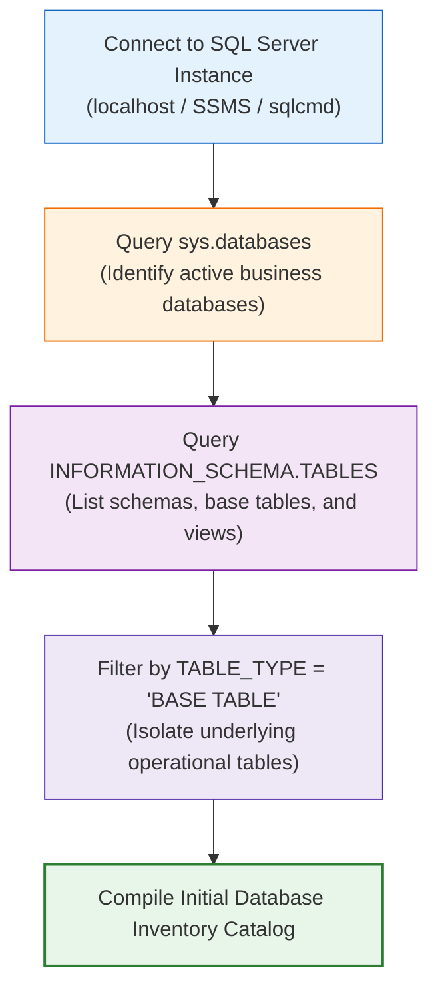

# 🔬 Lab 01: Database Discovery & Catalog Inspection

> [!abstract] Objective
> Learn how a professional analytics engineer systematically investigates an unfamiliar database for the first time. You will use SQL Server system catalog views (`sys.databases`, `INFORMATION_SCHEMA.TABLES`) to inventory databases, discover schemas, and isolate base transactional tables from views.

---

## 1. Concept & Theory

When assigned to build a reporting dashboard on an existing corporate database, you must **never guess table names or rely on informal word-of-mouth**. SQL Server maintains an internal, highly indexed metadata catalog that describes every database, schema, table, column, and constraint in the system.



---

## 2. Lab Exercises

### Exercise 1.1: Discovering Databases on the Server
Open SSMS or `sqlcmd` and query the server's master catalog:

```sql
SELECT 
    name AS DatabaseName,
    database_id,
    compatibility_level,
    state_desc,
    create_date
FROM sys.databases
WHERE database_id > 4 -- Exclude system databases: master, tempdb, model, msdb
ORDER BY name;
```

### Exercise 1.2: Inventorying All Base Tables in Northwind
Switch context to `Northwind` and query `INFORMATION_SCHEMA`:

```sql
USE Northwind;
GO

SELECT 
    TABLE_CATALOG,
    TABLE_SCHEMA,
    TABLE_NAME,
    TABLE_TYPE
FROM INFORMATION_SCHEMA.TABLES
WHERE TABLE_TYPE = 'BASE TABLE'
ORDER BY TABLE_NAME;
```
*Expected Output*: Exactly 13 tables (`Categories`, `Customers`, `Employees`, `Order Details`, `Orders`, `Products`, `Shippers`, `Suppliers`, etc.).

### Exercise 1.3: Comparing Table Counts Across Schemas in AdventureWorks2022
In enterprise databases, tables are partitioned across functional business schemas rather than everything dumping into `dbo`:

```sql
USE AdventureWorks2022;
GO

SELECT 
    TABLE_SCHEMA,
    COUNT(*) AS BaseTableCount
FROM INFORMATION_SCHEMA.TABLES
WHERE TABLE_TYPE = 'BASE TABLE'
GROUP BY TABLE_SCHEMA
ORDER BY BaseTableCount DESC;
```
*Expected Output*:
- `Production`: 25 tables
- `Sales`: 19 tables
- `Person`: 13 tables
- `HumanResources`: 6 tables
- `Purchasing`: 5 tables
- `dbo`: 3 tables

---

## 3. Key Takeaways & Defense Question

> **Interview Defense Question**: *Why is `INFORMATION_SCHEMA.TABLES` preferred over proprietary vendor queries when discovering tables?*
> **Answer**: `INFORMATION_SCHEMA` is an ANSI-SQL standard supported across SQL Server, PostgreSQL, MySQL, and BigQuery. Using it ensures your database discovery scripts remain portable and standardized.
