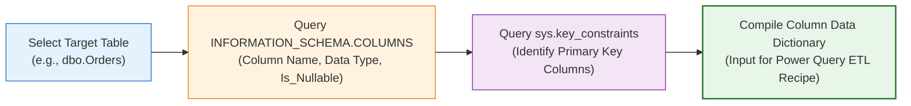

# 🔬 Lab 02: Schema Exploration & Column Data Types

> [!abstract] Objective
> Learn how to inspect the physical data types, nullability, precision, and primary key constraints of any table in SQL Server. You will write automated inspection queries using `INFORMATION_SCHEMA.COLUMNS` and `sys.key_constraints` to compile comprehensive table data dictionaries.

---

## 1. Concept & Theory

Before ingesting data into Power Query or writing SQL queries, you must understand the **physical data types and column attributes**:
- Is `Freight` a `decimal(10,2)` or a `float`? (Floating points introduce rounding inaccuracies!).
- Is `OrderDate` a `datetime` (with timestamps) or a pure `date`?
- Can `ShippedDate` be `NULL`? (Yes, for unshipped orders!).
- What column serves as the unique identifier (Primary Key)?



---

## 2. Lab Exercises

### Exercise 2.1: Extracting Complete Column Metadata for `Northwind.dbo.Orders`
```sql
USE Northwind;
GO

SELECT 
    ORDINAL_POSITION AS Pos,
    COLUMN_NAME,
    DATA_TYPE,
    CHARACTER_MAXIMUM_LENGTH AS MaxLen,
    NUMERIC_PRECISION AS Precision,
    NUMERIC_SCALE AS Scale,
    IS_NULLABLE AS Nullable,
    COLUMN_DEFAULT AS DefaultVal
FROM INFORMATION_SCHEMA.COLUMNS
WHERE TABLE_SCHEMA = 'dbo' AND TABLE_NAME = 'Orders'
ORDER BY ORDINAL_POSITION;
```

### Exercise 2.2: Automated Script to Detect Primary Keys for Any Table
```sql
SELECT 
    kc.name AS ConstraintName,
    t.name AS TableName,
    c.name AS PrimaryKeyColumn,
    ic.key_ordinal AS KeyOrder
FROM sys.key_constraints kc
INNER JOIN sys.tables t ON kc.parent_object_id = t.object_id
INNER JOIN sys.index_columns ic ON kc.parent_object_id = ic.object_id AND kc.unique_index_id = ic.index_id
INNER JOIN sys.columns c ON ic.object_id = c.object_id AND ic.column_id = c.column_id
WHERE kc.type = 'PK' AND t.name IN ('Orders', 'Order Details')
ORDER BY t.name, ic.key_ordinal;
```
*Key Finding*: `Orders` has a single-column primary key (`OrderID`), while `Order Details` has a **composite primary key** consisting of two columns (`OrderID` + `ProductID`).

---

## 3. Key Takeaways & Defense Question

> **Interview Defense Question**: *Why is a composite primary key significant in `Order Details`, and what happens if you group by only `OrderID` in SQL?*
> **Answer**: A composite key of `(OrderID, ProductID)` guarantees that each product can appear at most once per order. If you group by `OrderID` alone without aggregating line items (using `SUM(UnitPrice * Quantity)`), SQL Server throws an error, or Power Query creates an unintended cartesian product.
