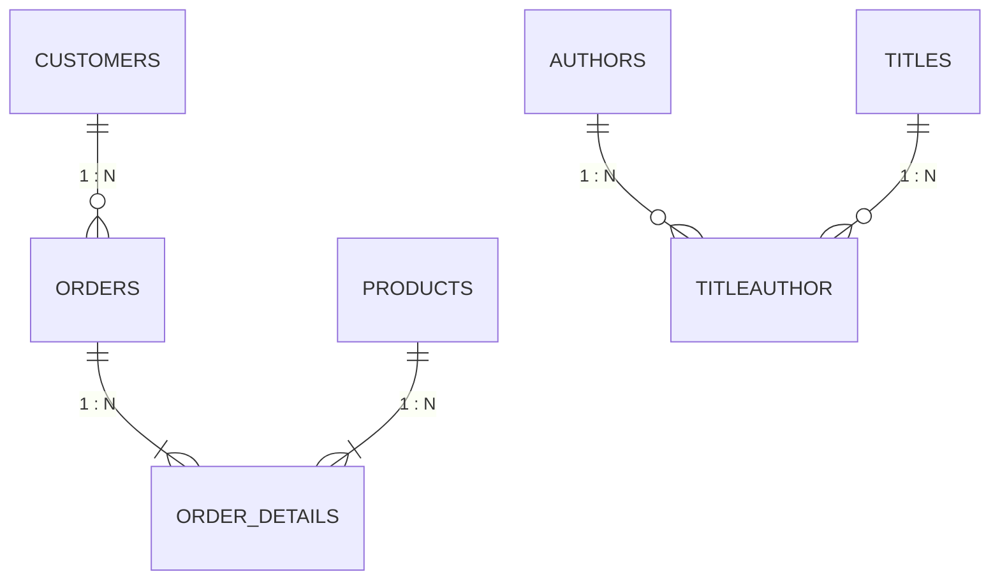

# 🔬 Lab 03: Relationship Analysis & Foreign Key Mapping

> [!abstract] Objective
> Learn how to map relational connections, foreign keys, and cardinalities between tables using automated T-SQL queries against `sys.foreign_keys`. You will learn how to detect 1-to-many parent-child relationships and identify associative bridge tables that resolve many-to-many structures.

---

## 1. Concept & Theory

Relational integrity is governed by **Foreign Key (FK) constraints**. A Foreign Key in a child table references the Primary Key (PK) of a parent table:
- **Parent (1)** $\longrightarrow$ **Child ($N$)**: One Customer has many Orders (`Customers.CustomerID` $\xrightarrow{1:N}$ `Orders.CustomerID`).
- **Many-to-Many ($M:N$)**: Handled through an **Associative Bridge Table**:
  - `authors (au_id)` $\xrightarrow{1:N}$ `titleauthor` $\xleftarrow{N:1}$ `titles (title_id)`.



---

## 2. Lab Exercises

### Exercise 3.1: Automated Foreign Key Relationship Mapping Script
Execute this query in `Northwind` to map all parent-child connections across the database:

```sql
USE Northwind;
GO

SELECT 
    fk.name AS ForeignKeyName,
    OBJECT_NAME(fk.referenced_object_id) AS ParentTable,
    COL_NAME(fkc.referenced_object_id, fkc.referenced_column_id) AS ParentColumn,
    '-->' AS RelationshipFlow,
    OBJECT_NAME(fk.parent_object_id) AS ChildTable,
    COL_NAME(fkc.parent_object_id, fkc.parent_column_id) AS ChildColumn,
    fk.delete_referential_action_desc AS OnDeleteAction
FROM sys.foreign_keys fk
INNER JOIN sys.foreign_key_columns fkc ON fk.object_id = fkc.constraint_object_id
ORDER BY ParentTable, ChildTable;
```

### Exercise 3.2: Detecting Bridge Tables in `pubs`
Execute this query to identify tables that contain more than one foreign key column forming a composite primary key (the signature of a bridge table):

```sql
USE pubs;
GO

SELECT 
    t.name AS TableName,
    COUNT(DISTINCT fk.object_id) AS ForeignKeysCount
FROM sys.tables t
INNER JOIN sys.foreign_keys fk ON t.object_id = fk.parent_object_id
GROUP BY t.name
HAVING COUNT(DISTINCT fk.object_id) >= 2;
```
*Expected Output*: `titleauthor` (references both `authors` and `titles`).

---

## 3. Key Takeaways & Defense Question

> **Interview Defense Question**: *What is the difference between a natural 1-to-many relationship and a bridge table, and why does Power Pivot require special handling for bridge tables?*
> **Answer**: A 1-to-many relationship links a single parent record to multiple child records directly. A bridge table resolves an $M:N$ relationship by holding pairs of foreign keys. In Power Pivot, relationships must be single-directional $1:N$; bidirectional filtering or explicit DAX (`CALCULATE` with `CROSSFILTER` or `USERELATIONSHIP`) is required to filter across bridge tables without ambiguous paths.
