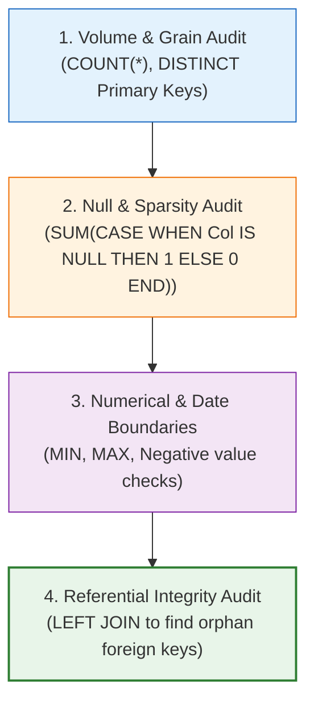

# 🔬 Lab 04: Data Profiling & Quality Audit via T-SQL

> [!abstract] Objective
> Learn how to perform deep, forensic data profiling directly inside SQL Server prior to data ingestion. You will write reusable profiling scripts to audit row counts, null distributions, value ranges, potential duplicates, and test referential integrity for orphan records.

---

## 1. Concept & Theory

Never assume a database is clean simply because it sits inside SQL Server! Even relational engines can contain:
- **Null Values**: E.g. unshipped orders (`ShippedDate IS NULL`).
- **Discounts / Negative Prices**: Testing for domain validity constraints.
- **Orphan Records**: Child rows whose foreign key points to a non-existent parent row (if foreign key constraints were disabled or missing).
- **Date Boundary Anomalies**: Orders with dates far in the future or preceding company founding.



---

## 2. Lab Exercises

### Exercise 4.1: Comprehensive Profiling of `Northwind.dbo.Orders`
```sql
USE Northwind;
GO

SELECT 
    COUNT(*) AS TotalRows,
    COUNT(DISTINCT OrderID) AS DistinctOrders,
    COUNT(DISTINCT CustomerID) AS DistinctCustomers,
    COUNT(DISTINCT EmployeeID) AS DistinctEmployees,
    MIN(OrderDate) AS EarliestOrderDate,
    MAX(OrderDate) AS LatestOrderDate,
    SUM(CASE WHEN ShippedDate IS NULL THEN 1 ELSE 0 END) AS UnshippedOrdersCount,
    ROUND(100.0 * SUM(CASE WHEN ShippedDate IS NULL THEN 1 ELSE 0 END) / COUNT(*), 2) AS UnshippedPct,
    MIN(Freight) AS MinFreight,
    MAX(Freight) AS MaxFreight,
    AVG(Freight) AS AvgFreight
FROM dbo.Orders;
```

### Exercise 4.2: Auditing for Orphan Records in `Order Details`
Verify that every `OrderID` in `Order Details` points to a legitimate parent in `Orders`:

```sql
SELECT 
    od.OrderID AS OrphanOrderID,
    od.ProductID
FROM dbo.[Order Details] od
LEFT JOIN dbo.Orders o ON od.OrderID = o.OrderID
WHERE o.OrderID IS NULL;
```
*Expected Output*: Exactly **0 rows** returned (referential integrity intact).

### Exercise 4.3: Auditing Discounts and Negative Prices in `Order Details`
```sql
SELECT 
    COUNT(*) AS TotalLineItems,
    SUM(CASE WHEN UnitPrice <= 0 THEN 1 ELSE 0 END) AS ZeroOrNegativePriceCount,
    SUM(CASE WHEN Quantity <= 0 THEN 1 ELSE 0 END) AS ZeroOrNegativeQtyCount,
    SUM(CASE WHEN Discount < 0 OR Discount > 1.0 THEN 1 ELSE 0 END) AS InvalidDiscountCount
FROM dbo.[Order Details];
```
*Expected Output*: All error counts are **0**.

---

## 3. Key Takeaways & Defense Question

> **Interview Defense Question**: *How do you verify data quality in SQL Server before building a Power Query model?*
> **Answer**: I run a standard data profiling script checking 4 dimensions: (1) Total rows vs distinct primary keys to guarantee uniqueness, (2) Null count and percentage across every column to identify optional fields, (3) Boundary checks (`MIN`, `MAX`) on dates and numerical metrics to flag anomalies, and (4) Left anti-joins to verify zero orphan records exist between child and parent tables.
