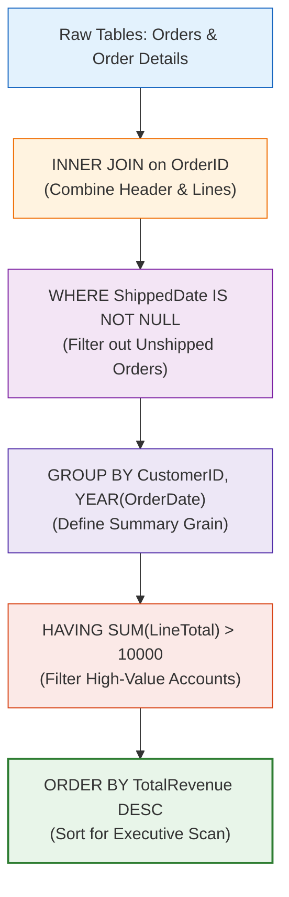

# 🔬 Lab 05: Core SQL Querying: Aggregation, Filtering & Joins

> [!abstract] Objective
> Master the foundational SQL data manipulation techniques required for analytical extraction. You will progress through Levels 1–3 of SQL querying: selective filtering, multi-table relational joins, conditional aggregations, and `HAVING` threshold filters on the Northwind database.

---

## 1. Concept & Theory

In business intelligence, raw rows are rarely reported directly. We aggregate transactions to answer executive questions.
- **Relational JOINs**: Connect dimension entities (`Categories`, `Customers`) to fact transactions (`Orders`, `Order Details`).
- **Grouping**: Collapses multiple line items into customer, product, or temporal summaries.
- **`WHERE` vs `HAVING`**: `WHERE` filters rows *before* aggregation; `HAVING` filters aggregated values *after* grouping.



---

## 2. Lab Exercises

### Exercise 5.1: Level 1 — Filtering & Sorting High-Value Orders
Find the top 10 highest-freight orders shipped to Germany:

```sql
USE Northwind;
GO

SELECT TOP 10
    OrderID,
    CustomerID,
    OrderDate,
    ShipCountry,
    Freight
FROM dbo.Orders
WHERE ShipCountry = 'Germany'
ORDER BY Freight DESC;
```

### Exercise 5.2: Level 2 & 3 — Category Revenue Summary via Multi-Table JOIN
Calculate total revenue and order count across all 8 food categories:

```sql
SELECT 
    c.CategoryID,
    c.CategoryName,
    COUNT(DISTINCT o.OrderID) AS TotalOrders,
    SUM(od.Quantity) AS TotalUnitsSold,
    ROUND(SUM(od.UnitPrice * od.Quantity * (1 - od.Discount)), 2) AS GrossSalesRevenue,
    ROUND(AVG(od.UnitPrice * od.Quantity * (1 - od.Discount)), 2) AS AvgLineItemValue
FROM dbo.Categories c
INNER JOIN dbo.Products p ON c.CategoryID = p.CategoryID
INNER JOIN dbo.[Order Details] od ON p.ProductID = od.ProductID
INNER JOIN dbo.Orders o ON od.OrderID = o.OrderID
GROUP BY c.CategoryID, c.CategoryName
ORDER BY GrossSalesRevenue DESC;
```

### Exercise 5.3: Level 3 — High-Value Customer Segmentation via `HAVING`
Isolate commercial customers whose lifetime purchases exceed $20,000:

```sql
SELECT 
    c.CustomerID,
    c.CompanyName,
    c.Country,
    COUNT(DISTINCT o.OrderID) AS TotalOrdersPlaced,
    ROUND(SUM(od.UnitPrice * od.Quantity * (1 - od.Discount)), 2) AS LifetimeSpend
FROM dbo.Customers c
INNER JOIN dbo.Orders o ON c.CustomerID = o.CustomerID
INNER JOIN dbo.[Order Details] od ON o.OrderID = od.OrderID
GROUP BY c.CustomerID, c.CompanyName, c.Country
HAVING SUM(od.UnitPrice * od.Quantity * (1 - od.Discount)) > 20000
ORDER BY LifetimeSpend DESC;
```

---

## 3. Key Takeaways & Defense Question

> **Interview Defense Question**: *Why can't you write `WHERE SUM(...) > 20000`?*
> **Answer**: SQL's logical query processing order executes `WHERE` during row evaluation before grouping occurs. Aggregations (`SUM`, `AVG`, `COUNT`) only exist *after* the `GROUP BY` clause evaluates, meaning post-aggregation filters must be placed in the `HAVING` clause.
