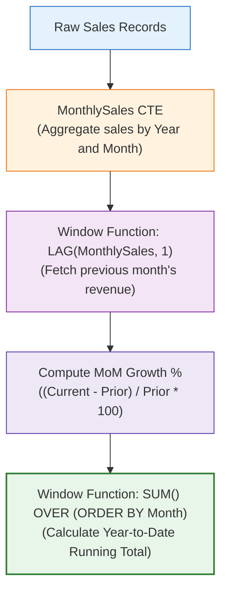

# 🔬 Lab 06: Analytical SQL: CTEs, Window Functions & CASE Logic

> [!abstract] Objective
> Advance to Levels 4 and 5 of SQL proficiency by authoring sophisticated analytical transformations: Common Table Expressions (CTEs), conditional `CASE` categorization, and analytical Window Functions (`ROW_NUMBER`, `DENSE_RANK`, `LAG`, and running totals).

---

## 1. Concept & Theory

When preparing data for executive dashboards, standard aggregations often fall short:
- **Month-over-Month (MoM) Growth**: Requires comparing the current month's sales to the prior month's sales (`LAG`).
- **Cumulative Running Totals**: Requires summing sales from the beginning of the year up to the current date (`SUM(...) OVER (ORDER BY ...)`).
- **Ranking**: Identifying the top 3 products in *each* category (`DENSE_RANK() OVER (PARTITION BY ...)`).
- **Modular Readable Logic**: Replacing messy nested subqueries with Common Table Expressions (`WITH ... AS (...)`).



---

## 2. Lab Exercises

### Exercise 6.1: Level 4 — Conditional Customer Tiering via `CASE`
Segment Northwind customers into commercial tiers based on average order value:

```sql
USE Northwind;
GO

SELECT 
    c.CustomerID,
    c.CompanyName,
    COUNT(DISTINCT o.OrderID) AS TotalOrders,
    ROUND(SUM(od.UnitPrice * od.Quantity * (1 - od.Discount)), 2) AS TotalSpend,
    ROUND(AVG(od.UnitPrice * od.Quantity * (1 - od.Discount)), 2) AS AvgSpendPerOrder,
    CASE 
        WHEN SUM(od.UnitPrice * od.Quantity * (1 - od.Discount)) >= 25000 THEN 'Tier 1 - Enterprise VIP'
        WHEN SUM(od.UnitPrice * od.Quantity * (1 - od.Discount)) >= 10000 THEN 'Tier 2 - Commercial Mid'
        ELSE 'Tier 3 - Standard SMB'
    END AS CustomerSegment
FROM dbo.Customers c
INNER JOIN dbo.Orders o ON c.CustomerID = o.CustomerID
INNER JOIN dbo.[Order Details] od ON o.OrderID = od.OrderID
GROUP BY c.CustomerID, c.CompanyName
ORDER BY TotalSpend DESC;
```

### Exercise 6.2: Level 5 — Month-over-Month (MoM) Growth via `LAG()`
Calculate monthly revenue, prior month revenue, and percentage growth rate:

```sql
WITH MonthlyRevenueCTE AS (
    SELECT 
        YEAR(o.OrderDate) AS OrderYear,
        MONTH(o.OrderDate) AS OrderMonthNum,
        DATENAME(MONTH, o.OrderDate) AS OrderMonthName,
        ROUND(SUM(od.UnitPrice * od.Quantity * (1 - od.Discount)), 2) AS CurrentMonthRevenue
    FROM dbo.Orders o
    INNER JOIN dbo.[Order Details] od ON o.OrderID = od.OrderID
    GROUP BY YEAR(o.OrderDate), MONTH(o.OrderDate), DATENAME(MONTH, o.OrderDate)
)
SELECT 
    OrderYear,
    OrderMonthNum,
    OrderMonthName,
    CurrentMonthRevenue,
    LAG(CurrentMonthRevenue, 1) OVER (ORDER BY OrderYear, OrderMonthNum) AS PriorMonthRevenue,
    ROUND(
        100.0 * (CurrentMonthRevenue - LAG(CurrentMonthRevenue, 1) OVER (ORDER BY OrderYear, OrderMonthNum)) / 
        NULLIF(LAG(CurrentMonthRevenue, 1) OVER (ORDER BY OrderYear, OrderMonthNum), 0), 
        2
    ) AS MoM_GrowthRatePct,
    SUM(CurrentMonthRevenue) OVER (PARTITION BY OrderYear ORDER BY OrderMonthNum) AS YTD_RunningTotal
FROM MonthlyRevenueCTE
ORDER BY OrderYear, OrderMonthNum;
```

### Exercise 6.3: Level 5 — Top 2 Best-Selling Products per Category via `DENSE_RANK()`
```sql
WITH RankedProductsCTE AS (
    SELECT 
        cat.CategoryName,
        p.ProductName,
        ROUND(SUM(od.UnitPrice * od.Quantity * (1 - od.Discount)), 2) AS ProductRevenue,
        DENSE_RANK() OVER (
            PARTITION BY cat.CategoryName 
            ORDER BY SUM(od.UnitPrice * od.Quantity * (1 - od.Discount)) DESC
        ) AS RevenueRank
    FROM dbo.Categories cat
    INNER JOIN dbo.Products p ON cat.CategoryID = p.CategoryID
    INNER JOIN dbo.[Order Details] od ON p.ProductID = od.ProductID
    GROUP BY cat.CategoryName, p.ProductName
)
SELECT 
    CategoryName,
    RevenueRank,
    ProductName,
    ProductRevenue
FROM RankedProductsCTE
WHERE RevenueRank <= 2
ORDER BY CategoryName, RevenueRank;
```

---

## 3. Key Takeaways & Defense Question

> **Interview Defense Question**: *Why is `DENSE_RANK()` preferred over `ROW_NUMBER()` or `RANK()` when identifying top performers?*
> **Answer**: `ROW_NUMBER()` assigns arbitrary consecutive numbers even if two products have identical sales, arbitrarily declaring a winner. `RANK()` leaves gaps in numbering after ties (1, 1, 3). `DENSE_RANK()` handles ties gracefully without skipping rank numbers (1, 1, 2), ensuring fair multi-item threshold filtering.
