# 🔬 Lab 07: SQL-to-Excel Ingestion Architectures & Power Query

> [!abstract] Objective
> Learn the four standard enterprise architectures for ingesting SQL Server data into Microsoft Excel using Power Query. You will evaluate the trade-offs between **Direct Table Navigation, Custom SQL Statements, SQL Views, and Direct Data Model Loading**, while mastering **Query Folding**.

---

## 1. Concept & Theory: The 4 Ingestion Architectures

```mermaid
flowchart TD
    subgraph A ["Architecture A: Direct Table Navigation (Maximum Folding)"]
        A1["SQL Table"] --> A2["Power Query Navigator"] --> A3["Excel Table"]
    end
    subgraph B ["Architecture B: Explicit SQL Query (Complex Logic Pushdown)"]
        B1["SQL Database"] --> B2["Custom SQL Statement\n[Query='SELECT...']"] --> B3["Excel Table"]
    end
    subgraph C ["Architecture C: SQL View (Governed & Reusable)"]
        C1["SQL View\n(vw_SalesSummary)"] --> C2["Power Query (Folds cleanly)"] --> C3["Excel Presentation"]
    end
    subgraph D ["Architecture D: Tabular Star Model (Zero Grid Bloat)"]
        D1["SQL Source"] --> D2["Power Query ETL"] --> D3["Power Pivot Data Model\n(VertiPaq Memory)"]
    end

    style A fill:#e3f2fd,stroke:#1565c0,stroke-width:1px
    style B fill:#fff3e0,stroke:#ef6c00,stroke-width:1px
    style C fill:#f3e5f5,stroke:#7b1fa2,stroke-width:1px
    style D fill:#e8f5e9,stroke:#2e7d32,stroke-width:2px
```



---

## 2. Ingestion Architectures Compared

| Architecture | How It Is Implemented | When to Use | Query Folding Behavior | Governance & Maintainability |
| :--- | :--- | :--- | :--- | :--- |
| **A: Direct Table** | Select table in PQ Navigator | Simple tables requiring minimal transformations | **Preserved**: Filter/sort steps fold back to SQL | High (No custom SQL to maintain) |
| **B: Custom SQL Query** | Enter SQL query in PQ Advanced options | Complex joins, CTEs, or window functions | **Frozen**: Subsequent M steps may not fold | Low (SQL embedded invisibly in workbook) |
| **C: Database SQL View** | Create `VIEW` in SQL Server, then navigate | Enterprise standard for reusable business views | **Preserved**: PQ treats the view as a table and folds | **Highest**: View updated centrally on server |
| **D: Direct Data Model** | Uncheck "Table", check "Add to Data Model" | Datasets $> 100,000$ rows or multi-table star models | **Preserved**: Memory-compressed in VertiPaq | **Optimal for Dashboards**: Zero sheet bloat |

---

## 3. Lab Exercises

### Exercise 7.1: Authoring a Governed SQL View on `Northwind`
Execute this DDL statement in SSMS to create an optimized reporting view:

```sql
USE Northwind;
GO

CREATE OR ALTER VIEW dbo.vw_ExecutiveSalesSummary
AS
SELECT 
    o.OrderID,
    o.OrderDate,
    YEAR(o.OrderDate) AS OrderYear,
    MONTH(o.OrderDate) AS OrderMonth,
    DATENAME(MONTH, o.OrderDate) AS OrderMonthName,
    c.CustomerID,
    c.CompanyName AS CustomerName,
    c.Country AS CustomerCountry,
    CONCAT(e.FirstName, ' ', e.LastName) AS SalesRepName,
    cat.CategoryName,
    p.ProductName,
    od.Quantity,
    od.UnitPrice,
    od.Discount,
    ROUND(od.UnitPrice * od.Quantity * (1 - od.Discount), 2) AS LineTotalRevenue
FROM dbo.Orders o
INNER JOIN dbo.Customers c ON o.CustomerID = c.CustomerID
INNER JOIN dbo.Employees e ON o.EmployeeID = e.EmployeeID
INNER JOIN dbo.[Order Details] od ON o.OrderID = od.OrderID
INNER JOIN dbo.Products p ON od.ProductID = p.ProductID
INNER JOIN dbo.Categories cat ON p.CategoryID = cat.CategoryID;
GO
```

### Exercise 7.2: Power Query M Recipe to Ingest `vw_ExecutiveSalesSummary`
Open Excel $\to$ Power Query $\to$ Advanced Editor, and paste:

```powerquery
let
    // 1. Connect to local SQL Server using Windows Integrated Security
    Source = Sql.Database("localhost", "Northwind"),
    
    // 2. Select the Governed View from the Database Catalog
    dbo_vw_Sales = Source{[Schema="dbo", Item="vw_ExecutiveSalesSummary"]}[Data],
    
    // 3. Filter on Year >= 1997 (This step FOLDS directly into a SQL WHERE clause!)
    FilteredRecentYears = Table.SelectRows(dbo_vw_Sales, each [OrderYear] >= 1997),
    
    // 4. Ensure Strict Type Safety
    TypedTable = Table.TransformColumnTypes(FilteredRecentYears, {
        {"OrderID", Int64.Type},
        {"OrderDate", type date},
        {"OrderYear", Int64.Type},
        {"OrderMonth", Int64.Type},
        {"Quantity", Int64.Type},
        {"UnitPrice", Currency.Type},
        {"LineTotalRevenue", Currency.Type}
    })
in
    TypedTable
```

---

## 4. Key Takeaways & Defense Question

> **Interview Defense Question**: *Why is creating a SQL View (Architecture C) generally superior to pasting a custom SQL query into Power Query's Advanced Options (Architecture B)?*
> **Answer**: Pasting raw SQL inside Power Query creates hidden, un-versioned dependencies inside the Excel workbook that database administrators cannot see or index. Creating a SQL View on the server allows the DBA to optimize execution plans, add covering indexes, and share the exact same logic with Power BI, Tableau, and SSRS. Furthermore, Power Query can fold subsequent UI filter steps onto a View, whereas custom SQL blocks further query folding.
