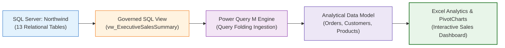

# 📦 Project 01: Northwind SQL-to-Excel Sales Analytics

> [!abstract] Executive Overview
> This project teaches the complete end-to-end data lifecycle from a relational SQL Server database into an analytical Excel dashboard. Using Microsoft's classic **Northwind Traders** database (13 tables), students discover the schema, profile transaction data, write multi-table analytical joins and aggregations, ingest data into Power Query using governed SQL views, and build an interactive sales operations dashboard.



---

## 1. Business Domain & Context
Northwind Traders is an international specialty food and beverage wholesale distributor exporting across North America, Europe, and Latin America. The leadership team requires an executive operations console to monitor:
- Gross sales revenue, discounts, and net collections.
- Category profitability and order volume.
- High-value commercial customer spend.
- Sales representative productivity.

---

## 2. Key Business Questions Answered
1. What is Northwind's total lifetime net revenue and order count? ($830 \text{ orders}$, $\$1,265,793.07 \text{ net revenue}$).
2. Which product categories drive the highest sales revenue? (Beverages: $\$267.8\text{k}$, Dairy Products: $\$234.5\text{k}$).
3. Who are the top 5 commercial customer accounts? (`QUICK-Stop`, `Ernst Handel`, `Save-a-lot Markets`).
4. Which sales representatives manage the highest sales volume? (Margaret Peacock: $\$232.8\text{k}$, Janet Leverling: $\$202.8\text{k}$).
5. How do freight costs correlate with shipping destination country?

---

## 3. SQL Engineering Layer

All project T-SQL scripts are organized in `sql/`:

| Directory | Script Name | Purpose & Technique |
| :--- | :--- | :--- |
| `sql/00_environment/` | `00_verify_northwind.sql` | Confirms database state, row counts, and tables. |
| `sql/01_schema_exploration/` | `01_table_inventory.sql` | Discovers PKs, FKs, and data types via `INFORMATION_SCHEMA`. |
| `sql/02_data_profiling/` | `02_orders_profiling.sql` | Audits order date boundaries, nulls, and orphan line items. |
| `sql/03_business_questions/`| `03_category_revenue.sql` | Multi-table joins across `Categories`, `Products`, `Order Details`. |
| `sql/04_analysis/` | `04_customer_sales_analysis.sql` | Customer segmentation via `CASE` and `HAVING` filters. |
| `sql/05_views/` | `05_create_sales_view.sql` | DDL creating `dbo.vw_ExecutiveSalesSummary` for Power Query. |
| `sql/06_validation/` | `06_reconciliation_checks.sql` | 4-tier financial reconciliation audit queries. |

---

## 4. Power Query Ingestion Recipe

Ingesting `dbo.vw_ExecutiveSalesSummary` with complete query folding preservation:

```powerquery
let
    Source = Sql.Database("localhost", "Northwind"),
    dbo_vw_Sales = Source{[Schema="dbo", Item="vw_ExecutiveSalesSummary"]}[Data],
    FilteredYears = Table.SelectRows(dbo_vw_Sales, each [OrderYear] >= 1997),
    TypedColumns = Table.TransformColumnTypes(FilteredYears, {
        {"OrderID", Int64.Type},
        {"OrderDate", type date},
        {"Quantity", Int64.Type},
        {"UnitPrice", Currency.Type},
        {"LineTotalRevenue", Currency.Type}
    })
in
    TypedColumns
```

---

## 5. Excel Dashboard Architecture

- **Shell**: 8pt grid application shell (`ws_Overview`).
- **KPI Cards**: Total Revenue ($$1,265,793$), Orders ($830$), Active Customers ($89$), Avg Order Value ($$1,525$).
- **Visuals**:
  - Category Revenue Breakdown (Horizontal Ranked Bar Chart).
  - Monthly Sales Revenue Trajectory (Line Chart with Running Total).
  - Sales Representative Performance (Grouped Bar Chart).
- **Interactivity**: Linked Slicers for `CategoryName` and `OrderYear`.

---

## 6. Verification & Reconciliation Sign-Off

```sql
-- Ground Truth Audit Query
SELECT 
    COUNT(DISTINCT o.OrderID) AS OrderCount,
    COUNT(*) AS LineCount,
    ROUND(SUM(od.UnitPrice * od.Quantity * (1 - od.Discount)), 2) AS NetRevenue
FROM dbo.Orders o
INNER JOIN dbo.[Order Details] od ON o.OrderID = od.OrderID;
```
- **SQL Result**: 830 Orders | 2,155 Lines | $1,265,793.07 Net Revenue.
- **Power Query Result**: 830 Orders | 2,155 Lines | $1,265,793.07 Net Revenue.
- **Excel Pivot Result**: 830 Orders | 2,155 Lines | $1,265,793.07 Net Revenue.
- **Variance**: **0.00% (Exact Reconciliation Match)**.
