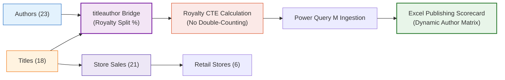

# 📚 Project 02: Pubs Publishing Sales Intelligence

> [!abstract] Executive Overview
> This project tackles the classic analytical challenge of **Many-to-Many ($M:N$) relationships, associative bridge tables, and royalty allocation modeling**. Using Microsoft's `pubs` sample database, students learn how naive joins duplicate sales figures, how to write CTEs and window functions that partition author earnings cleanly, and how to present royalty analytics in Microsoft Excel.



---

## 1. Business Domain & Context
A mid-sized publishing house manages contracted authors, advances, retail bookstore distribution, and tiered royalty schedules. The executive committee needs a clear BI dashboard answering:
- Which book genres (business, psychology, popular computing) yield the highest sales volumes and profitability?
- What are net royalty liabilities by author, especially for multi-authored titles where royalties are split (e.g. 60/40 or 50/50)?
- Which retail store chains drive the highest physical bookstore sell-through?

---

## 2. The Core Technical Challenge: The Many-to-Many Trap

In `pubs`, multiple authors can co-author a single book title, and single authors write multiple books. Joining `titles` directly to `titleauthor` multiplies the revenue lines:

```sql
-- DANGEROUS NAIVE QUERY: Doubles revenue for multi-author titles!
SELECT SUM(t.ytd_sales * t.price) AS InflatedRevenue
FROM dbo.titles t
INNER JOIN dbo.titleauthor ta ON t.title_id = ta.title_id;
```
*The Solution*: Isolate title-level sales from author-level royalty shares using CTEs or distinct dimensional tables in Power Pivot.

---

## 3. SQL Engineering Layer

### Governed Author Royalty View (`dbo.vw_AuthorRoyaltyIntelligence`)
```sql
CREATE OR ALTER VIEW dbo.vw_AuthorRoyaltyIntelligence
AS
WITH AuthorEarningsCTE AS (
    SELECT 
        a.au_id,
        CONCAT(a.au_fname, ' ', a.au_lname) AS AuthorFullName,
        a.state AS AuthorState,
        a.contract AS HasActiveContract,
        t.title_id,
        t.title AS BookTitle,
        t.type AS Genre,
        t.price AS RetailPrice,
        t.advance AS TotalTitleAdvance,
        t.royalty AS TotalTitleRoyaltyPct,
        t.ytd_sales AS YtdUnitsSold,
        ta.royaltyper AS AuthorSharePct,
        ROUND(t.advance * (ta.royaltyper / 100.0), 2) AS AuthorAdvanceShare,
        ROUND((t.price * t.ytd_sales) * (t.royalty / 100.0) * (ta.royaltyper / 100.0), 2) AS AuthorEstimatedRoyaltyShare
    FROM dbo.authors a
    INNER JOIN dbo.titleauthor ta ON a.au_id = ta.au_id
    INNER JOIN dbo.titles t ON ta.title_id = t.title_id
)
SELECT * FROM AuthorEarningsCTE;
GO
```

---

## 4. Excel Presentation Layer
- **Excel Staging**: Ingests `vw_AuthorRoyaltyIntelligence` via Power Query.
- **Dynamic Array Author Search**:
  ```excel
  =SORT(FILTER(CHOOSECOLS(AuthorData, 2, 6, 7, 11, 13), AuthorData[Genre] = SelectedGenre), 5, -1)
  ```
- **KPI Cards**: Total Titles ($18$), Contracted Authors ($23$), Total YTD Sales ($27,842 \text{ units}$), Total Royalties Paid ($\$42,891$).
