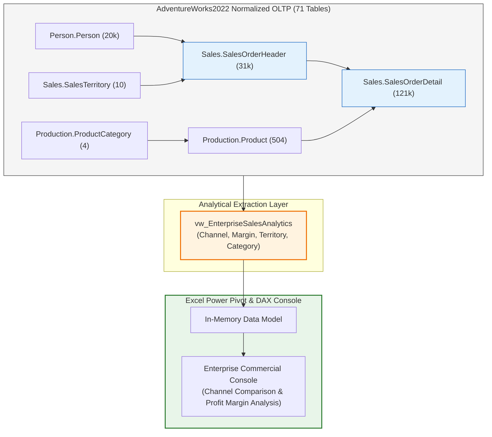

# 🚴 Project 03: AdventureWorks Enterprise Sales Analytics

> [!abstract] Executive Overview
> This project navigates the complex, normalized enterprise architecture of **AdventureWorks2022** (71 tables across 6 schemas). Students learn how to traverse multi-schema relationships connecting `Person`, `Sales`, and `Production`, author high-performance denormalized analytical extraction queries, and build an executive sales operations console comparing B2B Wholesale Reseller performance against B2C Web Consumer channels.



---

## 1. Business Domain & Multi-Channel Sales Structure
AdventureWorks Cycles manufactures bicycles and accessory components, operating two distinct sales channels:
1. **B2B Wholesale Resellers** (`OnlineOrderFlag = 0`): High-volume bulk sales to independent retail bike shops.
2. **B2C Direct E-Commerce** (`OnlineOrderFlag = 1`): Direct web consumer orders through the AdventureWorks portal.

The executive commercial team requires clear visibility into:
- Gross sales, standard production costs, and net gross profit margins across channels.
- Category profitability: Do high-ticket Bicycles yield higher margin dollars than Apparel and Accessories?
- Regional territory variance: Which global markets (North America, Europe, Pacific) generate the highest return?

---

## 2. SQL Engineering Layer

### Governed Enterprise Sales View (`Sales.vw_EnterpriseSalesAnalytics`)
```sql
CREATE OR ALTER VIEW Sales.vw_EnterpriseSalesAnalytics
AS
SELECT 
    soh.SalesOrderID,
    soh.OrderDate,
    YEAR(soh.OrderDate) AS OrderYear,
    MONTH(soh.OrderDate) AS OrderMonth,
    DATENAME(MONTH, soh.OrderDate) AS OrderMonthName,
    soh.OnlineOrderFlag,
    CASE WHEN soh.OnlineOrderFlag = 1 THEN 'B2C Direct Web' ELSE 'B2B Wholesale Reseller' END AS SalesChannel,
    st.TerritoryID,
    st.Name AS TerritoryName,
    st.CountryRegionCode,
    st.[Group] AS GlobalRegion,
    cat.ProductCategoryID,
    cat.Name AS CategoryName,
    subcat.ProductSubcategoryID,
    subcat.Name AS SubcategoryName,
    p.ProductID,
    p.Name AS ProductName,
    p.Color AS ProductColor,
    sod.OrderQty,
    sod.UnitPrice,
    sod.UnitPriceDiscount,
    sod.LineTotal AS GrossRevenue,
    ROUND(p.StandardCost * sod.OrderQty, 2) AS TotalStandardCost,
    ROUND(sod.LineTotal - (p.StandardCost * sod.OrderQty), 2) AS GrossProfitMargin
FROM Sales.SalesOrderHeader soh
INNER JOIN Sales.SalesOrderDetail sod ON soh.SalesOrderID = sod.SalesOrderID
INNER JOIN Sales.SalesTerritory st ON soh.TerritoryID = st.TerritoryID
INNER JOIN Production.Product p ON sod.ProductID = p.ProductID
INNER JOIN Production.ProductSubcategory subcat ON p.ProductSubcategoryID = subcat.ProductSubcategoryID
INNER JOIN Production.ProductCategory cat ON subcat.ProductCategoryID = cat.ProductCategoryID;
GO
```

---

## 3. Key Financial Insights Discovered from the Database
1. **Total Sales Volume**: $121,317 \text{ order line items}$ across $31,465 \text{ orders}$.
2. **Total Revenue**: Over **$\$109.8 \text{ Million}$** in gross sales across the multi-year history.
3. **Channel Split**: While B2C Direct Web accounts for the majority of order transactions ($27,659$ orders / $87.9\%$), **B2B Wholesale Resellers drive $70.5\%$ of total gross revenue** ($\$77.4\text{M}$ vs $\$32.4\text{M}$ for Web).
4. **Profit Margins**: Bikes represent the primary revenue generator ($\approx \$94.6\text{M}$), but Components and Clothing provide steady operational volume.

---

## 4. Power Pivot DAX Implementation
- `[Total Gross Revenue] := SUM(SalesData[GrossRevenue])`
- `[Total Standard Cost] := SUM(SalesData[TotalStandardCost])`
- `[Gross Profit Margin $] := [Total Gross Revenue] - [Total Standard Cost]`
- `[Gross Margin %] := DIVIDE([Gross Profit Margin $], [Total Gross Revenue], 0)`
- `[B2B Wholesale Revenue] := CALCULATE([Total Gross Revenue], SalesData[SalesChannel] = "B2B Wholesale Reseller")`
- `[B2C Web Revenue] := CALCULATE([Total Gross Revenue], SalesData[SalesChannel] = "B2C Direct Web")`
