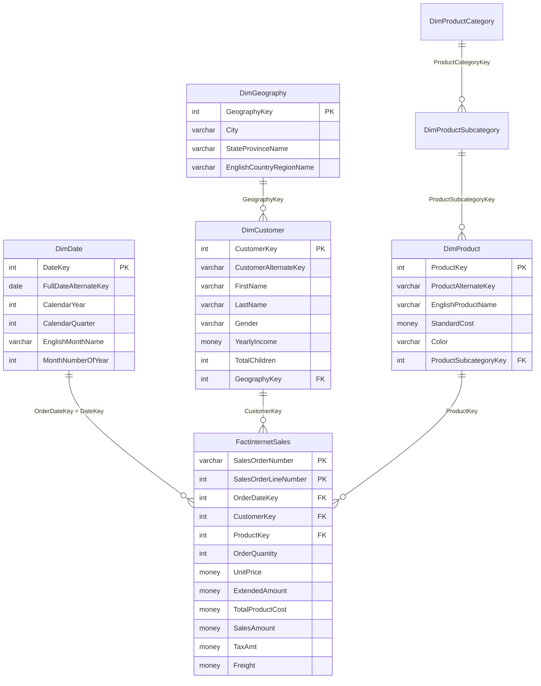

# AdventureWorksDW Dimensional Data Model

This document specifies the analytical star schema architecture of **AdventureWorksDW2022**, contrasting its dimensional design against the normalized OLTP engine of AdventureWorks2022.

---

## 1. Dimensional Architecture Overview

While the operational database ([AdventureWorks2022](file:///d:/courses/Data%20Analysis%2026-27/7-Introducation%20to%20Data%20Fields%20(Excel)/07_Reference/SQL%20Database%20Sources/AdventureWorks%20Documentation.md)) splits entities across 71 tables and 6 schemas to minimize transactional update anomalies (3NF), **AdventureWorksDW2022** restructures historical data into a **Kimball Star Schema**:

1. **Fact Tables (`Fact*`)**: Numerical measurements and additive business metrics at a uniform transactional grain.
2. **Dimension Tables (`Dim*`)**: Descriptive attributes, business hierarchies, and filtering context surrounding the facts.
3. **Surrogate Keys**: Integer keys generated by the data warehouse pipeline (e.g., `CustomerKey`, `ProductKey`, `OrderDateKey`) decoupling analytical models from operational system key churn.

---

## 2. Mermaid Star Schema Diagram



---

## 3. Fact & Dimension Inventory

| Table Name | Classification | Primary Key / Grain | Row Count (DW2022) | Business Role |
| :--- | :--- | :--- | :--- | :--- |
| `dbo.FactInternetSales` | Fact Table | `(SalesOrderNumber, SalesOrderLineNumber)` | 60,398 | B2C E-commerce line-item transactions |
| `dbo.FactResellerSales` | Fact Table | `(SalesOrderNumber, SalesOrderLineNumber)` | 60,855 | B2B Wholesale line-item transactions |
| `dbo.DimCustomer` | Dimension | `CustomerKey` (Surrogate) | 18,484 | B2C Individual Consumer demographics |
| `dbo.DimProduct` | Dimension | `ProductKey` (Surrogate) | 606 | Finished goods and components |
| `dbo.DimProductSubcategory`| Dimension | `ProductSubcategoryKey` | 37 | Mid-level product taxonomy |
| `dbo.DimProductCategory` | Dimension | `ProductCategoryKey` | 4 | Top-level product taxonomy (Bikes, Components, Clothing, Accessories) |
| `dbo.DimDate` | Conformed Dim | `DateKey` (Integer: YYYYMMDD) | 3,652 | Temporal calendar hierarchy (2005–2014) |
| `dbo.DimGeography` | Dimension | `GeographyKey` | 655 | Global regional and postal mapping |

---

## 4. Key Analytical DAX Measures

In the Excel Power Pivot Data Model, define these explicit DAX measures:

```dax
-- Total Internet Revenue
Internet Sales := SUM(FactInternetSales[SalesAmount])

-- Total Internet Product Cost
Internet Cost := SUM(FactInternetSales[TotalProductCost])

-- Gross Profit
Internet Gross Profit := [Internet Sales] - [Internet Cost]

-- Gross Margin Percentage
Internet Margin % := DIVIDE([Internet Gross Profit], [Internet Sales], 0)

-- Total Distinct Orders
Internet Order Count := DISTINCTCOUNT(FactInternetSales[SalesOrderNumber])

-- Average Order Value (AOV)
Internet AOV := DIVIDE([Internet Sales], [Internet Order Count], 0)
```

---

## 5. Summary of Truth

All calculations in this star schema reconcile against physical tables:
- **Total Internet Sales**: `$29,358,677.22` across `60,398` lines.
- **Total Gross Profit**: `$12,080,883.65` (Gross Margin = `41.15%`).
- **Date Range**: December 29, 2010 through January 28, 2014.
