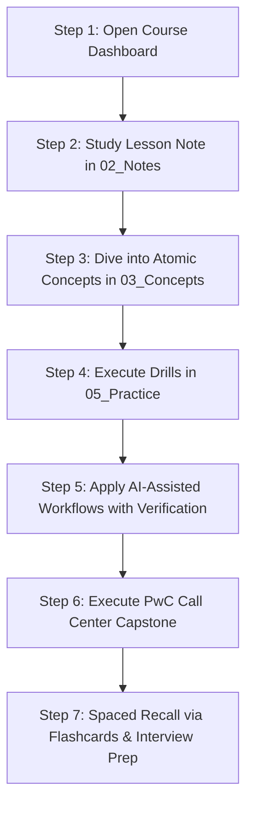

# 📊 Excel Zero to Hero: Second Brain & Analytics Repository

<div align="center">

[](LICENSE)
[](https://linkedin.com/in/sohilakabbas)
[](https://sohilakhaled-portfolio.lovable.app)
[](https://obsidian.md)
[](https://github.com/Sohila-Khaled-Abbas/COURSE-EXCEL-ZERO-TO-HERO/rules)
[](https://www.mindmeister.com/app/map/3782166881?t=I9gXHbkAlV)
[](https://youtu.be/uv1bxe2gdnU)
[](https://www.microsoft.com/en-us/microsoft-365/excel)
[](06_Projects/Call%20Center%20Performance%20Analysis/Project%20Overview.md)
[](03_Concepts/AI%20for%20Data%20Analysts%20MOC.md)
[](07_Reference/Sample%20Superstore%20Dataset%20Documentation.md)
[](https://github.com/Sohila-Khaled-Abbas/COURSE-EXCEL-ZERO-TO-HERO/actions)

**A production-grade Obsidian Knowledge System, Data Analytics Curriculum, and GitHub Portfolio Repository for mastering modern Microsoft Excel, Power Query, Power Pivot, DAX, AI-Assisted Workflows, and Executive Dashboard Engineering.**

[Explore Dashboard](00_Home/Course%20Dashboard.md) • [Course Curriculum](01_Course/Course%20Curriculum.md) • [Live Mindmap](https://www.mindmeister.com/app/map/3782166881?t=I9gXHbkAlV) • [AI Track](03_Concepts/AI%20for%20Data%20Analysts%20MOC.md) • [Superstore Dataset](07_Reference/Sample%20Superstore%20Dataset%20Documentation.md) • [Call Center Capstone](06_Projects/Call%20Center%20Performance%20Analysis/Project%20Overview.md) • [Portfolio Case Study](10_Portfolio/Call%20Center%20Analysis%20Portfolio%20Case%20Study.md) • [Implementation Log](implementation.md) • [Contributing](CONTRIBUTING.md) • [Citation](CITATION.cff)

</div>

---

## 🧭 Repository Overview & Pedagogical Mission

This repository converts the 8-hour masterclass **[Excel from Zero to Hero in 8 Hours | Complete Course + Call Center Analysis Project](https://youtu.be/uv1bxe2gdnU)** by **Mostafa Hamed** into an interconnected **Obsidian Second Brain**, **GitHub Portfolio Artifact**, and **AI-Augmented Analytical System**.

Rather than serving as a passive archive or transcript dump, this system converts raw learning materials into an active, disciplined learning pipeline:
```
Course ➔ Concepts ➔ Notes ➔ Practice ➔ AI Assistance ➔ Verification ➔ Projects ➔ Revision ➔ Portfolio
```


---

## 🧠 Interactive Course Mindmap

Visualize the entire learning curriculum, module hierarchies, and formula ecosystems through our live interactive mindmap:

🔗 **[Open Live Course Mindmap on MindMeister](https://www.mindmeister.com/app/map/3782166881?t=I9gXHbkAlV)**

This online mindmap provides:
- Real-time exploration of course chapters from Interface Foundations to Advanced DAX.
- Visual breakdown of the **Six Dimensions of Data Quality** and ETL pipelines.
- Direct alignment with the **PwC Call Center Performance Analysis** capstone project.
- Fast orientation for visual learners navigating the 8-hour curriculum.

---

## 🗂️ Vault Structure & Directory Map

```text
COURSE-EXCEL-ZERO-TO-HERO/
├── .agents/                                # Antigravity IDE Reusable Rules & Skills
│   ├── rules/learning-vault-rules.md       # Knowledge governance & frontmatter constraints
│   └── skills/                             # Custom agent skills (lesson, concept, exercise, dashboard)
├── .github/                                # Continuous Integration, Workflows & Governance
│   ├── workflows/lint.yml                  # Markdown link integrity & schema verification
│   ├── ISSUE_TEMPLATE/                     # Standardized issue templates
│   ├── PULL_REQUEST_TEMPLATE.md            # Pull request checklist
│   └── dependabot.yml                      # Automated dependency maintenance
├── .obsidian/                              # Pre-configured Obsidian settings, plugins, & themes
│   ├── plugins/                            # Dataview, Omnisearch, Tasks, Templater, Table Editor
│   ├── themes/                             # Minimal, Catppuccin, Obsidian Nord
│   └── snippets/                           # Custom Second-Brain styling
├── assets/                                 # Visual Blueprints, Architectural Diagrams & Media
│   ├── analytics-pipeline-data-comparison.png # Modern Data Stack & ETL pipeline architecture
│   ├── data-quality-mind-map.png           # 6-dimension data hygiene & audit framework
│   ├── data-quality-essentials-guide.png   # Data quality pillars & verification flow
│   ├── enterprise-architecture-mindmap.png # Enterprise analytics topology & BI integration
│   ├── excel-interface-blueprint.pdf       # Architectural manual covering ribbon & formula bar
│   └── getting-started-with-excel-navigation-and-setup.mp4 # Video setup walkthrough
├── implementation.md                       # Comprehensive engineering log & step-by-step roadmap
├── 00_Home/                                # Central Command & Navigation
│   ├── Home.md                             # Welcome orientation & quick jump portal
│   ├── Course Dashboard.md                 # Dynamic Dataview queries & metric trackers
│   ├── Learning Roadmap.md                 # 7-stage pedagogical pathway
│   ├── Course Map.md                       # High-level Mermaid MOC & MindMeister portal
│   └── Progress Tracker.md                 # Active checkbox tracking across all modules
├── 01_Course/                              # Ground-Truth Curriculum & Supplementary Guides
│   ├── Course Overview.md                  # Metadata, instructor, duration, & prerequisites
│   ├── Course Curriculum.md                # 9-module syllabus & file cross-reference
│   ├── Lesson Index.md                     # Comprehensive directory of all lectures
│   ├── Learning Objectives.md              # Bloom's taxonomy competency matrix + 15 AI objectives
│   ├── Gemini Notebook Resource Index.md   # Supplementary knowledge resource index
│   └── Supplementary Learning Path.md      # 9-stage advanced analytical learning pathway
├── 02_Notes/                               # Comprehensive Structured Lecture Notes
│   ├── 01_Fundamentals/                    # Interface, GUI ergonomics, BI Analyst roadmaps
│   ├── 02_Data_Management/                 # Data types, custom formats, validation, Flash Fill
│   ├── 03_Formulas_and_Functions/          # Referencing, SUMIFS, XLOOKUP, logic, text, dates
│   ├── 04_Tables/                          # ListObjects, structured references, dynamic expansion
│   ├── 05_Pivot_Tables/                    # Multidimensional aggregation, Show Values As, slicers
│   ├── 06_Data_Analysis_Charts/            # Visual hierarchy, chart selection, decluttering
│   ├── 07_Data_Cleaning_and_Importing/     # 6 Dimensions of Data Quality, ERP/CRM, SQL ingestion
│   ├── 08_Power_Query_and_M/               # Automated ETL pipelines, unpivoting, merging, M language
│   └── 09_Data_Modeling_and_DAX/           # Star schemas, relationships, calculated columns vs measures
├── 03_Concepts/                            # 22+ Standalone Atomic Concept Notes & MOCs
│   ├── Excel Tables.md                     # ListObject mechanics & auto-expansion
│   ├── Structured References.md            # [@Column] syntax & table referencing
│   ├── Relative vs Absolute References.md  # Coordinate locking ($) & F4 toggles
│   ├── VLOOKUP vs XLOOKUP.md               # Decoupled vector search vs legacy index lookup
│   ├── Pivot Tables.md                     # In-memory aggregation engine mechanics
│   ├── Slicers and Timelines.md            # Visual filtering & multi-pivot Report Connections
│   ├── Six Dimensions of Data Quality.md   # DAMA quality dimensions & forensic auditing
│   ├── Power Query.md                      # Automated ETL pipelines & Applied Steps
│   ├── Dimensional Modeling.md             # Kimball methodology for analytical modeling
│   ├── Data Analysis Expressions (DAX).md  # Context transition & dynamic scalar measures
│   ├── Resource to Skill Map.md            # Fast mapping from skills to drills and projects
│   ├── Human Skill vs AI Assistance.md     # Cognitive division of labor matrix
│   └── AI for Data Analysts MOC.md         # Master visual Map of Content for AI track
├── 04_Formulas/                            # Categorized Excel Formula Knowledge Base
│   ├── Lookup/                             # XLOOKUP, VLOOKUP, INDEX, MATCH
│   ├── Aggregation/                        # SUM, AVERAGE, SUMIFS, COUNTIFS, AVERAGEIFS
│   ├── Logical/                            # IF, IFS, IFERROR, AND, OR
│   ├── Text/                               # TRIM, PROPER, TEXTJOIN, TEXTSPLIT, LEN
│   ├── Date_and_Time/                      # TODAY, DATE, DATEDIF, NETWORKDAYS, EDATE
│   ├── Dynamic_Array/                      # FILTER, UNIQUE, SORT, SORTBY
│   └── DAX/                                # CALCULATE, DIVIDE, RELATED
├── 05_Practice/                            # Progressive Practice System (Levels 1 to 5)
│   ├── Exercises/                          # Ex01 through Ex07 (data management, lookups, ETL, KPIs)
│   ├── Challenges/                         # Advanced dynamic array & API transformation drills
│   ├── Mini Projects/                      # Hotel Reservation & HR Workforce Analytics
│   ├── Solutions/                          # Verified step-by-step solutions (including Ex07)
│   └── AI Assisted Excel/                  # 10 Dedicated AI-Assisted Hands-on Labs:
│       ├── 01 — Generate a Formula With AI.md
│       ├── 02 — Debug a Broken Formula.md
│       ├── 03 — Explain a Complex Formula.md
│       ├── 04 — Detect Data Quality Issues With AI.md
│       ├── 05 — Clean Messy Data With AI Assistance.md
│       ├── 06 — Categorize Data With AI.md
│       ├── 07 — Ask AI to Propose KPIs.md
│       ├── 08 — Design a Dashboard With AI Assistance.md
│       ├── 09 — Validate an AI Generated Solution.md
│       ├── 10 — Rebuild the AI Solution Manually.md
│       └── AI Experiment Log.md            # Reusable prompt engineering & test journal
├── 06_Projects/                            # Production Analytics Case Studies
│   ├── Hotel Reservation Analysis/         # 36,000+ bookings, ADR, RevPAR, cancellation drivers
│   └── Call Center Performance Analysis/   # Complete PwC Capstone Documentation:
│       ├── Project Overview.md             # Scope, executive summary & team roster
│       ├── Business Problem.md             # Stakeholder objectives & SLA bottlenecks
│       ├── Dataset Documentation.md        # 5,000 call records (Q1 2021)
│       ├── Data Dictionary.md              # Granular attribute definitions & null rules
│       ├── Data Quality Assessment.md      # Grounded forensic audit of valid operational nulls
│       ├── Analysis Plan.md                # 6-phase DALC execution methodology
│       ├── KPIs.md                         # Mathematical formulas, DAX measures & benchmarks
│       ├── Findings.md                     # Evidence-based observations & agent scorecard
│       ├── Recommendations.md              # Actionable staffing, process, & self-service strategies
│       ├── Project Retrospective.md        # Engineering retrospective & competencies demonstrated
│       └── AI-Assisted Analysis Workflow.md # Execution classification (AI vs Automated vs Manual)
├── 07_Reference/                           # Rapid-Access Reference Assets & Supplementary Guides
│   ├── Excel Cheat Sheet.md                # High-yield formulas, syntax, & shortcuts
│   ├── Function Reference.md               # Master reference matrix with return types
│   ├── Keyboard Shortcuts.md               # High-velocity navigation & selection shortcuts
│   ├── Glossary.md                         # Analytics & Business Intelligence terminology
│   ├── Sample Superstore Dataset Documentation.md # 9,994-row benchmark data dictionary & provenance
│   ├── Gemini Notebook/                    # 12 Curated Supplementary Reference Guides:
│   │   ├── Analytics Pipeline Comparison.md
│   │   ├── Call Center KPI Analytics.md
│   │   ├── DAX Measures and Data Modeling.md
│   │   ├── Data Quality Framework Mind Map.md
│   │   ├── Data Quality Essentials Guide.md
│   │   ├── Dynamic Arrays and Modern Calculation.md
│   │   ├── Enterprise Architecture Mindmap.md
│   │   ├── Excel Interface Blueprint.md
│   │   ├── Excel Navigation and Setup Video Guide.md
│   │   ├── Executive Dashboard Design Principles.md
│   │   ├── Power Query ETL Transformations.md
│   │   └── XLOOKUP and Modern Lookups.md
│   └── AI for Excel/                       # 9 Verified AI-for-Excel Reference Manuals:
│       ├── AI for Excel Overview.md        # Foundations, architecture & workflow boundaries
│       ├── GPT for MS Excel — Twistly.md   # Twistly custom functions (AI.ASK, AI.TABLE, etc.)
│       ├── Claude for Excel — Anthropic.md # Anthropic sidebar workbook reasoning & citations
│       ├── AI Excel Installation Guide.md  # Office Add-ins vs COM add-ins & AppSource setup
│       ├── AI Excel Workflow.md            # 14-step professional analytics process
│       ├── AI Excel Prompt Library.md      # Production prompt templates (formulas, ETL, UI)
│       ├── AI Output Verification.md       # 6-stage verification framework & checklist
│       ├── AI Excel Security and Privacy.md# Security decision gate & PII data sanitization
│       └── AI Tool Comparison.md           # Objective side-by-side feature comparison
├── 08_Revision/                            # Spaced Repetition & Interview Prep
│   ├── Flashcards.md                       # Active-recall interactive flashcard deck
│   ├── Interview Questions.md              # Senior Data Analyst behavioral & technical questions
│   ├── Quick Review.md                     # 15-minute exam & interview cram sheet
│   └── Common Mistakes.md                  # Top 15 Excel errors (#SPILL!, #N/A, #VALUE!) & fixes
├── 09_Source_Materials/                    # Preserved Original Course Files & Datasets (Local)
│   ├── Module 1/ through Module 9/         # PPTX decks, Excel sheets, CSVs, SQL queries, UI assets
│   └── ...                                 # Untouched source-of-truth materials (gitignored)
├── 10_Portfolio/                           # Recruiter & Client-Facing Artifacts
│   └── Call Center Analysis Portfolio Case Study.md # Executive presentation ready for hiring managers
├── 11_Demos_and_Workbooks/                 # Student Excel Workbooks (.xlsx) & Personal Demos
│   ├── 01_Fundamentals/                    # Interface setup, ergonomics, navigation drills
│   ├── 02_Data_Management/                 # Superstore formatting, custom masks, validation
│   ├── 03_Formulas_and_Functions/          # Dynamic arrays, XLOOKUP, SUMIFS models
│   ├── 04_Tables/                          # Excel Table (ListObject) structured calculations
│   ├── 05_Pivot_Tables/                    # Multi-pivot reports, slicers, Show Values As
│   ├── 06_Charts_and_Visualizations/       # Dynamic charts, visual hierarchy, KPI cards
│   ├── 07_Data_Cleaning/                   # 6 Dimensions audit drills, text cleaning
│   ├── 08_Power_Query/                     # Automated ETL queries, unpivoting, joins
│   ├── 09_Data_Modeling_and_DAX/           # Star schema models, explicit DAX measures
│   └── 10_Projects_and_Demos/              # Capstone workbooks, PwC Call Center analysis
├── scripts/                                # Dynamic Auto-Publish & Watcher Automation
│   ├── watch_autopublish.ps1               # Continuous repository file watcher with debounce
│   ├── watch_workbooks.ps1                 # Dedicated workbook watcher (.xlsx)
│   ├── start_autopublisher.bat             # 1-click visible console launcher
│   ├── start_silent_autopublisher.vbs      # 1-click background invisible launcher
│   ├── stop_autopublisher.bat              # Clean watcher termination utility
│   └── sync_workbooks.bat                  # 1-click manual on-demand synchronization
└── Templates/                              # Standardized Reusable Note Templates
    ├── Lesson Note Template.md
    ├── Concept Note Template.md
    ├── Formula Note Template.md
    ├── Exercise Template.md
    ├── Project Template.md
    ├── Review Template.md
    └── Error Log Template.md
```

---

## 🎥 Official Course Video Curriculum & Masterclass Timestamps

The knowledge repository maps 1-to-1 to the full **8-hour YouTube masterclass**: [Excel from Zero to Hero in 8 Hours](https://youtu.be/uv1bxe2gdnU) by Mostafa Hamed.

| Chapter | Title | Video Timestamp | Duration | Core Subject Matter | Vault Notes & Artifacts |
| :---: | :--- | :---: | :---: | :--- | :--- |
| **01** | **Excel Introduction & GUI** | [0:00](https://www.youtube.com/watch?v=uv1bxe2gdnU) | `16m 05s` | Interface anatomy, Ribbon, Formula Bar, Grid System | [02_Notes/01_Fundamentals](02_Notes/01_Fundamentals/01_Excel_Interface_and_GUI.md) |
| **02** | **Data Management** | [16:05](https://www.youtube.com/watch?v=uv1bxe2gdnU&t=965s) | `1h 22m 51s` | Data types, custom formats, validation, Flash Fill, shortcuts | [02_Notes/02_Data_Management](02_Notes/02_Data_Management/01_Data_Types_and_Formatting.md) |
| **03** | **Excel Formulas & Functions** | [1:38:56](https://www.youtube.com/watch?v=uv1bxe2gdnU&t=5936s) | `56m 59s` | Absolute referencing (`$`), `SUMIFS`, `XLOOKUP`, Dynamic Arrays, DALC | [02_Notes/03_Formulas_and_Functions](02_Notes/03_Formulas_and_Functions/01_Formula_Basics_and_Cell_Referencing.md) |
| **04** | **Excel Tables** | [2:35:55](https://www.youtube.com/watch?v=uv1bxe2gdnU&t=9355s) | `22m 33s` | ListObjects, structured references (`[@Column]`), dynamic expansion | [02_Notes/04_Tables](02_Notes/04_Tables/01_Excel_Tables_Architecture.md) |
| **05** | **Pivot Tables** | [2:58:28](https://www.youtube.com/watch?v=uv1bxe2gdnU&t=10708s) | `28m 30s` | Multi-dimensional summarization, Show Values As, grouping, slicers | [02_Notes/05_Pivot_Tables](02_Notes/05_Pivot_Tables/01_Pivot_Table_Foundations.md) |
| **06** | **Data Analysis Charts** | [3:26:58](https://www.youtube.com/watch?v=uv1bxe2gdnU&t=12418s&pp=0gcJCWMAwfN6Pr3D) | `27m 05s` | Visual analytics, preattentive attributes, decluttering, dashboard layout | [02_Notes/06_Data_Analysis_Charts](02_Notes/06_Data_Analysis_Charts/01_Visual_Analytics_and_Chart_Selection.md) |
| **07** | **Importing Data & Data Cleaning** | [3:54:03](https://www.youtube.com/watch?v=uv1bxe2gdnU&t=14043s) | `26m 27s` | 6 Dimensions of Quality, CSV/SQL/API ingestion, ERP/CRM systems | [02_Notes/07_Data_Cleaning_and_Importing](02_Notes/07_Data_Cleaning_and_Importing/01_Data_Quality_Dimensions_and_Audit.md) |
| **08** | **Power Query & M Language** | [4:20:30](https://www.youtube.com/watch?v=uv1bxe2gdnU&t=15630s) | `43m 09s` | Automated ETL pipelines, unpivoting, merging (joins), appending (unions) | [02_Notes/08_Power_Query_and_M](02_Notes/08_Power_Query_and_M/01_Power_Query_Fundamentals_and_ETL.md) |
| **09** | **Data Modeling, Power Pivot & DAX** | [5:03:39](https://www.youtube.com/watch?v=uv1bxe2gdnU&t=18219s) | `36m 07s` | Star schema, relationships, calculated columns vs explicit measures, `CALCULATE` | [02_Notes/09_Data_Modeling_and_DAX](02_Notes/09_Data_Modeling_and_DAX/01_Dimensional_Modeling_Principles.md) |
| **Final** | **PwC Call Center Performance Analysis** | [5:39:46](https://www.youtube.com/watch?v=uv1bxe2gdnU&t=20386s) | `2h 20m 14s` | 5,000 call records, ASA, CSAT, answer/resolution rates, agent scorecards | [06_Projects/Call Center Capstone](06_Projects/Call%20Center%20Performance%20Analysis/Project%20Overview.md) |

---

## ⚡ Quick Navigation Links

| Hub | Description | Direct Link |
| :--- | :--- | :--- |
| 🎛️ **Command Center** | Dataview queries, progress tracking, and active review queue | [00_Home/Course Dashboard](00_Home/Course%20Dashboard.md) |
| 📋 **Full Curriculum** | 9-module detailed syllabus and lab cross-references | [01_Course/Course Curriculum](01_Course/Course%20Curriculum.md) |
| 🗺️ **Live Mindmap** | Interactive full-course mindmap on MindMeister | [MindMeister Course Map](https://www.mindmeister.com/app/map/3782166881?t=I9gXHbkAlV) |
| 🤖 **AI for Data Analysts** | Master MOC for AI tools, prompt library, verification & labs | [03_Concepts/AI for Data Analysts MOC](03_Concepts/AI%20for%20Data%20Analysts%20MOC.md) |
| 🚀 **Supplementary Path** | 9-phase pedagogical progression & skill matrix | [01_Course/Supplementary Learning Path](01_Course/Supplementary%20Learning%20Path.md) |
| 📞 **PwC Capstone** | End-to-end 5,000-call operational intelligence case study | [06_Projects/Call Center Project Overview](06_Projects/Call%20Center%20Performance%20Analysis/Project%20Overview.md) |
| 💼 **Portfolio Case Study** | Executive case study formatted for recruiters and hiring managers | [10_Portfolio/Case Study](10_Portfolio/Call%20Center%20Analysis%20Portfolio%20Case%20Study.md) |
| 🏗️ **Implementation Log** | Comprehensive engineering log and step-by-step roadmap | [implementation.md](implementation.md) |
| 📁 **Student Workbooks** | Personal Excel workbooks (.xlsx) and lab implementations | [11_Demos_and_Workbooks](11_Demos_and_Workbooks/README.md) |
| 📦 **Superstore Dataset** | 9,994-row benchmark data dictionary, statistics, & mirrors | [07_Reference/Superstore](07_Reference/Sample%20Superstore%20Dataset%20Documentation.md) |
| 📖 **Function Reference** | Comprehensive Excel & DAX function reference manual | [07_Reference/Function Reference](07_Reference/Function%20Reference.md) |
| 🗂️ **Flashcard Deck** | Active-recall flashcards for retention and interview prep | [08_Revision/Flashcards](08_Revision/Flashcards.md) |

---

## 📞 Capstone Spotlight: PwC Call Center Performance Analysis

The flagship project in this repository is a rigorous, evidence-based operational analysis of **5,000 customer service interactions** from the **PwC Virtual Business Intelligence Simulation** (Q1 2021).

### Ground-Truth Operational Metrics (Q1 2021)
- **Total Inbound Calls**: `5,000`
- **Calls Successfully Answered**: `4,054` (**81.08%**)
- **Calls Abandoned in Queue**: `946` (**18.92%**)
- **Calls Resolved (of Answered)**: `3,646` (**89.94%**)
- **Average Speed of Answer (ASA)**: `67.52 seconds`
- **Average Customer Satisfaction (CSAT)**: `3.40 / 5.00`

### Agent Performance Benchmark Scorecard

| Agent | Inbound Calls | Answer Rate | Resolved Calls | Resolution Rate (Answered) | Avg Speed of Answer | Avg CSAT |
| :--- | :---: | :---: | :---: | :---: | :---: | :---: |
| **Becky** | 631 | 81.93% | 462 | 89.36% | **65.33 s** | 3.37 |
| **Dan** | 633 | **82.62%** | 471 | 90.06% | 67.28 s | 3.45 |
| **Diane** | 633 | 79.15% | 452 | 90.22% | 66.27 s | 3.41 |
| **Greg** | 624 | 80.45% | 455 | **90.64%** | 68.44 s | 3.40 |
| **Jim** | **666** | 80.48% | **485** | 90.49% | 66.34 s | 3.39 |
| **Joe** | 593 | 81.62% | 436 | 90.08% | 70.99 s | 3.33 |
| **Martha** | 638 | 80.56% | 461 | 89.69% | 69.49 s | **3.47** |
| **Stewart** | 582 | 81.96% | 424 | 88.89% | 66.18 s | 3.40 |

> [!tip] Forensic Data Quality Breakthrough
> Initial inspection reveals 946 null values across `Speed of answer`, `AvgTalkDuration`, and `Satisfaction rating`. A forensic audit confirms that these 946 records correspond **100%** to abandoned calls (`Answered == "N"`). They represent **valid operational missing values** rather than data corruption, preserving the statistical integrity of average wait times.

Explore the complete case study in **[Call Center Analysis Portfolio Case Study](10_Portfolio/Call%20Center%20Analysis%20Portfolio%20Case%20Study.md)** and the AI execution audit in **[AI-Assisted Analysis Workflow](06_Projects/Call%20Center%20Performance%20Analysis/AI-Assisted%20Analysis%20Workflow.md)**.

---

## 📦 Benchmark Dataset: Sample Superstore & Data Management Labs

The foundational data management practices in this repository (**[02_Notes/02_Data_Management](02_Notes/02_Data_Management/01_Data_Types_and_Formatting.md)**) are grounded in the classic **Sample Superstore** dataset — the global pedagogical standard used across Tableau, Excel, and Power BI commercial analytics education.

### Audited Benchmark Figures (Empirically Verified):
- **Total Inbound Rows**: `9,994` transaction line-items
- **Data Grain**: 1 row = 1 product line-item within an order
- **Unique Orders**: `5,009` orders | **Unique Customers**: `793` buyers | **Unique Products**: `1,862` SKUs
- **Total Gross Sales**: `$2,297,200.86` | **Total Net Profit**: `$286,397.02` (Margin: `12.47%`)
- **Total Units Sold**: `37,873` units | **Average Discount**: `15.62%`

### Provenance, Official Sources & Open Mirrors
Sample Superstore is a **fictitious retail enterprise dataset** created by Tableau for business intelligence, ETL, and data visualization training (it is not an Egyptian or open-government dataset).
- 🏛️ **Official Tableau Hub**: [Tableau Public Sample Data](https://public.tableau.com/app/learn/sample-data) & [Tableau Desktop Superstore Guide](https://help.tableau.com/current/guides/get-started-tutorial/en-gb/get-started-tutorial-connect.htm)
- 📊 **Kaggle Source Mirrors**: [Kaggle: Naveen Kumar](https://www.kaggle.com/datasets/naveenkumar20bps1137/sample-superstore), [Kaggle: Upal Kundu](https://www.kaggle.com/datasets/upalkundu287/sample-superstore-data), [Kaggle: Anoop](https://www.kaggle.com/datasets/anooper/sample-superstore)
- 🐙 **Open GitHub Mirrors**: [Ashwini Gist CSV](https://gist.github.com/SharmaAshwini/8bd642f6c46792a9c40c8ccad60391e9), [Phuong Gist CSV](https://gist.github.com/nnbphuong/38db511db14542f3ba9ef16e69d3814c), [Sau101 Tableau Project](https://github.com/Sau101/Tableau-Superstore)

Full 19-column data dictionary, formatting masks, and lab instructions are documented in **[Sample Superstore Dataset Documentation](07_Reference/Sample%20Superstore%20Dataset%20Documentation.md)**.

---

## 🤖 AI-Assisted Excel Analytics Track

This repository includes a structured, professional AI-for-Excel curriculum designed to cultivate **AI-augmented analytical competence** rather than AI dependency:

```text
Excel Fundamentals ➔ Understand Logic ➔ Use AI Assistant ➔ Inspect Output ➔ 
Test & Validate ➔ Improve Manually ➔ Document Final Logic ➔ Apply to Real Data
```

### Core Architecture & Components
- **Verified Tool Coverage**:
  - **[GPT for MS Excel — Twistly](07_Reference/AI%20for%20Excel/GPT%20for%20MS%20Excel%20%E2%80%94%20Twistly.md)**: Independent AppSource add-in by Twistly featuring custom formula functions (`AI.ASK`, `AI.TABLE`, `AI.FILL`, `AI.CHOICE`, `AI.EXTRACT`, `AI.TRANSLATE`).
  - **[Claude for Excel — Anthropic](07_Reference/AI%20for%20Excel/Claude%20for%20Excel%20%E2%80%94%20Anthropic.md)**: Contextual multi-tab workbook reasoning, dependency-preserving formula assistance, and cell-level citations.
- **[Installation Architecture](07_Reference/AI%20for%20Excel/AI%20Excel%20Installation%20Guide.md)**: Deployment workflows for Office.js web add-ins, contrasting them with legacy `.xlam` and COM `.dll` add-ins.
- **[14-Step Methodology](07_Reference/AI%20for%20Excel/AI%20Excel%20Workflow.md)**: End-to-end framework from business framing to human validation.
- **[Prompt Engineering Library](07_Reference/AI%20for%20Excel/AI%20Excel%20Prompt%20Library.md)**: Battle-tested templates for formula generation, debugging, data profiling, and executive dashboard wireframing.
- **[6-Stage Output Verification](07_Reference/AI%20for%20Excel/AI%20Output%20Verification.md)**: Pre-flight checklist utilizing native Excel tools (`F9`, `Evaluate Formula`).
- **[Security & Privacy](07_Reference/AI%20for%20Excel/AI%20Excel%20Security%20and%20Privacy.md)**: 5-step security decision gate, 8 pre-flight questions, and data sanitization protocols.
- **[10 Hands-on Practice Labs](05_Practice/AI%20Assisted%20Excel/)**: Progressive drills covering formula generation, debugging, text cleaning, sentiment categorization, KPI formulation, and full manual rebuilds.
- **[AI Experiment Log](05_Practice/AI%20Assisted%20Excel/AI%20Experiment%20Log.md)**: Reusable scientific prompt tracking journal.

---

## 🌐 Supplementary Knowledge Sources & Media Blueprints

This repository extends the core curriculum with curated supplementary resources from the public [Gemini Notebook](https://notebook.google.com/notebook/bcdef821-08bc-4186-9221-2c747d5a2b15?authuser=1) and professional architecture artifacts.

### 🖼️ Physical Media Assets (`assets/`)

| Asset File | Format | Size | Description |
| :--- | :---: | :---: | :--- |
| `analytics-pipeline-data-comparison.png` | PNG | 5.5 MB | High-resolution comparison matrix between Excel, SQL, Python, and Modern BI stacks |
| `data-quality-mind-map.png` | PNG | 2.9 MB | Comprehensive visual diagram of the 6 Dimensions of Data Quality & remediation flows |
| `data-quality-essentials-guide.png` | PNG | 5.4 MB | Data quality essentials infographic detailing core validation checks and cleaning rules |
| `enterprise-architecture-mindmap.png` | PNG | 1.4 MB | End-to-end enterprise analytical architecture connecting ERP/CRM sources to executive BI |
| `excel-interface-blueprint.pdf` | PDF | 12.3 MB | Vector-quality architectural guide detailing ribbon commands, formula bar mechanics, and grid |
| `getting-started-with-excel-navigation-and-setup.mp4` | MP4 | 34.8 MB | High-efficiency video tutorial demonstrating workspace setup, quick access customization, and navigation |

### 🧭 Supplementary Curriculum Hubs
- 📋 **Master Resource Index**: [`01_Course/Gemini Notebook Resource Index.md`](01_Course/Gemini%20Notebook%20Resource%20Index.md) — Comprehensive directory linking external insights to vault notes.
- 🚀 **Supplementary Learning Path**: [`01_Course/Supplementary Learning Path.md`](01_Course/Supplementary%20Learning%20Path.md) — Structured 9-phase journey bridging basic spreadsheet mechanics to enterprise engineering.
- 🎯 **Resource-to-Skill Matrix**: [`03_Concepts/Resource to Skill Map.md`](03_Concepts/Resource%20to%20Skill%20Map.md) — Direct mapping connecting technical competencies to lessons, drills, and projects.
- 📚 **Dedicated Reference Manuals**: 12 notes in [`07_Reference/Gemini Notebook/`](07_Reference/Gemini%20Notebook/) covering modern lookups, dynamic arrays, DAX modeling, Power Query transformations, and dashboard UI best practices.
- 🧪 **Hands-on Mastery Drills**: [`05_Practice/Exercises/Ex07_Supplementary_Dynamic_Lookups_and_KPIs.md`](05_Practice/Exercises/Ex07_Supplementary_Dynamic_Lookups_and_KPIs.md) with full mathematical solutions in [`05_Practice/Solutions/Ex07_Solutions.md`](05_Practice/Solutions/Ex07_Solutions.md).

---

## 🛡️ Repository Governance & Branch Protection

To guarantee production reliability and protect the integrity of the ground-truth curriculum, the repository enforces strict engineering governance:

- **Branch Protection Ruleset**: Configured on `main` (**Ruleset ID: 24128437**)
  - 🚫 **No Direct Force Pushing**: Prevents historical rewrite and accidental data erasure.
  - 🚫 **Branch Deletion Blocked**: Protects the default release branch against accidental deletion.
  - 🔄 **Strict Fast-Forward Merges**: Requires linear commit histories and pull requests for major architectural additions.
- **Automated CI Validation**: Runs on every pull request via [`.github/workflows/lint.yml`](.github/workflows/lint.yml) to verify markdown structure and internal link integrity.
- **Source Material Isolation**: Raw course datasets and presentations in `09_Source_Materials/` remain preserved locally and strictly excluded from Git tracking via `.gitignore`.

---

## 🚀 Dynamic Hands-Free GitHub Auto-Publishing

The repository includes a real-time background automation engine that continuously watches for changes to your notes and `.xlsx` workbooks, automatically committing and pushing updates directly to GitHub:

| Tool / Script | Execution Method | Behavior |
| :--- | :--- | :--- |
| **`scripts/start_autopublisher.bat`** | Double-Click | Launches a live PowerShell console displaying detected file changes, debounced auto-commits, and upload statuses. |
| **`scripts/start_silent_autopublisher.vbs`** | Double-Click | Runs the watcher completely invisibly in the background with zero terminal popup windows. |
| **`scripts/stop_autopublisher.bat`** | Double-Click | Cleanly terminates any active background watcher processes. |
| **`scripts/sync_workbooks.bat`** | Double-Click | Performs an instant, one-click manual synchronization of all modified workbooks to GitHub. |

### How the File Watcher Works:
1. Powered by .NET's `System.IO.FileSystemWatcher` via `scripts/watch_autopublish.ps1`.
2. Employs a **4-second debounce timer** that waits for Microsoft Excel to finish saving and cleanly release file locks.
3. Automatically ignores temporary lock files (`~$*.xlsx`), cache folders, and git internals.
4. Generates clean semantic commits (e.g. `feat(auto-sync): update [timestamp]`) and pushes directly to `origin/main`.

---

## 💻 Obsidian Setup & Second Brain Configuration

This repository is configured as a standalone, fully functional Obsidian vault out of the box.

### Pre-Configured Settings & Custom Plugins
The `.obsidian/` configuration has been tuned for instant productivity:
- **Community Plugins Installed & Configured**:
  - `Dataview`: Drives real-time dynamic querying across notes and dashboards (configured with custom prefix to avoid formula conflict).
  - `Table Editor`: Enables effortless Markdown table formatting and navigation.
  - `Omnisearch`: AI-powered fuzzy text search across all notes, markdown files, and PDFs.
  - `Tasks`: Track action items, exercises, and revision cycles.
  - `Templater`: Reusable metadata insertion for new notes.
  - `Admonitions`: Styled callout boxes and alert banners.
  - `Kanban`: Agile task management for project progression.
  - `Linter`: Markdown hygiene and formatting enforcement.
- **Active Theme**: `Minimal` (with support for `Catppuccin` and `Obsidian Nord`).
- **Typography**: Inter (Body & Interface), Source Code Pro (Monospace).
- **CSS Snippets Enabled**:
  - `second-brain.css`: Visual styling for callouts, tables, and tags.
  - `metadata-icon-auto-gen.css`: Automated property icons.

### Opening in Obsidian Desktop
1. Open **Obsidian**.
2. Click **Open folder as vault**.
3. Select this repository folder: `d:\courses\Data Analysis 26-27\7-Introducation to Data Fields (Excel)`.
4. When prompted, click **Trust author and enable plugins**.
5. The vault will open automatically to **[[00_Home/Home]]**!

---

## 🔄 Learning Workflow & Retention Strategy



1. **Before Learning**: Open `00_Home/Course Dashboard.md`, inspect module prerequisites and Bloom's taxonomy objectives.
2. **During Learning**: Follow along in the structured lesson notes (`02_Notes/`), examining step-by-step procedures and watch-outs.
3. **After Learning**: Test understanding with Level 1-5 practice exercises in `05_Practice/Exercises/` and check answers against `05_Practice/Solutions/`.
4. **During AI Exploration**: Complete the 10 hands-on AI exercises in `05_Practice/AI Assisted Excel/` and log findings in `AI Experiment Log.md`.
5. **During Revision**: Cycle through active recall flashcards in `08_Revision/Flashcards.md` and review diagnostic fixes in `08_Revision/Common Mistakes.md`.

---

## 📜 Source Grounding & Anti-Hallucination Evidence
Every note, formula, metric, and exercise in this repository is strictly grounded in verifiable primary evidence:
- **Original Lecture**: [Excel from Zero to Hero in 8 Hours | Mostafa Hamed](https://youtu.be/uv1bxe2gdnU)
- **Local Course Datasets**: Preserved in `09_Source_Materials/` (Modules 1 through 9).
- **PwC Dataset Verification**: Programmatically verified across 5,000 records using Python, Pandas, and OpenPyXL.
- **Supplementary Knowledge Source**: Publicly accessible [Gemini Notebook](https://notebook.google.com/notebook/bcdef821-08bc-4186-9221-2c747d5a2b15?authuser=1).
- **Curriculum Architecture**: Live [MindMeister Mindmap](https://www.mindmeister.com/app/map/3782166881?t=I9gXHbkAlV).
- **AI Tool Documentation**: Verified against official Microsoft AppSource listings, Anthropic documentation, and Twistly user manuals.

---

## 🤝 Community & Contributing

Contributions, feedback, and discussion are welcome! Please review:
- 📖 **[Contribution Guidelines](CONTRIBUTING.md)**: Standards for adding new concepts, exercises, or formula notes.
- 📜 **[Code of Conduct](CODE_OF_CONDUCT.md)**: Community standards and expectations.
- 🛡️ **[Security Policy](SECURITY.md)**: Procedures for responsibly reporting vulnerabilities.
- 🔖 **[Citation File](CITATION.cff)**: Academic and professional citation metadata.

---

## 👩‍💻 Author & Architecture Lead

<div align="center">

### **Sohila Khaled Abbas**
*BI Developer • Data Analytics Engineer • Enterprise Analytics Specialist*

[](https://linkedin.com/in/sohilakabbas)
[](https://sohilakhaled-portfolio.lovable.app)
[](mailto:sohila.k.data@gmail.com)
[](https://github.com/Sohila-Khaled-Abbas)

</div>

---

## 📄 License & Attribution
This repository is open-sourced under the **[MIT License](LICENSE)**.  
Built upon the educational framework and masterclass delivered by **Mostafa Hamed** (@mostavadel). All dataset rights and trademarks belong to their respective holders (PwC Virtual Experience Program).
