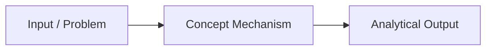

# {{title}}

> [!summary] Definition & Quick Summary
> High-level definition of the concept in one to two clear sentences.

## 1. What Is It?
*Detailed conceptual explanation.*

## 2. Why Is It Used? (Problem It Solves)
*Contrast with previous or inferior methods (e.g., Tables vs Normal Ranges).*

## 3. How Does It Work?
*Underlying mechanics, engine execution, or mental model.*

## 4. Syntax / Structure / Architectural Rules
*Grammar, formula syntax, UI location, or data structure requirements.*

## 5. Practical Example
*Concrete scenario with sample table and output.*

## 6. Common Mistakes & Misconceptions
> [!caution] Gotchas
> What goes wrong when analysts apply this improperly?

## 7. When to Use
- Scenario A
- Scenario B

## 8. When NOT to Use (Alternatives)
- When to avoid
- What to use instead

## 9. Real-World Analytics Use Case
*How is this applied in real business reporting (e.g. PwC Call Center or Financial Reporting)?*

## 10. Related Concepts
- [[Related Concept 1]]
- [[Related Concept 2]]
