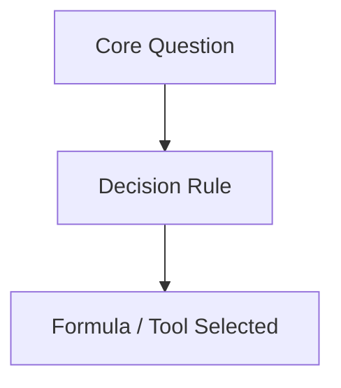

# Spaced Review: {{title}}

## Quick Recall Check
- [ ] What is the primary purpose of this topic?
- [ ] What are the top 3 functions or techniques used?
- [ ] What is the most dangerous common error?

## Core Mental Model

## Flash Review Questions
1. **Q**: ...
   **A**: ...
2. **Q**: ...
   **A**: ...

## Edge Cases to Remember
> [!important] Key Edge Case
> Detailed description of tricky behavioral aspect.

## Connection to Capstone Project
*How does this exact topic impact [[Call Center Performance Analysis]]?*
