# 🏗️ Implementation Specification & Architecture Log

> **Repository**: [Sohila-Khaled-Abbas/COURSE-EXCEL-ZERO-TO-HERO](https://github.com/Sohila-Khaled-Abbas/COURSE-EXCEL-ZERO-TO-HERO)  
> **Author & Lead Architect**: Sohila Khaled Abbas  
> **Status**: Verified & Production-Deployed  
> **Version**: 2.0.0 (Core + Supplementary + AI-Assisted Track)

---

## 🎯 Executive Summary & Mission

This document formalizes the complete implementation lifecycle that transformed the 8-hour masterclass **[Excel from Zero to Hero in 8 Hours](https://youtu.be/uv1bxe2gdnU)** by **Mostafa Hamed** into an interconnected **Obsidian Second Brain**, **GitHub Analytics Portfolio**, and **AI-Augmented Analytical System**.

The repository bridges raw video training into a professional software-engineered knowledge system:
```text
Video Lecture ➔ Atomic Concepts ➔ Structured Notes ➔ Drills & Exercises ➔ 
Production Capstone ➔ Supplementary Blueprints ➔ AI-Assisted Layer ➔ Enterprise Portfolio
```

---

## 🗺️ Master Phase & Implementation Roadmap

```mermaid
flowchart TD
    subgraph P1 ["Phase 1: Ground-Truth Curriculum"]
        M1["9 Core Module Notes (02_Notes)"]
        M2["20 Atomic Concepts (03_Concepts)"]
        M3["Formula Knowledge Base (04_Formulas)"]
        M4["Levels 1-5 Practice (05_Practice)"]
    end

    subgraph P2 ["Phase 2: PwC Capstone & Portfolio"]
        C1["5,000 Call Record Dataset"]
        C2["Forensic Data Quality Audit (946 Nulls)"]
        C3["DAX Measures & Agent Scorecards"]
        C4["Executive Case Study (10_Portfolio)"]
    end

    subgraph P3 ["Phase 3: Supplementary Assets & Mindmaps"]
        G1["Gemini Notebook Curation"]
        G2["Physical Media (assets/)"]
        G3["MindMeister Live Course Map"]
        G4["11 Supplementary Reference Guides"]
    end

    subgraph P4 ["Phase 4: AI-Assisted Analytics Track"]
        A1["GPT for MS Excel (Twistly)"]
        A2["Claude for Excel (Anthropic)"]
        A3["14-Step AI Analytical Workflow"]
        A4["Prompt Engineering Library"]
        A5["6-Stage Output Verification"]
        A6["10 AI Practice Drills & Log"]
    end

    subgraph P5 ["Phase 5: Governance & Production Deployment"]
        D1["GitHub Branch Protection (Ruleset 24128437)"]
        D2["Dataview Parser Conflict Hardening"]
        D3["Chunked Push Transfer Strategy"]
        D4["README & Build Reports"]
    end

    P1 --> P2
    P2 --> P3
    P3 --> P4
    P4 --> P5

    style P1 fill:#0f172a,stroke:#3b82f6,stroke-width:2px,color:#fff
    style P2 fill:#0f172a,stroke:#06b6d4,stroke-width:2px,color:#fff
    style P3 fill:#0f172a,stroke:#f59e0b,stroke-width:2px,color:#fff
    style P4 fill:#0f172a,stroke:#8b5cf6,stroke-width:2px,color:#fff
    style P5 fill:#0f172a,stroke:#22c55e,stroke-width:2px,color:#fff
```



---

## 🛠️ Step-by-Step Implementation Breakdown

### Step 1: Core Vault Knowledge System Construction
- **Directory Hierarchy**: Established folders `00_Home/` through `10_Portfolio/`, `.agents/`, and `.obsidian/`.
- **Lesson Notes (`02_Notes/`)**: Built 9 module notes mapping 1-to-1 with video chapters (Interface, Data Management, Referencing, Tables, Pivots, Charts, Cleaning, Power Query, Data Modeling).
- **Atomic Concepts (`03_Concepts/`)**: Created 20 concept notes with Mermaid diagrams answering 10 essential questions.
- **Formula Knowledge Base (`04_Formulas/`)**: Categorized notes for Lookup, Aggregation, Logic, Text, Date, Dynamic Array, and DAX.
- **Practice System (`05_Practice/`)**: Assembled progressive exercises (Ex01 to Ex06) with folded solutions and mini-projects (Hotel Reservation, HR Analytics).

### Step 2: PwC Call Center Performance Analysis Capstone
- **Dataset Grounding**: Analyzed 5,000 customer service interactions from Q1 2021.
- **Forensic Data Quality Breakthrough**: Demonstrated that 946 null values across speed of answer, talk duration, and customer satisfaction correspond 100% to abandoned calls (`Answered == "N"`). Proved that naive mean imputation would falsify customer sentiment.
- **Agent Scorecard Benchmarks**: Reconciled ground-truth metrics for all 8 agents (Becky, Dan, Diane, Greg, Jim, Joe, Martha, Stewart).
- **Portfolio Deliverable**: Authored `10_Portfolio/Call Center Analysis Portfolio Case Study.md` for recruiters and hiring managers.

### Step 3: GitHub Community Governance & Branch Protection
- **Open-Source Standards**: Added `LICENSE` (MIT), `CONTRIBUTING.md`, `CODE_OF_CONDUCT.md`, `SECURITY.md`, `CITATION.cff`, `.editorconfig`, issue templates, and pull request template.
- **Branch Protection Ruleset**: Configured Ruleset ID `24128437` on `Sohila-Khaled-Abbas/COURSE-EXCEL-ZERO-TO-HERO` targeting `~DEFAULT_BRANCH`:
  - Blocks branch deletion.
  - Blocks non-fast-forward force pushing.
  - Enables admin bypass for automated workflows.

### Step 4: Gemini Notebook Knowledge & Media Ingestion
- **Asset Ingestion (`assets/`)**:
  - `analytics-pipeline-data-comparison.png` (5.5 MB)
  - `data-quality-mind-map.png` (2.9 MB)
  - `enterprise-architecture-mindmap.png` (1.4 MB)
  - `excel-interface-blueprint.pdf` (12.3 MB)
  - `getting-started-with-excel-navigation-and-setup.mp4` (34.8 MB)
  - `data-quality-essentials-guide.png` (5.4 MB)
- **Supplementary Knowledge Guides (`07_Reference/Gemini Notebook/`)**:
  - Created 12 reference guides linking external insights to core modules.
  - Authored `01_Course/Gemini Notebook Resource Index.md` and `01_Course/Supplementary Learning Path.md`.
  - Created `05_Practice/Exercises/Ex07_Supplementary_Dynamic_Lookups_and_KPIs.md` and full solutions.

### Step 5: Interactive MindMeister Course Map & Dataview Hardening
- **Interactive Mindmap**: Integrated live MindMeister map (`https://www.mindmeister.com/app/map/3782166881?t=I9gXHbkAlV`) across `README.md`, `Course Map.md`, and dashboard.
- **Dataview Parsing Conflict Resolution**: Resolved Dataview inline query parsing crash on `=VLOOKUP(...)` formulas by configuring `.obsidian/plugins/dataview/data.json` with `"inlineQueryPrefix": "dataview="`, `"enableInlineDataview": false`, and isolating Excel formulas inside standard code fences.

### Step 6: AI-Assisted Excel Analytics Track
- **Reference Architecture (`07_Reference/AI for Excel/`)**:
  - `AI for Excel Overview.md`: Pedagogical mission and core principles.
  - `GPT for MS Excel — Twistly.md`: Custom formula functions (`AI.ASK`, `AI.TABLE`, `AI.FILL`, etc.).
  - `Claude for Excel — Anthropic.md`: Multi-tab workbook reasoning and cell citations.
  - `AI Excel Installation Guide.md`: Office.js vs COM add-ins, AppSource deployment.
  - `AI Excel Workflow.md`: 14-step professional analytics process.
  - `AI Excel Prompt Library.md`: Standardized templates for formulas, debugging, ETL, and dashboards.
  - `AI Output Verification.md`: 6-stage verification framework and pre-flight checklist.
  - `AI Excel Security and Privacy.md`: 5-step security decision gate and data sanitization.
  - `AI Tool Comparison.md`: Objective side-by-side feature matrix.
- **Concepts**:
  - `03_Concepts/Human Skill vs AI Assistance.md`: Division of labor matrix.
  - `03_Concepts/AI for Data Analysts MOC.md`: Master visual Map of Content.
- **Hands-On Practice (`05_Practice/AI Assisted Excel/`)**:
  - 10 targeted exercises (Formula generation, debugging, explanation, data quality, cleaning, categorization, KPIs, dashboarding, validation, and full manual rebuilds).
  - `AI Experiment Log.md`: Reusable scientific prompt tracking journal.
- **Capstone Project Integration**:
  - `06_Projects/Call Center Performance Analysis/AI-Assisted Analysis Workflow.md`: Documented task classification (Automated, AI-Assisted, Manually Performed, Manually Validated) on the 5,000-call dataset.

### Step 7: Push & Network Delivery Optimization
- **Problem**: Large binary pack (~57 MB) over slow upload caused GitHub HTTPS reverse proxies to drop connection with `HTTP 408 (Request Timeout)`.
- **Solution**: Decoupled the repository push into clean sequential stages:
  1. Core text, markdown notes, code, configurations, and templates (pushed in ~6s).
  2. Individual media assets pushed sequentially in manageable chunks under the 300s timeout window.

---

## 📊 Deliverables Inventory

| Category | File Count | Primary Components | Status |
| :--- | :---: | :--- | :---: |
| **Course Curriculum & Dashboards** | 7 notes | Overview, Curriculum, Objectives, Index, Learning Path, Dashboard, MOC | Verified |
| **Structured Lesson Notes** | 9 notes | Modules 1 through 9 covering 8-hour masterclass timestamps | Verified |
| **Atomic Concepts & MOCs** | 22 notes | Excel Tables, XLOOKUP, DAX, Quality, M Language, AI MOC, Human vs AI | Verified |
| **Formula Reference Base** | 25+ notes | Lookup, Math, Logic, Text, Date, Dynamic Arrays, DAX Measures | Verified |
| **Practice & Solutions** | 19 notes | Ex01–Ex07, 10 AI Drills, Mini Projects, Full Solutions | Verified |
| **Capstone Project Files** | 11 notes | PwC 5,000-call audit, KPIs, Findings, AI Workflow, Case Study | Verified |
| **Supplementary Reference Notes** | 12 notes | Gemini Notebook guides, modern lookups, DAX modeling, ETL | Verified |
| **AI for Excel Knowledge Base** | 9 notes | Overview, Twistly, Claude, Install, Workflow, Prompts, Verification, Security | Verified |
| **Physical Media Assets** | 6 files | 4 PNG mindmaps, 1 PDF blueprint (12.3MB), 1 MP4 walkthrough (34.8MB) | Staged / Pushed |
| **Obsidian Configuration** | Pre-set | Dataview, Omnisearch, Tasks, Minimal theme, Second Brain CSS | Configured |
| **GitHub Governance** | 9 files | Workflows, Rulesets, Community standards, Issue templates | Active |

---

## 🔒 Final Verification & Compliance Checklist

- [x] **No Fabricated Data**: All numbers match primary lecture sources and 5,000 verified PwC call records.
- [x] **No Fabricated Tool Capabilities**: Twistly and Claude capabilities strictly grounded in official AppSource and vendor documentation.
- [x] **Accurate Publisher Identity**: GPT for MS Excel explicitly attributed to Twistly, not OpenAI.
- [x] **YAML Frontmatter Integrity**: Validated syntax and metadata consistency across all markdown notes.
- [x] **Internal Wikilinks**: 100% verified working internal links (`[[...]]`) across MOCs and dashboards.
- [x] **Branch Protection Active**: Ruleset ID `24128437` actively enforcing linear commits and protecting `main`.
- [x] **Privacy & Security Grounding**: Clear stop-gates for enterprise data and PII sanitization.
